# Aegis Labs (DQ Studio) — Product Specification

**Product:** Aegis Labs / AegisDQ (internal codename: Archimedes, v0.5.2) · **Hosting:** Microsoft Azure
**Purpose of this document:** handover reference for a team building a similar product — covers (A) Business Requirements, (B) Feature Specifications, (C) Technical Specifications, including product naming and brand guidelines. All facts are sourced from the codebase at `source-codes/`; file paths are cited inline.

**Status:** Current for application version 0.5.2. Historical release decisions
are linked from the workspace documentation index and are not repeated here.

---

## A. Business Requirements

### A1. Product Overview & Positioning

Aegis Labs DQ Studio is an intelligent data-quality studio built around one promise: **"Trust your data before your models do."** It sits between a connected database and the models that consume it, turning data assessment from a manual checklist into an agentic workflow. Autonomous agents ingest and summarize a connected DB schema, screen variables, discover relationships, and recommend stability and distribution checks — work an analyst would otherwise scope by hand.

The positioning is *agentic assessment with a deterministic backbone*. AI proposes and ranks; it never computes the verdict. A rule-weighted health score aggregates test results deterministically, the AI contributing criticality ranking only. Where AI writes executable logic — root-cause analysis and mitigation code — that code lands in a sandboxed Python workbench for an SME to read, edit, and run.

### A2. Target Users & Personas

- **Subject-matter experts (SMEs)** — primary persona; review, edit, and execute AI-generated RCA and mitigation code in the Code Workbench.
- **Admin users** — elevated role (`authz_roles` = `admin`) gating admin-only sidebar navigation.
- **Standard users** — full assessment workflow, no admin surfaces.
- **Independent testers/verifiers** — hands-on platform verification; every step must be self-explanatory.

### A3. Business Objectives & Value Proposition

- **Trust before models.** Data trustworthiness becomes a gate ahead of model development, not a post-hoc audit.
- **Deterministic health score.** Rule-weighted and reproducible; AI ranks criticality but never calculates the math, so the number is defensible to a reviewer.
- **Human-in-the-loop by design.** AI-generated RCA/mitigation code is a proposal, executed only in a sandbox after SME review.
- **Compressed assessment effort.** Agents do schema ingestion, variable screening, relationship discovery, and check recommendation that would otherwise be manual.

### A4. Scope & Deployment Context

Azure-hosted web application. LLM calls go to **Azure OpenAI**, model **gpt-4.1**, configured via `AZURE_OPENAI_ENDPOINT`, `AZURE_OPENAI_API_KEY`, `AZURE_OPENAI_DEPLOYMENT`, `AZURE_OPENAI_API_VERSION`; provider attribution surfaces as "Azure OpenAI". A persistent `/data` volume backs state (`system_state.db`); source files land in `/data/uploads`.

### A5. Product Naming & Brand Guidelines

**(a) Naming hierarchy**

| Name | Role | Where it appears |
|---|---|---|
| Aegis Labs | Brand | Product brand, primary wordmark |
| DQ Studio | Subtitle | Paired under the brand |
| AegisDQ | Product short name | Tour welcome screen |
| Archimedes | Internal codename | Shown with version string |
| Genpact | Parent brand | Logo source |
| Galileo | Retired predecessor | Do not use in new copy |

**(b) UI palette** — light theme vars at `:root`; sidebar is always dark (`bg-dq-dark`). No web font is imported; system default is intentional.

| CSS var | Hex | True name |
|---|---|---|
| `--color-dq-purple` | `#FFAD28` | Genpact Sunset Orange — **gotcha: the var says purple, the value is orange** |
| `--color-dq-dark` | `#181C23` | Midnight Black |

Chart palette: `#FFAD28`, `#10b981`, `#3b82f6`, `#FF4F59`, `#6D706B`.

**(c) PDF report palette** — a *different*, true-purple scheme; do not reuse UI hexes. Typeface: Helvetica.

| Role | RGB |
|---|---|
| Purple | 75, 30, 120 |
| Grey | 107, 114, 128 |
| Light grey | 249, 250, 251 |
| Dark | 30, 30, 46 |
| Divider | 221, 214, 254 |

**(d) Logo assets** — `ui/public/genpact-logo.svg`, `ui/public/genpact-logo-white.svg`, `ui/public/favicon.svg`, `ui/public/icons.svg`.

**(e) Tone of voice** — instructional, reassuring, trust-framing.

- Mandatory AI disclaimer, verbatim: *"AI-generated content may be inaccurate or incomplete. Please review and edit before relying on it."*
- AI attribution: **"Aegis Labs AI"**, sourced from `app_config` key `AI_ATTRIBUTION`.
- PDF report title: **"Agentic Feature Validation & Guardrail Workspace"**.

---

## B. Feature Specifications

### B1. End-to-End Assessment Workflow

**1) Data Sourcing.** The user connects a database or uploads a dataset (SQLite DB file, CSV, or multi-sheet Excel). The DB-Understanding Agent ingests the asset and summarizes its schema, so the user starts from an AI-written description of what the data actually contains rather than a raw table list.

**2) Governed diagnostics.** The Test Lab begins with a nine-diagnostic Coverage register. A workflow-pending diagnostic remains visible but cannot be run. Opening an executable diagnostic starts a dedicated Scope → Run → Findings → Score workflow: scope is reviewed and frozen, execution streams progress, findings receive explicit dispositions, and scoring remains deterministic. Supporting investigations can also produce reusable analytics artifacts.

**3) Health Score.** Passed tests aggregate into a deterministic, rule-weighted 0-100 score. The critical design decision: AI only ranks criticality; the arithmetic lives in `scoring/health.py` and `scoring/criticality.py` and is never delegated to a model.

**4) Code Workbench.** A sandboxed Python surface where SMEs review AI-generated root-cause analysis and edit the proposed mitigation code before it is applied — human approval sits between hypothesis and fix.

### B2. Feature Inventory

| Feature | What it does | UI surface | Key endpoints |
|---|---|---|---|
| Data Sourcing & Ingestion | Upload DB/CSV/Excel, AI schema summarization, versioned assets | DataSourcing page + AgentConsole | `POST /api/v2/items`, `/items/{id}/process`; `GET /items/{id}/ingest`, `/tables`, `/columns`, `/profile/stream` |
| Asset Catalogue & Versioning | Reusable assets, version history, diff, restore | AssetCatalogue | `GET /api/v2/catalogue`, `/assets/{id}/versions/{a}/diff/{b}`; `POST .../restore` |
| DQ Test Framework | Governed nine-diagnostic register with taxonomy, readiness, thresholds, and framework reference data | DQFramework page | `GET /api/v2/framework/overview`, `/areas`, `/matrix` |
| Test Lab / Diagnostics | Coverage → frozen scope → SSE execution → findings disposition → deterministic score | Coverage board + dedicated diagnostic workflow | `POST /diagnostics/manifest`, `/manifests/{id}/run`; `GET /runs/{id}/stream`; `POST /findings/{id}/disposition` |
| Health Scoring | Deterministic 0-100 = criticality-weighted pass rate | ScorePanel | `scoring/health.py` + `criticality.py` — no endpoint of its own |
| Issue Management | Failed tests tracked with status/criticality/tags; one row per failed test per table | IssueManagement | `GET /issues/register`, `/items/{id}/issues`; `PATCH /issues/tracked/{id}` |
| RCA agentic case workflow | Intake → opening look → planner/runner/reader → hypothesis → human-approved fix → rerun → closure → KB update | IssueRca page | `POST /v3/rca/cases`, `/opening-look`, `/planner-look`, `/hypotheses/{id}/propose-fix`, `/cases/{id}/close` |
| Knowledge Base | Document → Version → Section → Rule hierarchy; `kb.py` is the sole writer of `kb_rules`; publish/archive is human-only | KnowledgeBase page | `POST /v3/knowledge/documents`, `/rules/{id}/publish`, `/archive`; `GET /knowledge/retrieve` |
| Tagging / Taxonomy | Tag assets, tests, results, issues and KB docs by dimension | TagPicker | `GET /v3/taxonomy/dimensions` + per-entity tag CRUD |
| Admin | User management, factory reset, asset and context-memory oversight | Admin page | `/api/admin/users`, `/factory-reset`, `/context-memory` |
| Auth & Profile | Login/session, AI-personality and theme preferences | Login, Profile | `POST /api/login`, `/logout`; `GET`/`PUT /api/me` |

### B3. AI Skills Roster

Each skill is an editable markdown prompt file under `backend/skills/`; seeded `db_understanding_*.md` and `db_discovery_*.json` artifacts live in the same directory. Roles, by function:

| Skill role | Function |
|---|---|
| Test Manager (orchestrator) | Coordinates test design across the sub-agent roster |
| Database Understanding | Ingests and summarizes a connected schema |
| Test Screening | Screens candidate library tests and recommends checks |
| Relationship Discovery | Finds candidate relationships |
| Relationship Validation | Validates relationships within a table |
| Relationship Architect | Cross-table ERD / join inference |
| Global Consistency | Consistency checks beyond a single table/db |
| Criticality Ranking | Ranks importance of tests and findings |
| Health-Score role doc | Describes the score; the math lives in `scoring/health.py` (deterministic) |
| Root-Cause Analysis | Authors RCA hypotheses and mitigation code |
| RCA Checker | Effective challenge / gating of RCA output |
| Test Feedback Adjudicator | HITL verdicts on feedback to a designed test |
| Domain Expert (credit risk) | Domain knowledge; also: consolidated executive-narrative DQ report, data-grounded test hypotheses, per-test "Dossier" interpretation |
| Context-Memory Broker | Object context-memory retrieval policy |

### B4. Inputs & Outputs

**Inputs.** SQLite DB files, CSV, multi-sheet Excel. Ingest enriches each with classification, header detection, dictionary state, column mapping, warnings, and upload status.

**Outputs.**

| Output | Where |
|---|---|
| Per-item assessment report | `GET /api/v2/items/{item_id}/report` |
| Diagnostics run report | `GET .../runs/{run_id}/report` |
| KB parse report | `GET /api/v3/knowledge/versions/{version_id}/parse-report` |
| Health Score (0-100) | UI |
| Asset version diffs / restore snapshots | Asset Catalogue |
| Branded PDF reports | `ai/report_pdf.py` |

### B5. UI/UX Specification

| Route | Page | Purpose |
|---|---|---|
| `/` | Inventory | Dashboard with live counts |
| `/data-sourcing` | DataSourcing | Connect / upload / ingest |
| `/asset-catalogue` | AssetCatalogue | Versioned asset library |
| `/test-lab` | TestLab | Coverage board; opens Scope → Run → Findings → Score |
| `/test-lab/artifacts` | AnalyticsArtifactRepository | Reusable supporting-analysis evidence |
| `/issues` | IssueManagement | Tracked failed-test register |
| `/issues/:issueRowId` | IssueRca | RCA case; RCA is regenerated on open |
| `/knowledge-base` | KnowledgeBase | Documents, versions, rules |
| `/dq-framework` | DQFramework | Test library reference |
| `/admin` | Admin | Users, reset, oversight |
| `/profile` | Profile | Preferences |
| `/login` | Login | Authentication |

**Interaction patterns worth lifting.** Dark sidebar command-center against a light content area. A guided product tour (driver.js) for first-run orientation. Live SSE streaming consoles for both ingestion profiling and test runs, so long operations show progress instead of a spinner. Component kit of radix-ui/shadcn with lucide-react icons, Recharts for charts, and `@xyflow/react` for flow and relationship diagrams. Nav items are admin-gated via the `authz_roles` `"admin"` role.

#### B5.1 Screens

Captured from a local run of v0.5.2. Screenshots are stored in the workspace
[`spec-assets/`](../../spec-assets/) directory. The local database held one
profiled dataset; AI-driven panels are inert without an Azure OpenAI key.

**Login** — brand surface: Genpact wordmark, Aegis Labs + tagline, codename/version line, sunset-orange primary action on the dark theme.

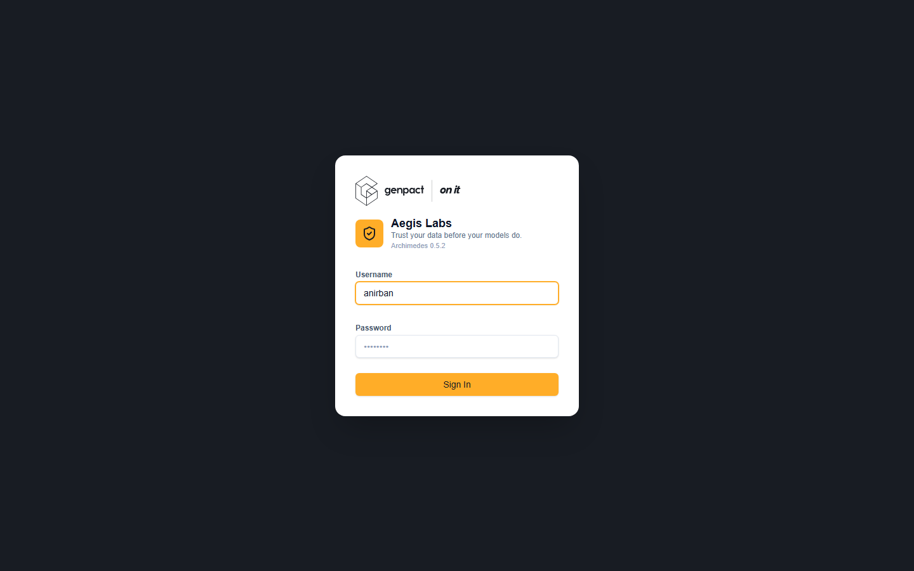

**Data Inventory (`/`)** — landing dashboard; Database vs Dataset item kinds with in-progress/completed counts and per-item health/issue columns.

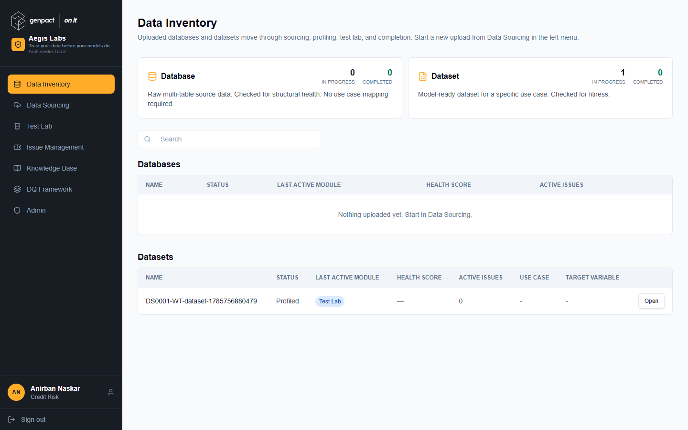

**Data Sourcing (`/data-sourcing`)** — source-kind cards (Database = multi-table workbook, Dataset = single model-ready table), each with View Existing / Add New.

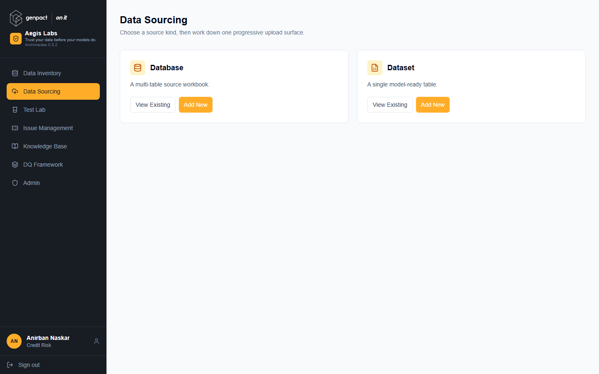

**Asset Catalogue (`/asset-catalogue`)** — versioned asset register: kind, version, snapshots, dictionary binding, lifecycle state, usage summary.

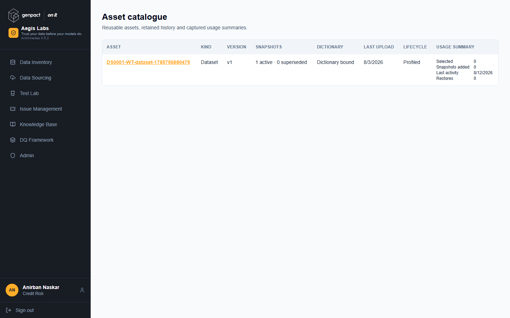

**Test Lab (`/test-lab`)** — nine-diagnostic Coverage board with cards grouped
by tier and readiness. "Open scope" enters the selected diagnostic's dedicated
Scope → Run → Findings → Score workflow.

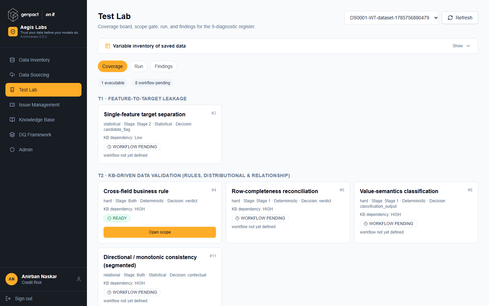

**Issue Management (`/issues`)** — failed-test register (shown empty): status/criticality/table filters, one row per failed test per table, tracked-issue linkage.

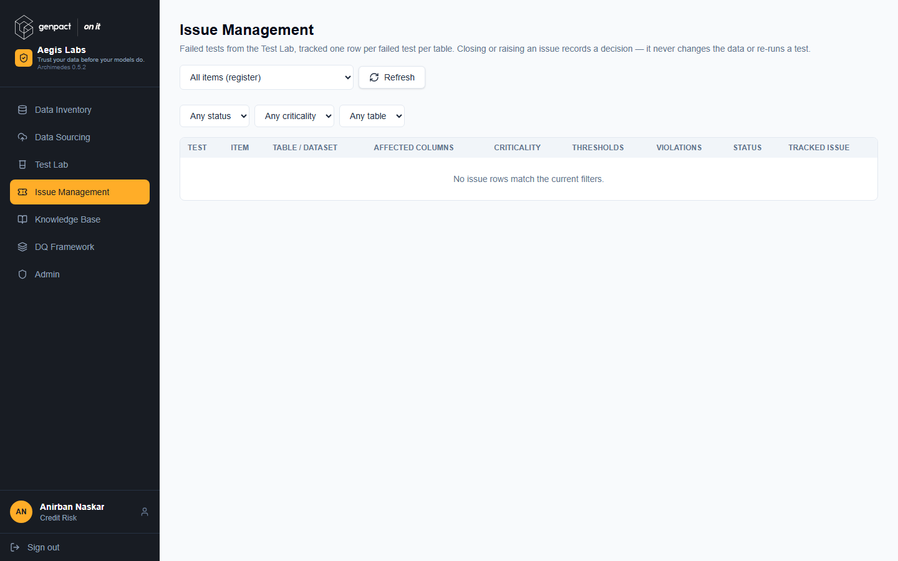

**Knowledge Base (`/knowledge-base`)** — domain-document library with upload/tag/parse/publish flow.

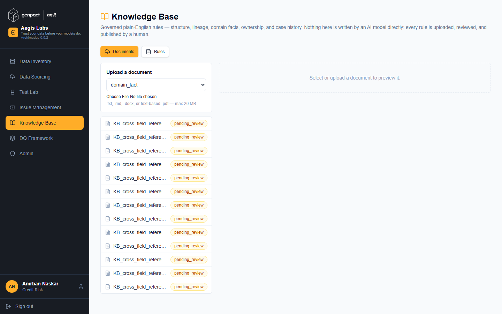

**DQ Framework (`/dq-framework`)** — reference view of the governed diagnostic
taxonomy (overview / areas / matrix).

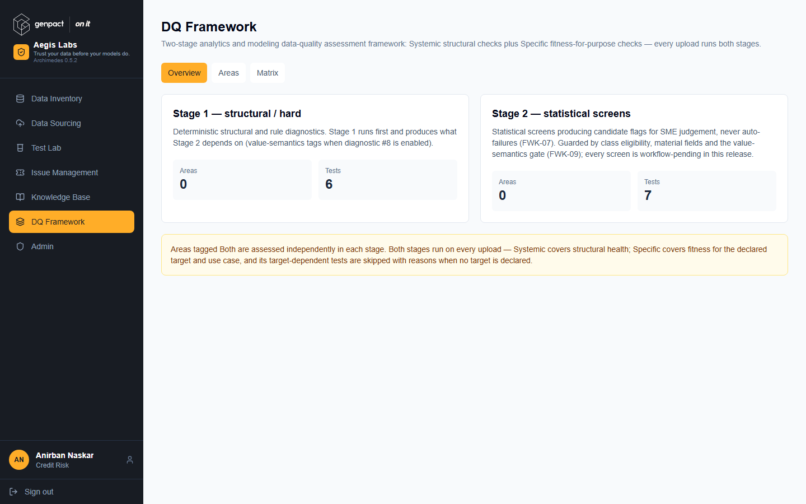

**Admin (`/admin`)** — user management, factory reset, asset and context-memory oversight (admin-gated).

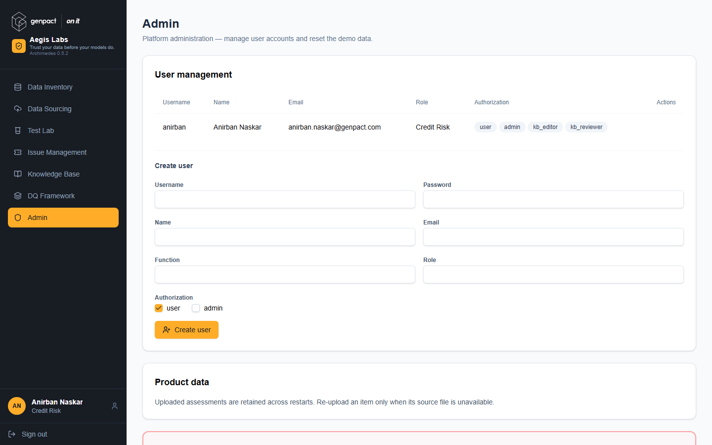

**Profile (`/profile`)** — user preferences including AI personality and theme.

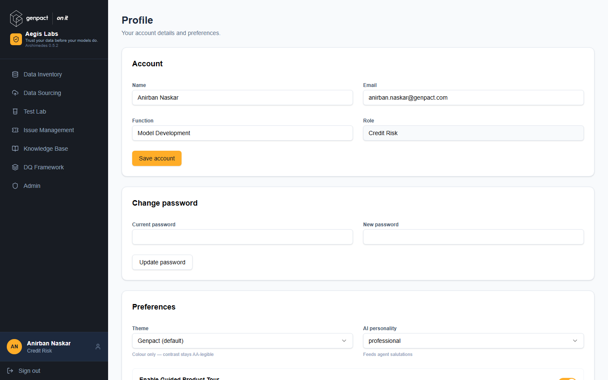

---

## C. Technical Specifications

### C1. Architecture Overview

Two independently shipped deployables:

- **Backend** — FastAPI app in a container (uvicorn, port 8000), hosted on Azure Container Apps.
- **Frontend** — Vite/React SPA, static-built, hosted on Azure Static Web Apps.

**Data flow:** browser loads the SPA from Static Web Apps → SPA calls the backend at the build-time `VITE_API_BASE` origin → backend reads/writes the `system_state.db` SQLite file on local container disk, persists durable artifacts to an Azure Files volume, and calls Azure OpenAI for all model work.

**Startup behavior (backend boot):**

1. **Restore** — pull `system_state.db` from `SYSTEM_DB_BACKUP_PATH` (Azure Files) onto the ephemeral container disk.
2. **Seed** — create/populate defaults (including agent skill prompts) *without overwriting* existing edits.
3. **Daemon threads** — start (a) periodic SQLite snapshot back to Azure Files on `SYSTEM_DB_BACKUP_INTERVAL`, and (b) an hourly RCA time-box sweep on `RCA_TIME_BOX_SWEEP_INTERVAL`. A shutdown hook writes a final snapshot.

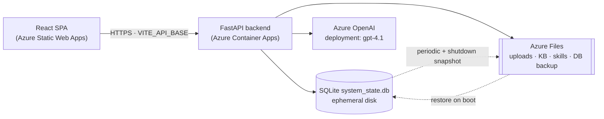

### C2. Tech Stack & Versions

| Layer | Components |
|---|---|
| Backend runtime | Python 3.12; FastAPI ≥0.115; uvicorn |
| Data/stats | pandas, numpy, scipy, statsmodels, scikit-learn |
| DQ engine | great-expectations ≥1.3.0 |
| File parsing | pdfplumber, python-docx, openpyxl |
| Reporting | fpdf2 |
| AI client | openai ≥1.50.0 |
| Frontend | React 19.2.7; Vite 8.1.0; Tailwind CSS v4 via `@tailwindcss/vite`; react-router-dom 7.18 |
| UI libraries | Recharts 3.9; `@xyflow/react` 12.11; radix-ui / shadcn; lucide-react; driver.js |

**Version source of truth:** a single root `VERSION` file (currently `0.5.2`), read by the backend's `app_version.py` *and* by the UI's `vite.config.js` — one edit propagates to API responses and the built bundle.

### C3. Backend Design & Persistence

**Router layout** — `backend/main.py` mounts `auth`, `admin`, `v2`, `v3`, and
supporting-analysis routers, plus `/health` and `/api/config`. `routers/v2.py`
remains the compatibility aggregator while domain ownership is split across
`routers/sourcing.py`, `routers/asset_catalogue.py`, `routers/diagnostics.py`,
`routers/issues.py`, and `routers/framework.py`; shared response helpers live in
`routers/v2_common.py`.

**Module map**

| Path | Role |
|---|---|
| `gx/` | Great Expectations integration |
| `dq_diagnostics/`, `dq_tests/` | diagnostics and test execution |
| `ingest/` | file/database ingestion |
| `kb.py` + `kb_storage/` | knowledge base logic and stored documents |
| `rca.py` | root-cause analysis |
| `ai/` | agents, prompts, model orchestration |
| `scoring/`, `analytics/` | scoring and analytics |
| `routers/` | mounted API boundaries and the v2 compatibility aggregator |

**Persistence** — one SQLite database, `system_state.db`. A single ~90KB `system_db.py` owns both schema and queries across ~75+ tables. Main clusters:

- `users`, `app_fsm` (sessions)
- `ingested_databases`, `table_metadata`
- `test_library`, `test_plan`, `test_dossiers`
- `dq_items`, `dq_assets` + versions
- `plan_v2`, `results_v2`, `scores_v2`, `issues_v2`
- `rca_cases` + ~20 further `rca_*` tables
- `diagnostic_register`, `diag_*`
- `kb_documents`, `kb_sections`, `kb_rules`
- `tenants`, `feature_flags`
- `usage_events`, `health_scores`, `hitl_decisions`, `notifications`, `schedules`

> **Pattern worth lifting — split durability from locking.** Container disk is ephemeral, so `system_state.db` is snapshotted to `SYSTEM_DB_BACKUP_PATH` (Azure Files) periodically and on shutdown, then restored on boot. But **per-item working SQLite DBs stay on local temp disk (`ITEM_DB_DIR`), never Azure Files** — SMB lacks SQLite byte-range locking. They are regenerated from the durable uploads after a restart. Azure Files holds only what tolerates SMB semantics.

### C4. AI Subsystem

- **Client** — Azure OpenAI through the `openai` SDK `AzureOpenAI` client, falling back to the plain `OpenAI` client. Deployment `gpt-4.1`, API version `2025-01-01-preview`; `AI_REQUEST_TIMEOUT` and `AI_MAX_RETRIES` are tunable.
- **Agent roster** (`ai/skills.py`) — 14 agents with parent/child topology and an execution sequence: an orchestrator; relationship- and test-discovery sub-agents; a criticality ranker; an RCA author and an RCA checker; a DB-profiling agent; a domain-expert SME; a deterministic scorer; and a feedback adjudicator.
- **Agent modules** (`ai/agents/`) — criticality, global_consistency, relationship_discovery / join / validation, test_screening, variable_screening.
- **Workflow layers** — the deterministic v2 service in `ai/v2/service.py`
  supports the current asset and diagnostic workflow while preserving its
  compatibility API surface.
- **Reports** — PDF generation via fpdf2: pure-Python, vector, A4.

> **Pattern worth lifting — prompts as editable files on a volume.** Each agent's system prompt is a markdown file at `backend/skills/<agent_key>.md`. In production `SKILLS_DIR` points at the persistent volume, so prompt edits made in the admin console survive restarts; first boot seeds defaults but never overwrites an existing edited file.

### C5. Frontend Design

Separate deployable from the backend. The API base is baked in at build time via `VITE_API_BASE`; the backend allowlists the Static Web App origin through `CORS_ORIGINS`. Routing is client-side via react-router-dom; charts use Recharts, node-graph views use `@xyflow/react`, and UI primitives come from radix-ui/shadcn with lucide-react icons and driver.js walkthroughs.

### C6. Azure Deployment & Configuration

**Services:** ACR (images) · Azure Container Apps (backend) · Azure Static Web Apps (frontend) · Azure Files (persistent volume) · Azure OpenAI.

**`deploy.ps1` flow:**

1. Load config from `deployment.local.psd1` (copied from the checked-in `deployment.example.psd1`).
2. Backend: robocopy-stage the source, excluding `.venv`, `__pycache__`, `.env`, `system_state.db` → `az acr build` → `az containerapp update` with a timestamped revision suffix → poll `/health` and revision traffic.
3. Frontend: `npm ci` + `vite build` (with `VITE_API_BASE`) → `swa deploy` using a token from `az staticwebapp secrets list`.
4. Preconditions: `az login` and a clean `main` branch. A full release tags git as `archimedes-v<version>`.

**Dockerfile:** `python:3.12-slim`, uvicorn on port 8000, `curl`-based `HEALTHCHECK`.

**Infra as code:** none — no bicep, ARM, or pipeline YAML in the repo; provisioning is manual.

**Environment variables**

| Group | Names |
|---|---|
| AI | `AZURE_OPENAI_ENDPOINT`, `AZURE_OPENAI_API_KEY`, `AZURE_OPENAI_DEPLOYMENT`, `AZURE_OPENAI_API_VERSION`, `OPENAI_API_KEY`, `OPENAI_MODEL`, `AI_REQUEST_TIMEOUT`, `AI_MAX_RETRIES` |
| Web | `CORS_ORIGINS`, `VITE_API_BASE` (build-time) |
| State | `SYSTEM_DB_PATH`, `SYSTEM_DB_BACKUP_PATH`, `SYSTEM_DB_BACKUP_INTERVAL`, `SYSTEM_DB_RETIREMENT_SNAPSHOT_PATH` |
| Jobs/sessions | `RCA_TIME_BOX_SWEEP_INTERVAL`, `SESSION_MAX_AGE_HOURS` |
| Storage paths | `SKILLS_DIR`, `UPLOAD_DIR`, `ITEM_DB_DIR`, `KB_STORAGE_DIR` |

### C7. Auth & Security

Custom bearer-token scheme:

- `POST /api/login` checks username/password against the `users` table. **The comparison is plaintext — no hashing library is present.** Do **not** replicate this; use bcrypt or argon2.
- On success an opaque `uuid4` token is issued and stored as a session row in `app_fsm` with `entity_type="session"`.
- Absolute expiry only, via `SESSION_MAX_AGE_HOURS` (default 24h). No refresh, no rotation.
- `POST /api/logout` ends the session.
- Code comments describe this as an interim fix pending migration to secure cookies + CSRF protection.
