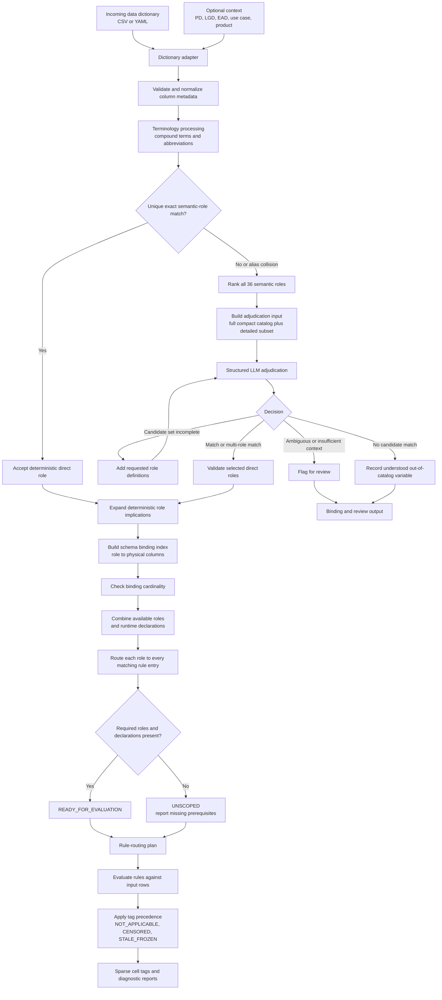

# T2 D08 Value Semantics

This experiment matches incoming variables to reusable semantic roles and then
deterministically routes every confirmed role to all applicable value-semantics
rule entries. Model type, use case, and product are optional context hints; they
never filter rule applicability.

The design separates semantic understanding from rule execution:

1. Understand what each incoming variable means.
2. Bind it to one or more canonical semantic roles.
3. Reconcile bindings across the complete schema.
4. Route confirmed roles to every relevant rule entry.
5. Evaluate routed rules against runtime data and declarations in a later execution layer.

## End-to-end process



The complete illustrated path is now executable for the synthetic PD, LGD, and
EAD fixtures when reviewed role bindings are supplied.

## Semantic role catalog

The active v0.2 KB defines the following 36 canonical roles. These roles describe
the business meaning of a variable; they are separate from the incoming dictionary's
structural role such as `identifier`, `period`, `target`, `feature`, `score`,
`weight`, `date`, `ignore`, or `group`.

| # | Semantic role | Simple summary |
|---:|---|---|
| 1 | `entity_id` | Identifies an exposure, facility, account, borrower, or workout case. |
| 2 | `period` | Gives the ordered reporting period or observation date. |
| 3 | `segment` | Groups observations into a portfolio or population partition. |
| 4 | `outcome_state` | Shows whether an LGD recovery or workout remains open or is finished. |
| 5 | `outcome_values` | Holds realised LGD results or components of the workout outcome. |
| 6 | `return_to_performing` | Indicates that an exposure cured without a realisation event. |
| 7 | `realisation_fields` | Holds values that exist only when collateral or another asset is realised. |
| 8 | `forward_labels` | Holds outcomes measured over a future window from the current PD period. |
| 9 | `exit_indicators` | Indicates that an exposure left observation before the panel ended. |
| 10 | `arrears_measure` | Measures current contractual payment arrears or delinquency severity. |
| 11 | `priced_rate` | Gives the current interest rate applied to an exposure. |
| 12 | `rate_basis` | Distinguishes fixed pricing from benchmark-linked pricing. |
| 13 | `internal_grade` | Gives the internal credit grade or rating currently in force. |
| 14 | `income_measure` | Measures income generated by a borrower, exposure, or collateral. |
| 15 | `utilisation_measure` | Measures usage, drawdown, capacity, or occupancy that should vary over time. |
| 16 | `non_arrears_trigger` | Identifies a qualitative or judgement-based deterioration/default trigger. |
| 17 | `regime_stamp` | Identifies the policy or regime version supporting a judgement-based event. |
| 18 | `construction_constants` | Holds values fixed because of how a PD panel was constructed. |
| 19 | `spread_over_benchmark` | Gives the contractual margin added to a reference rate. |
| 20 | `maturity_date` | Gives the contractual maturity date of an exposure. |
| 21 | `maturity_conditional_flags` | Holds flags that apply only when maturity has been reached. |
| 22 | `amortisation_basis` | Describes whether and how principal is repaid over the exposure's life. |
| 23 | `amortisation_fields` | Measures principal repayment or balance paydown. |
| 24 | `static_attributes` | Holds attributes fixed at origination and not subsequently revised. |
| 25 | `default_event` | Indicates that the default event relevant to EAD measurement occurred. |
| 26 | `default_date` | Gives the date or period at which the relevant default occurred. |
| 27 | `drawn_balance` | Gives the amount currently drawn or outstanding. |
| 28 | `undrawn_commitment` | Gives the committed amount that remains undrawn. |
| 29 | `credit_limit` | Gives the current contractual maximum exposure or line limit. |
| 30 | `available_commitment` | Gives the amount currently available for additional drawing. |
| 31 | `exposure_at_default` | Gives exposure measured at the declared default measurement point. |
| 32 | `future_drawdown` | Measures additional drawing between observation and default. |
| 33 | `conversion_factor` | Converts eligible undrawn or off-balance amounts into EAD. |
| 34 | `exposure_change_indicators` | Records events expected to change an EAD balance component. |
| 35 | `commitment_status` | Describes whether an amount is committed, cancellable, available, or closed. |
| 36 | `facility_type` | Describes the facility structure relevant to drawing rights and EAD treatment. |

`realisation_fields` has a deterministic implication to `outcome_values`. The
matcher therefore selects the more specific direct role and the agent adds the
broader role during schema reconciliation.

## From input columns to diagnostic outcomes

The process has two distinct questions:

1. **What does this column mean?** The dictionary name, description, abbreviations
   and optional context are used to match the column to a semantic role.
2. **What does this value mean on this row?** The matched role routes the column
   to relevant KB rules. The rule then uses the row, related indicator columns and
   runtime declarations to decide whether the value is censored, unexpectedly
   frozen, not applicable, or not flagged.

A role match alone does not create a diagnostic flag. For example, matching
`DFLT_12M` to `forward_labels` makes the censoring rule available; the row is
flagged only when its declared forward horizon extends beyond the observable
panel. Likewise, values are never changed or imputed—the output is a separate,
sparse set of diagnostic tags with reasons.

The final classification sequence is:

```text
Input dictionary and rows
        → semantic-role matching
        → schema binding and prerequisite checks
        → rule routing
        → row-level condition evaluation
        → precedence if several rules claim the same cell
        → diagnostic tag plus reason
```

The experimental cell executor now produces these row-level outcomes for the
supplied synthetic fixtures. It uses reviewed role bindings by default so that
cell-rule behavior can be validated independently from LLM matching errors.

### Colour legend

| Colour | Outcome | Plain meaning |
|---|---|---|
| 🔴 | `CENSORED` | The value is not final because the required future window or process is incomplete. |
| 🟠 | `STALE_FROZEN` | The value is a declared sentinel or failed to change when evidence says it should. |
| 🔵 | `NOT_APPLICABLE` | The field does not apply to this row under the declared contract or process. |
| 🟢 | No tag | A routed rule checked the cell but did not find one of these conditions. This is not a guarantee that the value is valid. |
| 🟣 | Not routed | No semantic role was assigned, so this KB cannot assess the column. Review may be required. |

For readability, each output table repeats the exact input grid and overlays a
coloured marker on the cell being explained. The real diagnostic does not edit
the source table; it writes the corresponding flag and reason to a separate
sparse output record.

### PD example

The miniature PD extract below assumes a four-quarter forward-label horizon, a
panel end of `2024-Q4`, and a dictionary declaration that `NOI = -999` means
source data was unavailable.

**Simulated input data (5 rows)**

| Row | `RPT_QTR` | `RATE_TYPE` | `DFLT_12M` | `NOI` | `SPREAD_BPS` | `BAL_AMT` | `SAMPLE_WGT` |
|---|---|---|---:|---:|---:|---:|---:|
| PD-01 | 2024-Q4 | FLOATING | blank | 54,200 | 185 | 240,000 | 1.00 |
| PD-02 | 2024-Q2 | FLOATING | 0 | -999 | 175 | 242,000 | 1.00 |
| PD-03 | 2024-Q2 | FIXED | 0 | 61,500 | blank | 310,000 | 1.00 |
| PD-04 | 2024-Q3 | FLOATING | 0 | 58,100 | 190 | 238,000 | 1.00 |
| PD-05 | 2024-Q3 | FLOATING | 0 | 49,800 | 180 | 175,000 | 1.25 |

**Output data with diagnostic flags**

The output mirrors the input exactly. Only the evaluated example cell on each row
is annotated; the original value itself is not replaced or corrected.

| Row | `RPT_QTR` | `RATE_TYPE` | `DFLT_12M` | `NOI` | `SPREAD_BPS` | `BAL_AMT` | `SAMPLE_WGT` |
|---|---|---|---:|---:|---:|---:|---:|
| PD-01 | 2024-Q4 | FLOATING | blank 🔴 | 54,200 | 185 | 240,000 | 1.00 |
| PD-02 | 2024-Q2 | FLOATING | 0 | -999 🟠 | 175 | 242,000 | 1.00 |
| PD-03 | 2024-Q2 | FIXED | 0 | 61,500 | blank 🔵 | 310,000 | 1.00 |
| PD-04 | 2024-Q3 | FLOATING | 0 | 58,100 | 190 | 238,000 🟢 | 1.00 |
| PD-05 | 2024-Q3 | FLOATING | 0 | 49,800 | 180 | 175,000 | 1.25 🟣 |

**Why each highlighted cell received its outcome**

| Row and column | Matched semantic role | Decision | Reason |
|---|---|---|---|
| PD-01 · `DFLT_12M` | `forward_labels` | 🔴 `CENSORED` | Its four-quarter outcome window extends beyond the `2024-Q4` panel end. |
| PD-02 · `NOI` | `income_measure` | 🟠 `STALE_FROZEN` | `-999` is the dictionary's declared source-unavailable sentinel. |
| PD-03 · `SPREAD_BPS` | `spread_over_benchmark` | 🔵 `NOT_APPLICABLE` | A fixed-rate contract with no benchmark cannot have a benchmark spread. |
| PD-04 · `BAL_AMT` | `drawn_balance` | 🟢 No tag | No routed value-semantics condition claims this normally populated balance. |
| PD-05 · `SAMPLE_WGT` | No KB role | 🟣 Not routed | A sampling weight is understood but lies outside the current role catalog. |

### EAD example

This EAD extract assumes realised targets are observed at the default measurement
point and balances update monthly. Rows `EAD-02A` and `EAD-02B` show the same
facility in consecutive months so the frozen balance can be seen directly.

**Simulated input data (6 rows)**

| Row | Facility | `OBS_MTH` | `DFLT_EVT` | `FAC_TYPE` | `COMMIT_ST` | `EAD_AMT` | `OS_BAL` | `DRAW_AMT` | `UNDRAWN_AMT` | `FAC_LMT` | `Z9` |
|---|---|---|---:|---|---|---:|---:|---:|---:|---:|---:|
| EAD-01 | FAC-A | 2024-03 | 0 | REVOLVING | COMMITTED | blank | 2,000 | 0 | 8,000 | 10,000 | blank |
| EAD-02A | FAC-B | 2024-01 | 0 | REVOLVING | COMMITTED | blank | 600 | 0 | 4,400 | 5,000 | blank |
| EAD-02B | FAC-B | 2024-02 | 0 | REVOLVING | COMMITTED | blank | 600 | 100 | 4,300 | 5,000 | blank |
| EAD-03 | FAC-C | 2024-03 | 0 | TERM | NO_COMMITMENT | blank | 7,500 | 0 | 0 | blank | blank |
| EAD-04 | FAC-D | 2024-03 | 0 | REVOLVING | COMMITTED | blank | 4,000 | 0 | 6,000 | 10,000 | blank |
| EAD-05 | FAC-E | 2024-03 | 1 | TERM | NO_COMMITMENT | 12,400 | 12,400 | 0 | 0 | blank | 12.4 |

**Output data with diagnostic flags**

| Row | Facility | `OBS_MTH` | `DFLT_EVT` | `FAC_TYPE` | `COMMIT_ST` | `EAD_AMT` | `OS_BAL` | `DRAW_AMT` | `UNDRAWN_AMT` | `FAC_LMT` | `Z9` |
|---|---|---|---:|---|---|---:|---:|---:|---:|---:|---:|
| EAD-01 | FAC-A | 2024-03 | 0 | REVOLVING | COMMITTED | blank 🔴 | 2,000 | 0 | 8,000 | 10,000 | blank |
| EAD-02A | FAC-B | 2024-01 | 0 | REVOLVING | COMMITTED | blank | 600 🟢 | 0 | 4,400 | 5,000 | blank |
| EAD-02B | FAC-B | 2024-02 | 0 | REVOLVING | COMMITTED | blank | 600 🟠 | 100 | 4,300 | 5,000 | blank |
| EAD-03 | FAC-C | 2024-03 | 0 | TERM | NO_COMMITMENT | blank | 7,500 | 0 | 0 🔵 | blank | blank |
| EAD-04 | FAC-D | 2024-03 | 0 | REVOLVING | COMMITTED | blank | 4,000 | 0 | 6,000 | 10,000 🟢 | blank |
| EAD-05 | FAC-E | 2024-03 | 1 | TERM | NO_COMMITMENT | 12,400 | 12,400 | 0 | 0 | blank | 12.4 🟣 |

**Why each highlighted cell received its outcome**

| Row and column | Matched semantic role | Decision | Reason |
|---|---|---|---|
| EAD-01 · `EAD_AMT` | `exposure_at_default` | 🔴 `CENSORED` | The realised EAD outcome cannot be final before its default measurement point. |
| EAD-02A · `OS_BAL` | `drawn_balance` | 🟢 No tag | This is the prior observation used as evidence; no contradictory activity is recorded on this row. |
| EAD-02B · `OS_BAL` | `drawn_balance` | 🟠 `STALE_FROZEN` | The balance stayed at `600` even though this month records a drawing of `100`. |
| EAD-03 · `UNDRAWN_AMT` | `undrawn_commitment` | 🔵 `NOT_APPLICABLE` | A term facility declared as `NO_COMMITMENT` has no undrawn commitment component. |
| EAD-04 · `FAC_LMT` | `credit_limit` | 🟢 No tag | The limit applies, and a fixed contractual limit is not evidence of freezing. |
| EAD-05 · `Z9` | No KB role | 🟣 Not routed | `Z9` has no description or metadata from which to establish a business meaning. |

### LGD example

The miniature LGD extract declares `FINISHED` as the completed workout state,
`CURE_IND = 1` as return to performing, and `DPD_AT_DFLT = -999` as a
field-specific source-unavailable sentinel.

**Simulated input data (5 rows)**

| Row | `WO_STATUS` | `LGD_REAL` | `CURE_IND` | `DISP_PROCEEDS` | `DPD_AT_DFLT` | `ORIG_BAL` | `ROW_HASH` |
|---|---|---:|---:|---:|---:|---:|---|
| LGD-01 | OPEN | blank | 0 | blank | 110 | 140,000 | A10F... |
| LGD-02 | FINISHED | 0.12 | 1 | blank | 95 | 120,000 | B21A... |
| LGD-03 | FINISHED | 0.32 | 0 | 18,500 | -999 | 160,000 | C32B... |
| LGD-04 | FINISHED | 0.25 | 0 | 22,000 | 105 | 125,000 | D43C... |
| LGD-05 | FINISHED | 0.18 | 0 | 30,000 | 90 | 180,000 | A91F... |

**Output data with diagnostic flags**

| Row | `WO_STATUS` | `LGD_REAL` | `CURE_IND` | `DISP_PROCEEDS` | `DPD_AT_DFLT` | `ORIG_BAL` | `ROW_HASH` |
|---|---|---:|---:|---:|---:|---:|---|
| LGD-01 | OPEN | blank 🔴 | 0 | blank | 110 | 140,000 | A10F... |
| LGD-02 | FINISHED | 0.12 | 1 | blank 🔵 | 95 | 120,000 | B21A... |
| LGD-03 | FINISHED | 0.32 | 0 | 18,500 | -999 🟠 | 160,000 | C32B... |
| LGD-04 | FINISHED | 0.25 | 0 | 22,000 | 105 | 125,000 🟢 | D43C... |
| LGD-05 | FINISHED | 0.18 | 0 | 30,000 | 90 | 180,000 | A91F... 🟣 |

**Why each highlighted cell received its outcome**

| Row and column | Matched semantic role | Decision | Reason |
|---|---|---|---|
| LGD-01 · `LGD_REAL` | `outcome_values` | 🔴 `CENSORED` | Realised LGD is not final while `WO_STATUS` remains `OPEN`. |
| LGD-02 · `DISP_PROCEEDS` | `realisation_fields`, implying `outcome_values` | 🔵 `NOT_APPLICABLE` | A case cured without asset realisation can never have disposal proceeds. |
| LGD-03 · `DPD_AT_DFLT` | `arrears_measure` | 🟠 `STALE_FROZEN` | `-999` is the dictionary's declared source-unavailable sentinel. |
| LGD-04 · `ORIG_BAL` | `static_attributes` | 🟢 No tag | An origination balance is expected to remain unchanged. |
| LGD-05 · `ROW_HASH` | No KB role | 🟣 Not routed | A technical row hash is not a borrower, facility, account, or workout-case identifier. |

These examples also show why nullness alone is not enough. A blank value may be
`CENSORED`, `NOT_APPLICABLE`, unclassified, or simply unflagged depending on the
matched role and declared context. Conversely, a populated value can still be
flagged when it is a sentinel, is unexpectedly frozen, or appears where a field
does not apply.

## v0.2 enhancements

- Versioned YAML KB, terminology and adjudication prompt; v0.1 remains available
  as the first live-run baseline.
- A compact overview of all 36 roles is always visible to the adjudicator.
- Detailed retrieval is evidence-gated and normally limited to 12 roles, but has
  no hard maximum: the model can request any absent role from the full catalog.
- Ambiguous abbreviations remain unresolved until supported by column metadata.
  For example, `CURR_EXP` is recognized as `current exposure`, while `REV` retains
  both revolving and revenue interpretations.
- Business name, description, data type, allowed values, production role, model
  context, use case and product can be supplied as evidence. Context hints never
  enforce or exclude a semantic role.
- Direct roles can carry deterministic implications. A `realisation_fields`
  binding, for example, also creates the broader `outcome_values` binding without
  requiring the LLM to manufacture a multi-role answer.
- Complete-schema reconciliation creates a role-to-column binding index and reports
  one-to-one cardinality conflicts.
- The real OpenAI adjudicator and offline fake adjudicators use the same agent path.
- Response ID, actual response model and token usage are retained. Checkpoint keys
  include model, contract, prompt hash, KB version and validated request content.
- Routing reports `READY_FOR_EVALUATION`, rather than implying that a rule has
  already been applied, and reports missing roles or declarations as `UNSCOPED`.
- The stale combined JSON KB was moved to `kb/archive`; it is not an active resource.

## v0.2 live benchmark

The controlled live run used 75 synthetic columns spanning PD, LGD and EAD. It
contained 25 deterministic exact bypasses and 50 LLM-routed cases.

| Metric | v0.1 | v0.2 |
|---|---:|---:|
| Overall case accuracy | 89.33% | 92.00% |
| Role-set accuracy | 90.67% | 94.67% |
| LLM case accuracy | 84.31% | 88.00% |
| Retrieval recall at 5 | Not recorded | 98.48% |
| Retrieval recall at 12 | Not recorded | 100.00% |
| Mean detailed candidate count | 31.6 observed during review | 7.83 |
| Contract compliance | 100.00% | 98.00% |

The six remaining mismatches are documented in
`output/v0_2_live_run_review.md`. They indicate that a focused decision-policy
and structured-contract iteration should precede complete-dictionary execution.

## Offline build

From this experiment directory:

```powershell
& '..\..\.venv\Scripts\python.exe' -m functions.generate_test_data
& '..\..\.venv\Scripts\python.exe' -m pytest functions\tests -q
& '..\..\.venv\Scripts\python.exe' -m functions.run_cell_diagnostic
```

The cell diagnostic writes separate PD, LGD, and EAD execution plans, exhaustive
assessment ledgers, raw claims, precedence-resolved cell tags, group assessments,
summary tables, expectation comparisons, and run manifests under
`output/cell_execution_v0_1`.

For an interactive walkthrough, open
`value_semantics_end_to_end_v0_1.ipynb`. It defaults to the PD fixture and can
also load an Analysis Artifact Repository table using `SNAPSHOT_ID` and
`TABLE_NAME`, following the d11 notebook convention. `ELIGIBLE_ROLES` and
`SELECTED_COLUMNS` scope the columns sent through semantic matching; the full
table remains available to deterministic rules. A narrow selection can therefore
produce explicit `UNSCOPED` routes when an indicator role was not selected.
`DICTIONARY_PATH` optionally overlays a CSV or YAML dictionary by column name;
unknown or duplicate columns fail validation instead of being silently ignored.

The notebook provides independent dictionary controls:

- `USE_AAR_SOURCED_DICTIONARY` controls whether column descriptions and confirmed
  sentinel declarations saved with the referenced AAR snapshot are loaded into
  the active dictionary. The notebook displays the AAR-sourced dictionary and
  its description coverage separately, including when this switch is off.
- `USE_DICTIONARY_FOR_MATCHING` selects whether available business name,
  description, allowed values and confirmed sentinel declarations participate
  in matching. Name, data type and production role remain available in both modes.
- `COMPARE_DICTIONARY_MODES` displays and exports the retrieval results side by
  side, making the contribution of dictionary evidence measurable.

`USE_LLM_FALLBACK` is opt-in. When enabled, unique exact matches still bypass the
LLM; only unresolved selected-column metadata and the KB role catalogue are sent
to the configured endpoint. The notebook uses the d11 `.env`, validates the
structured response, and checkpoints successful calls. Raw table cells are not
sent to the LLM. The returned binding controls deterministic rule routing but the
LLM never decides cell flags. Snapshot runs also require dataset-specific
`SNAPSHOT_RUNTIME_DECLARATIONS`; absent prerequisites are reported as unscoped
rather than inferred.

### Action-focused notebook v0.2

`value_semantics_action_focused_v0_2.ipynb` retains the same fixture/snapshot,
role-selection, dictionary, exact-match and opt-in LLM controls, but leads with a
plain-language user decision instead of diagnostic counts. Its deterministic
interpretation layer separates:

- `RAISE_ISSUE_FOR_RCA`: stale/frozen evidence, populated values where the KB
  says the field is not applicable, or evidence that could not be classified;
- `REVIEW_CONFIGURATION`: unresolved semantic bindings or KB routes not executed
  because roles/declarations are missing;
- `APPLY_EXPECTED_TREATMENT`: supported censoring or unpopulated
  not-applicable cases that need correct downstream treatment but no RCA by
  default; and
- `NO_ACTION_EXPECTED_PATH`: assessed fields where no KB condition was met.

The notebook displays an executive decision banner, a priority-sorted action
queue, crisp issue and next-step text, affected cell/row scope, sample row
references, dedicated RCA evidence, configuration gaps, expected treatments,
and clear-path fields. Cell counts describe scope rather than business severity.
The complete ledger and execution plan remain available beneath the action view.
Its evidence pack is written under `output/action_focused_v0_2` with a v0.2
manifest and hashes.

The live structured-output runner uses the existing d11 environment
configuration by default; the file is referenced, not copied:

```powershell
& '..\..\.venv\Scripts\python.exe' -m functions.run_role_adjudication_baseline
```

Use `--env-file` to override that location. Successful calls are stored in an
append-only `.runtime` JSONL checkpoint, so an interrupted run can resume without
repeating completed calls. Results, decision/category metrics, retrieval metrics,
catalog-role coverage, a focused mismatch report, and a hash-based run manifest
are written to `output`. The runner targets v0.2.

The generator creates a 75-case role-matching benchmark and three reproducible
integration fixtures under `inputs/test_fixtures`:

- PD: 1,200 rows (100 facilities x 12 quarters)
- LGD: 400 workout cases
- EAD: 1,200 rows (100 facilities x 12 months)

Each integration fixture includes the data CSV, dictionary CSV and YAML,
runtime declarations, expected semantic-role bindings, and expected cell tags.
Dictionary roles use the production vocabulary declared in the KB.

## Current boundary

Implemented:

- YAML and terminology validation
- terminology normalization and abbreviation expansion
- unique exact-match bypass and alias-collision escalation
- complete compact 36-role catalog
- adaptive detailed candidate retrieval with no hard candidate maximum
- evidence-gated score-margin expansion (normally 12 detailed roles)
- structured single-role, multi-role, and candidate-expansion contracts
- deterministic role implications and schema-level cardinality diagnostics
- CSV/YAML dictionary adapters with optional business/value/context evidence
- deterministic role-to-rule fan-out
- offline agent orchestration and fake-adjudicator tests
- versioned role-adjudication prompt and Responses API Structured Outputs boundary
- benchmark truth validation, decision/category accuracy, retrieval recall,
  all-role coverage audit, response metadata, and a resumable call checkpoint
- safe cell-rule primitive execution for all 25 current KB entries
- row, segment-period-window, review-cycle, entity-update-cycle, and sentinel grains
- exhaustive assessment ledger and separate raw cell claims
- single-tag precedence resolution with suppressed-claim evidence
- dataset, field, rule, group, unexamined-field, unscoped, and populated-N/A summaries
- PD/LGD/EAD output exports with hash-based manifests
- end-to-end Jupyter notebook with fixture or repository-snapshot input
- snapshot role/column selection and generated stable row references
- dictionary-evidence on/off retrieval comparison
- exact-first, checkpointed opt-in LLM binding in the end-to-end notebook
- deterministic reviewed fixture bindings or explicit human binding overrides
- action-focused executive decision, priority queue, RCA evidence and expected-path reporting

The retired combined JSON is retained in `kb/archive` for historical reference only;
it is not loaded by the experiment.

Deferred:

- focused v0.2.1 decision-policy and structured-response repair experiment
- human-review persistence
- independently reviewed golden final-tag fixtures for the newly exposed KB findings
- production integration, scale testing, and performance tuning
