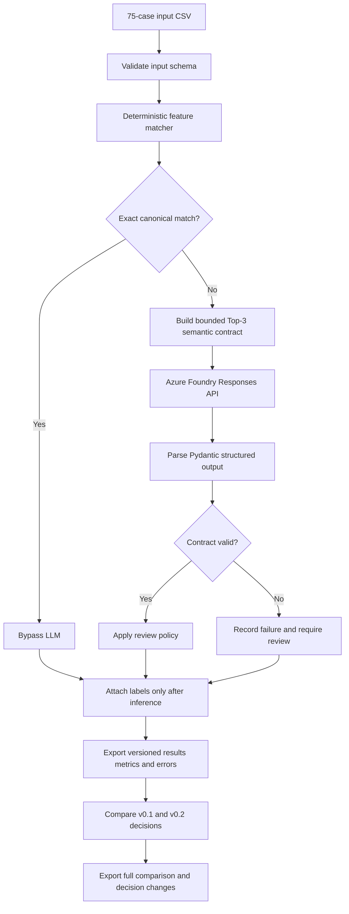

# T2-D11 directory consistency experiment

This experiment starts from the schema confirmed during Data Sourcing and saved in the
Analysis Artifact Repository (AAR). Production code must not import from this directory.

## Directory layout

- `functions/` contains reusable Python modules; its `tests/` subfolder contains their tests.
- `kb/` contains the directionality Knowledge Base and terminology YAML resources.
- `inputs/` contains the 75-case validation dataset and deliberately invalid test fixtures.
- `output/` contains generated baseline and semantic-challenger CSV results.
- `prompts/` remains a separate prompt-artifact area.
- `dir_consistency.ipynb` and `feature_matching_demo.ipynb` remain at the experiment root.
- `llm_semantic_adjudication_demo.ipynb` contains the first untuned LLM baseline workflow.
- `.env`, `requirements.txt`, and this README remain at the experiment root.

## Print the latest saved schema

From the workspace root:

```powershell
.\experiments\.venv\Scripts\python.exe `
  .\experiments\test-lab\t2_d11_dir_consistency\functions\extract_saved_schema.py
```

The command prints JSON to standard output so it can be inspected directly or passed to a future
agent. The projection contains the selected asset and snapshot, table metadata, and each column's
saved data type, classification, role, description, and AAR artifact identifier. Each column also
has a `profile` object containing its complete saved AAR payload. Depending on the column and the
profiling evidence available, this can include:

- total, non-null, null, distinct, regular-value, and effective-missing counts and shares;
- minimum, maximum, mean, variance, standard deviation, median, quartiles, IQR, MAD, skewness,
  kurtosis, zero/negative counts, and numeric parsing evidence;
- histograms, percentiles, top values, and distinct-set hashes; and
- declared and observed special values, their counts, and confirmation state.

The top-level schema fields remain available for simple consumers; `profile` is the lossless source
for profiling agents.

Use filters when the latest schema is not the desired one:

```powershell
.\experiments\.venv\Scripts\python.exe `
  .\experiments\test-lab\t2_d11_dir_consistency\functions\extract_saved_schema.py `
  --snapshot-id item_e741636c0d62 `
  --table Simulated_Data
```

The script honors the application's `SYSTEM_DB_PATH` and `ANALYSIS_ARTIFACT_DIR` environment
variables, allowing it to point at another local sandbox without changing the code.

## Build compact input for an agent

Use `--agent-input` to return a JSON array containing only the column context most useful to an
LLM: name, type, role, and saved description. It omits source, asset, snapshot, table, artifact
metadata, and profiling statistics by default.

Add `--include-statistics` only when profiling evidence is needed. Statistics are type-aware:

- Numeric and other non-string columns contain `summary_statistics` with range, quartiles, mean,
  standard deviation, counts, missingness, and cardinality.
- String columns contain `frequency_statistics` with counts, missingness, cardinality, mode, and a
  descending `values` list of retained AAR values with frequency and share. `values_are_top_k`
  indicates when that list is a bounded sample rather than the complete distinct set.

```powershell
.\experiments\.venv\Scripts\python.exe `
  .\experiments\test-lab\t2_d11_dir_consistency\functions\extract_saved_schema.py `
  --snapshot-id item_e741636c0d62 `
  --table Simulated_Data `
  --agent-input
```

In a notebook, call `build_agent_input` on the full extraction. Role matching is
case-insensitive:

```python
agent_input = extract_saved_schema.build_agent_input(
    schema,
    roles={"feature", "target"},
    include_statistics=True,
)
print(json.dumps(agent_input, indent=2))
```

The equivalent CLI filter is:

```powershell
.\experiments\.venv\Scripts\python.exe `
  .\experiments\test-lab\t2_d11_dir_consistency\functions\extract_saved_schema.py `
  --snapshot-id item_e741636c0d62 `
  --table Simulated_Data `
  --agent-input `
  --include-statistics `
  --roles feature target
```

Descriptions are never inferred. An empty description means the selected snapshot's active AAR
column profile did not retain a confirmed description. Summary values that do not apply to a
column type are represented as JSON `null`.

## Reference configuration

`functions/reference_configuration.py` provides the explicit reference-configuration boundary for
the Credit Risk Feature Directionality Diagnostic. This layer only selects and validates the
reference configuration. It does not transform an expected direction, calculate empirical
statistics, determine an observed direction, compare directions, invoke an LLM, or change the PD
Knowledge Base or semantic adjudication.

The public types are:

- `ReferenceType`: `TARGET` or `ANCHOR`.
- `ReferenceOrientation`: `HIGHER_IS_WORSE` or `HIGHER_IS_BETTER`.
- `ReferenceConfig`: an immutable configuration containing `variable`, `reference_type`, and
  `orientation`.
- `select_reference_config(column_metadata, target=..., anchor=...)`: deterministic selection from
  the saved column `name` and `role` metadata.
- `ReferenceSelectionError`: configuration/metadata selection failure.

`ReferenceConfig` requires a non-empty variable and enum instances for both type and orientation.
Orientation is always supplied by the caller. It is never inferred from a variable name,
correlation, feature behavior, or empirical statistic.

Selection follows these rules:

1. If metadata contains a `Target` role, the explicitly configured TARGET is selected.
2. If metadata has no TARGET, an explicitly configured ANCHOR is selected.
3. If metadata has a TARGET but no TARGET configuration, selection fails; it does not fall back to
   an ANCHOR.
4. If neither is available, selection fails.
5. A configured variable must be present in metadata, and a configured TARGET must have the
   `Target` role. Role comparison is case-insensitive; variable identity is exact.
6. When both configurations are supplied, only the TARGET participates if a TARGET role is
   available. TARGET and ANCHOR are not combined.

Use the columns from `extract_saved_schema()` directly:

```python
from functions.reference_configuration import (
    ReferenceConfig,
    ReferenceOrientation,
    ReferenceType,
    select_reference_config,
)

columns = schema["tables"][0]["columns"]

target_config = ReferenceConfig(
    variable="target_default_12m",
    reference_type=ReferenceType.TARGET,
    orientation=ReferenceOrientation.HIGHER_IS_WORSE,
)
reference = select_reference_config(columns, target=target_config)
```

For a dataset without a TARGET role, configure the fallback explicitly:

```python
anchor_config = ReferenceConfig(
    variable="rating",
    reference_type=ReferenceType.ANCHOR,
    orientation=ReferenceOrientation.HIGHER_IS_BETTER,
)
reference = select_reference_config(columns_without_target, anchor=anchor_config)
```

The names above do not determine their orientations; the enum values are deliberate caller
configuration. The requested logical examples `default_12` and `rating` are supported when those
exact variables occur in the supplied metadata. In the current saved real-data snapshot
`item_e243fa4e72f4`, the table is `mr_pd_sample` and its TARGET is named
`target_default_12m`, so that exact name must be configured for that snapshot.

Run the focused tests from this experiment folder:

```powershell
python -m pytest functions/tests/test_reference_configuration.py -q
```

## Python feature-to-KB matcher (v0.3 active resources)

`functions/feature_matching.py` is the notebook-development layer for mapping a column name and
optional description to the 49 canonical concepts in `kb/pd_directionality_kb_v0_3.yaml`. The
39-concept v0.2 KB remains preserved for historical reproduction. The matcher implements only
resource loading, terminology processing, deterministic matching, and candidate ranking. It does
not accept an NLP candidate, orient a target, calculate empirical directionality, compare empirical
and KB directions, call an LLM, or update the KB.

Install the experiment dependencies from the workspace root:

```powershell
.\experiments\.venv\Scripts\python.exe -m pip install `
  -r .\experiments\test-lab\t2_d11_dir_consistency\requirements.txt
```

The production application must not import this module. If the behavior is accepted, promote it by
implementing the contract under the production T2-D11 domain package.

### Public API

- `load_kb(path)` loads and lightly validates `feature_rules`, all eight required rule fields,
  supported optional fields, string-list shapes, and duplicate canonical names.
- `load_terminology(path)` validates the actual terminology sections while returning them as
  separate mappings. `ambiguous_abbreviations` is never merged into deterministic replacements.
- `normalize_text(value)` performs the shared base normalization.
- `process_terminology(value, terminology, context_text="")` exposes normalized text, expanded
  text, and unresolved ambiguity evidence for notebook inspection.
- `prepare_feature_matcher(kb, terminology)` preprocesses immutable terminology tables, KB text
  pieces, exact aliases, and KB comparison documents once for reuse. Batch matching uses this
  automatically; per-query TF-IDF fitting and scoring remain unchanged.
- `match_feature_to_kb(feature_name, feature_description, kb, terminology, top_n=3)` returns one
  structured exact/candidate/no-match result.
- `match_features_to_kb(feature_metadata, kb, terminology, top_n=3)` returns a pandas DataFrame.
  Input may be a DataFrame, one mapping, or an iterable of mappings. Set `include_details=True` to
  receive `(summary_dataframe, full_results)`.

The main internal helpers are `_read_yaml`, `_expand_terminology`, `_terminology_tables`,
`_replace_compounds`, `_duration_expansion`, `_rule_text_pieces`, `_exact_index`,
`_matching_document`, and `_rank_candidates`.

### Exact normalization sequence

The same functions process incoming names/descriptions and all KB matching fields:

1. Convert the value to Unicode NFKC and trim it.
2. Split acronym-to-word and lower-to-upper camel-case boundaries.
3. Split a letter followed by a number so `maxDpd24m` becomes `max Dpd 24m`; keep the compact
   number-unit token intact.
4. Convert `_` and `-` runs to spaces.
5. Convert remaining punctuation/separators to spaces without removing letters or digits.
6. Lowercase, collapse repeated whitespace, and trim.

Thus `CURRENT_LTV` becomes `current ltv`, `Debt-to-Income` becomes `debt to income`, and `4Q` or
`24M` remains available for duration interpretation.

### Exact terminology-expansion sequence

All expansions come from `kb/credit_risk_abbreviations_v0_2.yaml`; there is no Python abbreviation
dictionary.

1. Normalize the source text as above.
2. Normalize and apply complete-expression entries from `common_compound_terms`, longest first.
3. For each remaining complete token, preserve it unchanged if it occurs in
   `ambiguous_abbreviations`.
4. Interpret an unambiguous compact duration token (`12M`, `24M`, `3Q`, `5Y`, or `2W`) as a
   singular/plural duration.
5. Expand deterministic tokens in YAML guidance order: `domain_acronyms`,
   `standard_abbreviations`, `time_abbreviations`, `aggregation_abbreviations`,
   `transformation_abbreviations`, `consumer_credit_terms`, `mortgage_terms`,
   `commercial_credit_terms`, `cre_terms`, and `macroeconomic_terms`.
6. When a deterministic token appears in more than one section, the first section in that order is
   used. Every replacement is token/phrase bounded; unrestricted substring replacement is never
   performed.

Ambiguous terms remain literal in expanded text. Each result retains the YAML candidates and note,
plus a simple candidate-to-description token-overlap audit. All candidate meanings are added to the
NLP comparison text so the canonical layer can still retrieve a shared concept; none is selected as
the abbreviation's resolved meaning. For example, both meanings of `CLTV` remain present even when
`loan_to_value` ranks first.

### Matching and scoring

Exact matching uses only the processed feature name and runs before NLP against processed canonical
names, `representations`, and `inverse_representations`. An exact result records `canonical`,
`representation`, or `inverse_representation`. An inverse match is marked but the KB's expected
direction is not reversed.

When exact matching fails, the incoming comparison text is the processed name plus processed
description and any unresolved ambiguity candidate phrases. Each KB document is the processed
canonical name, definition, representations, and inverse representations. `rationale` is excluded.

- RapidFuzz score: `fuzz.token_set_ratio(incoming_text, kb_document) / 100`, in `[0, 1]`.
- TF-IDF score: cosine similarity between the query and each KB document, using word unigrams and
  bigrams, English stop words, and sublinear term frequency.
- Combined score: `0.5 * rapidfuzz_score + 0.5 * tfidf_cosine_score`.

The two non-negative weights are keyword-configurable and must sum to 1.0. Results retain both
component scores, the combined score, rank, best individual KB text, evidence source, top-1, top-2,
and their gap. There is no acceptance or escalation threshold. `candidate_match` means only that at
least one TF-IDF vocabulary term overlaps; `no_match` means there is no lexical evidence at all.
Top-N rankings are still retained for a `no_match` audit, and candidate number 1 is never promoted to
a deterministic match.

Expected direction and Knowledge Strength are copied verbatim from the KB rule attached to each
candidate. Terminology processing and NLP scoring never derive or alter them.

### Jupyter example and requested cases

The runnable notebook [`feature_matching_demo.ipynb`](feature_matching_demo.ipynb) contains the same
workflow. From a notebook whose working directory is this experiment folder:

```python
from pathlib import Path

from functions.feature_matching import load_kb, load_terminology, match_features_to_kb

HERE = Path.cwd()
kb = load_kb(HERE / "kb" / "pd_directionality_kb_v0_3.yaml")
terminology = load_terminology(HERE / "kb" / "credit_risk_abbreviations_v0_2.yaml")

cases = [
    {"feature_name": "CURRENT_LTV", "description": ""},
    {"feature_name": "credit_utilization", "description": ""},
    {"feature_name": "DSCR", "description": ""},
    {"feature_name": "VACANCY_RATE", "description": ""},
    {"feature_name": "MTH_SINCE_DLQ", "description": "Number of months since most recent delinquency"},
    {"feature_name": "REV_CR_BAL_PCT_AVAIL", "description": "Percentage of available revolving credit currently drawn"},
    {"feature_name": "MAX_DPD_24M", "description": "Maximum days past due observed during the previous 24 months"},
    {"feature_name": "CNT_DLQ_12M", "description": "Number of delinquency events during the previous 12 months"},
    {"feature_name": "DEBT_TO_ASSETS", "description": "Total debt divided by total assets"},
    {"feature_name": "CLTV", "description": "Current outstanding mortgage balance divided by current property value"},
    {"feature_name": "CLTV", "description": "Combined first and second lien balances divided by current property value"},
    {"feature_name": "RANDOM_VAR_X", "description": ""},
]

results, details = match_features_to_kb(cases, kb, terminology, include_details=True)
display(results.drop(columns="candidates"))
```

Observed with RapidFuzz 3.14.6 and the experiment environment (scores are rounded to six decimals):

| Input feature | Processed feature text | Status | Top candidate | Score | Second candidate | Score | Gap | Source/type |
| --- | --- | --- | ---: | ---: | --- | ---: | ---: | --- |
| `CURRENT_LTV` | current loan to value | exact_match | loan_to_value | 1.000000 | — | — | — | representation |
| `credit_utilization` | credit utilization | exact_match | utilization | 1.000000 | — | — | — | representation |
| `DSCR` | debt service coverage ratio | exact_match | debt_service_coverage | 1.000000 | — | — | — | representation |
| `VACANCY_RATE` | vacancy rate | exact_match | property_occupancy | 1.000000 | — | — | — | inverse_representation |
| `MTH_SINCE_DLQ` | months since delinquency + description | exact_match | delinquency_recency | 1.000000 | — | — | — | representation |
| `REV_CR_BAL_PCT_AVAIL` | revolving cr balance percentage available + description | candidate_match | utilization | 0.537152 | property_occupancy | 0.301322 | 0.235830 | representation |
| `MAX_DPD_24M` | maximum days past due 24 months + description | candidate_match | delinquency_severity | 0.338255 | delinquency_recency | 0.257542 | 0.080713 | representation |
| `CNT_DLQ_12M` | count delinquency 12 months + description | candidate_match | delinquency_frequency | 0.460691 | delinquency_recency | 0.343862 | 0.116829 | representation |
| `DEBT_TO_ASSETS` | debt to assets + description | exact_match | financial_leverage | 1.000000 | — | — | — | representation |
| `CLTV` (current description) | cltv + description | candidate_match | loan_to_value | 0.555183 | debt_yield | 0.410436 | 0.144747 | normal/canonical |
| `CLTV` (combined-liens description) | cltv + description | candidate_match | loan_to_value | 0.476695 | property_value_growth | 0.349884 | 0.126811 | normal/canonical |
| `RANDOM_VAR_X` | random variance x | no_match | debt_yield (unaccepted) | 0.128713 | rental_growth | 0.127451 | 0.001262 | representation |

`MTH_SINCE_DLQ` and `DEBT_TO_ASSETS` resolve deterministically because the v0.2 terminology and KB
representations provide exact processed aliases. `cr` in `REV_CR_BAL_PCT_AVAIL` and `cltv` remain
explicitly unresolved because both are listed as ambiguous in the terminology YAML.

Run verification from this folder:

```powershell
..\..\.venv\Scripts\python.exe -m pytest -q -p no:cacheprovider functions\tests
```

## Baseline validation harness (75 labelled cases)

`functions/feature_matching_validation.py` evaluates the existing matcher against
`inputs/feature_matching_validation_v0_1.csv`. The matcher implementation, similarity weights, KB, and
terminology resources are unchanged. The existing `feature_matching_demo.ipynb` has been expanded
in place to run this workflow; no second validation notebook is used. Its final cell writes the
compact row-level evaluation to `output/feature_matching_validation_results_v0_1.csv` (75 rows and 22 flat
columns) instead of rendering the full table as a notebook display.

The leakage boundary is explicit: `run_validation()` first projects the validation data to only
`feature_name` and `description`, calls `match_feature_to_kb()` using those values, and joins the
result rows back to ground truth afterward. Blank `expected_canonical_feature` values remain blank
and represent expected `no_match` cases.

Reusable validation functions:

- `load_validation_dataset(path)` validates the six-column labelled CSV contract.
- `run_validation(validation, kb, terminology, top_n=3)` returns the detailed evaluation DataFrame
  and complete matcher results.
- `overall_validation_summary(evaluation)` calculates retrieval, exact-match, no-match, and inverse
  metrics.
- `performance_by_category(evaluation)` reports Top-1, Top-3, and applicable no-match performance.
- `error_analysis_tables(evaluation)` returns incorrect Top-1, Top-3 recovery, missing Top-3,
  false-match, wrong-exact, and inverse-error DataFrames.
- `score_distribution_summary(evaluation)` describes combined scores and score gaps for correct,
  incorrect, and expected-no-match groups.
- `validate_feature_matcher(...)` assembles all notebook-ready artifacts in one call.
- `compact_evaluation_output(evaluation)` builds the stable 22-column CSV projection, and
  `compare_validation_outputs(previous, current)` reports schema, row, or value deviations before
  the notebook replaces the prior results file.

### Matching-performance optimization

The matcher now prepares terminology and the 39-concept KB corpus once per batch instead of once
per feature and once again during NLP ranking. This is a preprocessing/lifecycle change only:
normalization, exact-match priority, ambiguity handling, per-query TF-IDF fitting, RapidFuzz,
weights, ranking, tie-breaking, statuses, and result structures are unchanged.

On the 75-case validation set, the optimized validation run completed in 1.281 seconds. Comparing
all 75 rows and all 22 exported columns with the previously generated CSV found zero deviations.
The same 10-case batch used during diagnosis improved from 11.968 seconds to 0.078 seconds (about
154x on this machine).

### Untuned baseline results

| Measure | Result |
| --- | ---: |
| Expected match cases | 64 |
| Top-1 correct / accuracy | 62 / 96.875% |
| Top-3 correct / accuracy | 64 / 100.000% |
| Deterministic exact correct / accuracy | 18 of 18 / 100.000% |
| Expected no-match correct / accuracy | 4 of 11 / 36.364% |
| False matches / rate | 7 / 63.636% |
| Inverse identification correct / accuracy | 4 of 6 / 66.667% |

Category results:

| Category | Cases | Top-1 | Top-1 accuracy | Top-3 | Top-3 accuracy | No-match accuracy |
| --- | ---: | ---: | ---: | ---: | ---: | ---: |
| abbreviated | 15 | 14 | 93.333% | 15 | 100.000% | — |
| ambiguous | 5 | 4 of 4 matchable | 100.000% | 4 of 4 | 100.000% | 0 of 1 |
| description_assisted | 15 | 15 | 100.000% | 15 | 100.000% | — |
| easy | 10 | 10 | 100.000% | 10 | 100.000% | — |
| inverse_representation | 5 | 5 | 100.000% | 5 | 100.000% | — |
| out_of_kb | 10 | — | — | — | — | 4 of 10 / 40.000% |
| related_concepts | 15 | 14 | 93.333% | 15 | 100.000% | — |

The two incorrect Top-1 cases are `DTI_CURR` and `MONTHLY_DEBT_INC`: both rank
`income_capacity` first and recover the expected `debt_service_burden` second. No expected concept
is missing from Top-3 and there are no wrong deterministic exact matches.

Seven expected no-match cases return `candidate_match`: `RR_METRIC`, `BORROWER_ZIP_CODE`,
`PROPERTY_TYPE`, `LOAN_PURPOSE`, `INDUSTRY_CODE`, `CURRENCY_CODE`, and `ORIGINATION_CHANNEL`.
The two inverse errors are `RENT_UNCOLLECTED_PCT` and `RR_SCORE`; both retrieve the correct canonical
feature but the current matcher reports same-orientation evidence.

Score distributions are descriptive only:

| Group | Metric | Count | Min | P25 | Median | P75 | Max | Mean |
| --- | --- | ---: | ---: | ---: | ---: | ---: | ---: | ---: |
| Correct Top-1 | combined | 62 | 0.323326 | 0.489636 | 0.593814 | 1.000000 | 1.000000 | 0.671417 |
| Correct Top-1 | gap | 44 | 0.064325 | 0.114529 | 0.158788 | 0.244115 | 0.363412 | 0.179525 |
| Incorrect Top-1 | combined | 2 | 0.496480 | 0.519883 | 0.543285 | 0.566688 | 0.590090 | 0.543285 |
| Incorrect Top-1 | gap | 2 | 0.025301 | 0.041261 | 0.057221 | 0.073181 | 0.089141 | 0.057221 |
| Expected no-match | combined | 11 | 0.128713 | 0.219826 | 0.268649 | 0.285809 | 0.321704 | 0.248962 |
| Expected no-match | gap | 11 | 0.001253 | 0.005933 | 0.010270 | 0.034327 | 0.069573 | 0.022829 |

Observed systematic patterns, without tuning: income-focused text can outweigh the intended
debt-to-income burden concept; generic descriptive words create lexical evidence for several
out-of-KB fields; and semantic inversion expressed only in a description is not reliably recognized
unless an inverse KB representation itself supplies the best evidence. These observations do not
establish thresholds or justify matcher changes yet.

## Sentence-embedding challenger experiment

`functions/semantic_feature_matching.py` implements a separate challenger; it does not modify or combine
scores with `functions/feature_matching.py`. The selected model is
[`sentence-transformers/all-MiniLM-L6-v2`](https://huggingface.co/sentence-transformers/all-MiniLM-L6-v2),
used through Sentence Transformers 5.7.0 and CPU PyTorch 2.13.0. It is a compact established English
semantic-similarity/search model producing 384-dimensional embeddings.

The semantic input is the existing terminology-expanded feature name, the processed description,
and every unresolved ambiguous candidate meaning (without choosing one). Each canonical document
contains only its processed canonical name, definition, representations, and inverse
representations. Direction, Knowledge Strength, rationale, and risk-outcome language are excluded.

`build_semantic_index()` encodes the 39 canonical documents once and stores their L2-normalized
embeddings in memory. The 75 query texts are encoded in one batch. Ranking is normalized query
matrix multiplied by the normalized KB matrix, which is cosine similarity. RapidFuzz, TF-IDF, and
baseline combined scores do not participate. The primary challenger preserves the existing exact
alias layer; embedding-only rankings for all 75 cases are retained as separate diagnostic columns.

The leakage barrier projects validation data to only `feature_name` and `description` before the
semantic matcher runs. Labels and the baseline CSV are attached afterward.

### Challenger baseline results

| Measure | Baseline lexical | Semantic challenger |
| --- | ---: | ---: |
| Top-1 accuracy | 62/64 (96.875%) | 54/64 (84.375%) |
| Top-3 accuracy | 64/64 (100.000%) | 62/64 (96.875%) |
| Exact accuracy | 18/18 (100.000%) | 18/18 (100.000%) |
| No-match accuracy | 4/11 (36.364%) | 0/11 (0.000%); no threshold applied |
| Inverse accuracy | 4/6 (66.667%) | 4/6 (66.667%) |
| Embedding-only Top-1 | — | 53/64 (82.8125%) |
| Embedding-only Top-3 | — | 61/64 (95.3125%) |

| Category | Challenger Top-1 | Challenger Top-3 | No-match |
| --- | ---: | ---: | ---: |
| easy | 10/10 (100.000%) | 10/10 (100.000%) | — |
| abbreviated | 12/15 (80.000%) | 14/15 (93.333%) | — |
| description_assisted | 13/15 (86.667%) | 15/15 (100.000%) | — |
| related_concepts | 11/15 (73.333%) | 14/15 (93.333%) | — |
| inverse_representation | 5/5 (100.000%) | 5/5 (100.000%) | — |
| ambiguous | 3/4 matchable (75.000%) | 4/4 (100.000%) | 0/1 |
| out_of_kb | — | — | 0/10 |

The challenger did not repair either previous lexical failure. `DTI_CURR` ranked `debt_yield`,
then `income_capacity`, with expected `debt_service_burden` third. `MONTHLY_DEBT_INC` again ranked
`income_capacity`, with expected `debt_service_burden` second. It correctly identified
`MAX_DPD_24M` as severity and the exact layer preserved `MTH_SINCE_DLQ` as recency, but
`CNT_DLQ_12M` ranked recency ahead of frequency.

There are 19 baseline/challenger Top-1 disagreements. The challenger improved none of the two
baseline errors and degraded eight previously correct matchable cases: `CNT_DLQ_12M`, `PTI_ORIG`,
`CAPACITY_TREND`, `COV_METRIC_B`, `NUM_MISSED_PMTS_24M`, `NOI_DSCR`, `TOTAL_DEBT_ASSETS`, and one
`CLTV` case. Expected concepts were absent from the challenger Top-3 for `PTI_ORIG` and
`TOTAL_DEBT_ASSETS`. The remaining disagreement rows are expected no-match cases where both methods
produce different unaccepted nearest candidates; all 19 are retained in the notebook and CSV.

Embedding-only Top-1 cosine scores had medians of 0.623513 for correct matchable cases, 0.522948 for
incorrect matchable cases, and 0.248924 for expected no-match cases. Median Top-1/Top-2 gaps were
0.142804, 0.022203, and 0.022923 respectively. Scores overlap, particularly incorrect matches and
no-match cases, so this experiment records distributions without setting a threshold.

The executed challenger workflow is appended to `feature_matching_demo.ipynb`. Its review artifact,
`output/feature_matching_semantic_challenger_results_v0_1.csv`, contains all 75 rows, ground truth,
challenger Top-3 candidates and cosine scores, embedding-only diagnostics, baseline predictions,
correctness flags, and disagreement classifications.

## Semantic adjudication contract

`functions/semantic_adjudication_contract.py` defines a model-provider-independent boundary for any future
semantic adjudicator. It does not call an LLM and does not expose direction expectations, Knowledge
Strength, KB rationale, matcher scores, outcome statistics, target data, or anchor data.

The input contains one `InputFeature` and one to three unique `Candidate` objects. The output contains
exactly `decision`, `selected_candidate`, `representation_orientation`, and `reason`; undeclared
fields are rejected. `MATCH` requires both a supplied candidate and an orientation (`SAME`, `INVERSE`,
or `UNDETERMINED`). Every non-match decision requires both fields to be null. Reasons must be
non-empty. After structural validation, `validate_adjudication_result()` rejects any selected
candidate not present in the input.

`determine_review_required()` is deliberately separate system policy. In the MVP, known deterministic
exact matches need no review, every semantic adjudication requires review, and unknown sources default
to review. A future model cannot set its own review status.

## Untuned GPT-5.4-mini adjudication baseline

`functions/llm_semantic_adjudication.py` loads the selected fixed, versioned prompt resource verbatim,
builds a case message containing
only the adjudication input contract, and calls the OpenAI Responses API with Pydantic Structured
Outputs. Application-side `validate_adjudication_result()` remains authoritative. API responses are
requested with `store=False`; no secrets or chain-of-thought are written to audit artifacts.
The configured Azure/Foundry endpoint is normalized to its `/openai/v1/` SDK base route—even when
Foundry supplies the complete `/openai/v1/responses` URL—with the configured deployment name passed
as the model identifier.

`functions/llm_semantic_adjudication_validation.py` keeps matching/inference separate from label
attachment. Exact deterministic matches bypass the LLM. Every other case receives the matcher Top-3
candidate concepts without similarity scores, directions, rationale, statistics, targets, or labels.
Every LLM-routed case is marked for user review, including API and contract failures.

The existing CSV has match/no-match and orientation labels but no four-way adjudication-decision
column. For reporting only—and only after inference—the baseline derives the transparent decision
rubric: expected matches are `MATCH`; a no-match case without a description is
`INSUFFICIENT_CONTEXT`; `RR_METRIC` is `NO_CANDIDATE_MATCH`; the remaining described nominal/code
no-match cases are `NOT_DIRECTIONAL`. The source validation labels are not changed.

### Implemented enhancements

- **Versioned adjudication:** v0.1 remains reproducible, while v0.2 adds explicit decision precedence
  and is selected with `--experiment-version`. Outputs record the experiment, prompt, contract,
  model, and deployment metadata used for each run.
- **Stable model boundary:** the model receives only the raw feature name and description plus the
  bounded candidate set. Matcher scores, matcher direction, rationale, statistics, expected labels,
  and evaluation columns remain outside the prompt.
- **Secure Azure Foundry integration:** credentials are read from environment variables; the endpoint
  is normalized whether configured as the service root or the full `/openai/v1/responses` URL;
  Pydantic validates Structured Outputs; and requests use `store=False`.
- **Deterministic routing:** exact matches bypass the model. Only unresolved semantic cases are sent
  for adjudication, candidate selection is restricted to the supplied candidates, and invented or
  invalid selections fail validation.
- **Auditable evaluation:** row-level results retain the input contract, candidate set, structured
  response, validation status, review flag, and error details. Metrics, errors, full comparisons, and
  isolated decision changes are exported as separate CSV artifacts.
- **Regression controls:** the comparison workflow confirms unchanged matcher routing and Top-3
  candidates, distinguishes intended decision changes from regressions, and preserves the original
  v0.1 notebook workflow.

### Processing flow



### Versioned audit artifacts

| Artifact | Purpose |
| --- | --- |
| `output/llm_semantic_adjudication_results_v0_1.csv` | Preserved row-level v0.1 baseline |
| `output/llm_semantic_adjudication_metrics_v0_1.csv` | v0.1 aggregate performance metrics |
| `output/llm_semantic_adjudication_errors_v0_1.csv` | v0.1 errors and review exceptions |
| `output/llm_semantic_adjudication_results_v0_2.csv` | Row-level v0.2 challenger results |
| `output/llm_semantic_adjudication_metrics_v0_2.csv` | v0.2 aggregate performance metrics |
| `output/llm_semantic_adjudication_errors_v0_2.csv` | v0.2 errors and review exceptions |
| `output/llm_semantic_adjudication_comparison_v0_1_v0_2.csv` | Side-by-side comparison of all 75 cases |
| `output/llm_semantic_adjudication_decision_changes_v0_1_v0_2.csv` | Isolated decision changes for review |
| `output/llm_semantic_adjudication_results_v0_2_kb_v0_3.csv` | 75-case v0.2-prompt results using KB v0.3 |
| `output/llm_semantic_adjudication_metrics_v0_2_kb_v0_3.csv` | Aggregate metrics for the 75-case KB v0.3 run |
| `output/llm_semantic_adjudication_errors_v0_2_kb_v0_3.csv` | Focused review exceptions for the KB v0.3 run |
| `output/llm_semantic_adjudication_kb_comparison_v0_2_v0_3.csv` | All 75 cases compared across KB versions |
| `output/directionality_results_item_d982dc3d4a34_kb_v0_3.csv` | Independent-data v0.3 results for 23 eligible columns |
| `output/directionality_kb_comparison_item_d982dc3d4a34_v0_2_v0_3.csv` | Full independent-data KB comparison |
| `output/directionality_kb_changes_item_d982dc3d4a34_v0_2_v0_3.csv` | Changed independent-data outcomes only |

### Verification status

- 69 automated tests pass without requiring a live model call.
- The 75-case audit confirms identical matcher routing and Top-3 candidates between v0.1 and v0.2.
- All nine decision changes are the intended `NO_CANDIDATE_MATCH` to `NOT_DIRECTIONAL`
  corrections; no unrelated decision regressions were observed.
- The v0.2 live run completed with 57 valid LLM responses, zero API failures, zero invalid structured
  outputs, and zero invented candidates.

Run the local regression suite from this experiment folder with:

```powershell
..\..\.venv\Scripts\python.exe -m pytest -q -p no:cacheprovider functions\tests
```

Run the live baseline from this experiment folder:

```powershell
..\..\.venv\Scripts\python.exe -m functions.run_llm_adjudication_baseline --experiment-version v0_2 --kb-version v0_3
```

Live semantic adjudications use bounded concurrency (four simultaneous requests by default) and
an append-only checkpoint under `.runtime/`. Only successful responses that pass the application
contract are checkpointed. A rerun revalidates and reuses those responses while retrying missing,
failed, or invalid cases. Change the request bound with `--max-concurrency`; use `--checkpoint` to
select a different checkpoint file. The notebook configures the same behavior with
`MAX_CONCURRENCY` and `checkpoint_path`.

Prompt/contract version and KB version are independent. Use `--kb-version v0_2` for historical KB
reproduction, or `--experiment-version v0_1` to select the original prompt and contract.

The command writes the row-level human-review artifact, metrics, and combined error tables under
`output/`. Automated tests mock the external API and do not require network access or credentials.

## Empirical directionality evidence v0.1

Step 2 is implemented in `functions/empirical_directionality.py` under the frozen contract documented
in `EMPIRICAL_EVIDENCE_CONTRACT.md`. Pearson, Spearman, univariate regression, and quantile-bin
evidence remain separate in the result. The deterministic synthesis distinguishes increasing,
decreasing, non-monotonic, weak/no relationship, conflicting, insufficient, and not-applicable
states; it is not a majority vote.

The approved integration run explicitly uses `default_12m` as a binary `HIGHER_IS_WORSE` reference.
It excludes physical nulls and metadata-confirmed special values (including confirmed `-999`
sentinels) from paired observations. It does not infer special values from magnitude.

Run the integration from this experiment folder with:

```powershell
..\..\.venv\Scripts\python.exe -m functions.run_empirical_evidence
```

The `item_d982dc3d4a34` run produced 23 feature results: 8 decreasing, 3 increasing, 6 weak/no
relationship, and 6 not applicable. No result was conflicting, non-monotonic, or insufficient under
the recorded v0.1 thresholds. Excluding confirmed special values was material: including `-999` as
a real numerical value created artificial global-versus-rank conflicts for DSCR, debt yield, and
occupancy.

Continuous references are also supported. Pearson and Spearman remain unbinned; the regression is
standardized univariate linear regression, while quantile bins retain raw reference means and use
scale-independent standard-deviation materiality thresholds. Reference type, kind, and orientation
must all be explicit. An `ANCHOR` is accepted only when the saved schema has no `TARGET`, preserving
the frozen target-first selection rule.

The continuous proof of concept uses net interest margin as a separate `HIGHER_IS_BETTER` target:

```powershell
..\..\.venv\Scripts\python.exe -m functions.run_empirical_evidence `
  --reference net_interest_margin `
  --reference-kind CONTINUOUS `
  --reference-orientation HIGHER_IS_BETTER `
  --run-purpose proof_of_concept
```

This run demonstrates continuous cleaning, correlation, standardized linear regression, quantile
binning, evidence synthesis, and audit serialization. Its feature signs are not interpreted as
economic findings and should not enter expected-versus-observed adjudication. A genuine LGD target
or approved anchor must be configured for that purpose.

An additional proof of concept uses `rating` as a continuous `HIGHER_IS_BETTER` anchor. Because the
snapshot contains saved targets, this requires the explicit
`--allow-anchor-with-target-for-poc` switch and is recorded as a target-first-rule bypass. The
reference column is excluded from its own feature analysis. An exploratory—not formal Step 3—review
found agreement for all eight features having increasing/decreasing economic priors, seven features
with no directional prior, six not-applicable features, and one expected non-monotonic shape
(`months_on_book`) not confirmed by the global rating relationship.

| Artifact | Purpose |
| --- | --- |
| `output/empirical_evidence_item_d982dc3d4a34_default_12m_v0_1.csv` | Review-friendly component statistics and observed states |
| `output/empirical_evidence_item_d982dc3d4a34_default_12m_v0_1.json` | Full evidence, bin details, reasons, and threshold audit record |
| `output/empirical_evidence_item_d982dc3d4a34_net_interest_margin_v0_1.csv` | Review-friendly continuous-NIM component evidence |
| `output/empirical_evidence_item_d982dc3d4a34_net_interest_margin_v0_1.json` | Full continuous-NIM evidence and threshold audit record |
| `output/empirical_evidence_item_d982dc3d4a34_rating_v0_1.csv` | Continuous higher-is-better rating-anchor evidence |
| `output/empirical_evidence_item_d982dc3d4a34_rating_v0_1.json` | Full rating-anchor evidence and explicit proof-of-concept bypass metadata |
| `output/exploratory_economic_review_item_d982dc3d4a34_rating_v0_1.csv` | Non-formal expected-versus-rating review |

The final notebook section overlays these components per feature. For continuous references it shows
a sampled raw Pearson scatter cloud, empirical quantile-bin means, the fitted linear relationship,
and the symbolic expected sign. For binary references it replaces the raw two-band scatter with the
more useful fitted logistic probability curve. Pearson, Spearman, and regression coefficients and
p-values are printed in each panel; Spearman remains an annotation because it is a rank statistic,
not a separate fitted line.

### First untuned baseline results

The 75-case GPT-5.4-mini baseline ran on 2026-08-31 with the fixed v0.1 prompt and contract. Eighteen
deterministic exact matches bypassed the LLM and 57 cases were adjudicated. All 57 API responses
passed both Structured Outputs parsing and application contract validation; there were no invented
candidates, invalid structured outputs, or API failures.

| Measure | Result |
| --- | ---: |
| Canonical-feature accuracy | 64/64 (100%) |
| LLM-adjudicated expected-match accuracy | 46/46 (100%) |
| Expected no-match rejection accuracy | 11/11 (100%) |
| Orientation accuracy | 64/64 (100%) |
| Contract compliance | 57/57 (100%) |
| Insufficient-context accuracy | 1/1 (100%) |
| NOT_DIRECTIONAL accuracy under the documented supplemental rubric | 0/9 (0%) |

The two prior Python Top-1 errors, `DTI_CURR` and `MONTHLY_DEBT_INC`, were both corrected by selecting
Python candidate #2 (`debt_service_burden`). No case selected candidate #3. `RENT_UNCOLLECTED_PCT`
matched `rent_collection` with `INVERSE` orientation, and `RR_SCORE` matched
`credit_quality_score` with `INVERSE` orientation.

The main untuned failure pattern is decision taxonomy rather than canonical selection: the nine
described nominal/code no-match cases were correctly rejected but classified as
`NO_CANDIDATE_MATCH`, not `NOT_DIRECTIONAL`. `RR_METRIC` was also correctly rejected as
`NO_CANDIDATE_MATCH`, while `RANDOM_VAR_X` was correctly classified `INSUFFICIENT_CONTEXT`.
These outcomes are recorded without prompt, matcher, KB, terminology, weight, or label changes.

### v0.2 decision-precedence experiment

`prompts/semantic_feature_adjudication_v0_2.txt` preserves the v0.1 controls and adds one controlled
clarification: apply `INSUFFICIENT_CONTEXT`, then `NOT_DIRECTIONAL`, then candidate matching in that
order. The Pydantic schema, decisions, orientations, matcher, Top-3 candidates, KB, terminology,
model, review policy, data, and labels are unchanged. v0.1 remains available and reproducible.

| Measure | v0.1 | v0.2 | Change |
| --- | ---: | ---: | ---: |
| Canonical-feature accuracy | 64/64 (100%) | 64/64 (100%) | 0 |
| LLM-adjudicated match accuracy | 46/46 (100%) | 46/46 (100%) | 0 |
| Decision-taxonomy accuracy | 66/75 (88%) | 75/75 (100%) | +9 |
| Expected no-match rejection | 11/11 (100%) | 11/11 (100%) | 0 |
| Orientation accuracy | 64/64 (100%) | 64/64 (100%) | 0 |
| Contract compliance | 57/57 (100%) | 57/57 (100%) | 0 |
| API failures | 0 | 0 | 0 |
| Candidate #2 selections | 2 | 2 | 0 |
| Candidate #3 selections | 0 | 0 | 0 |

Exactly nine decisions changed: `BORROWER_ZIP_CODE`, `CUSTOMER_ID`, `PROPERTY_TYPE`, `STATE_CODE`,
`LOAN_PURPOSE`, `INDUSTRY_CODE`, `BRANCH_ID`, `CURRENCY_CODE`, and `ORIGINATION_CHANNEL` changed
from `NO_CANDIDATE_MATCH` to `NOT_DIRECTIONAL`. All nine are classified as intended taxonomy
corrections; there were no regressions or other decision changes.

`RR_METRIC` remained `NO_CANDIDATE_MATCH`, and `RANDOM_VAR_X` remained
`INSUFFICIENT_CONTEXT`. `DTI_CURR` and `MONTHLY_DEBT_INC` remained candidate-#2 matches to
`debt_service_burden`; `RENT_UNCOLLECTED_PCT` remained an inverse `rent_collection` match; and
`RR_SCORE` remained an inverse `credit_quality_score` match.
