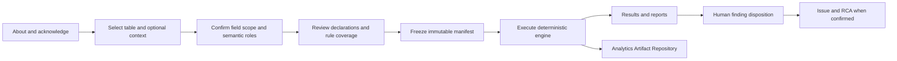

# T2 D08 Value Semantics

**Status:** Production workflow  
**Framework location:** Test 2, Diagnostic 8  
**Methodology:** Value Semantics KB v0.2; terminology v0.3; engine v1.0.0  
**Primary contract:** `docs/diagnostics/value-semantics/contract.md`

This diagnostic explains when a populated or missing value should not be interpreted as an ordinary data-quality defect. It assigns three governed, non-destructive cell tags:

- `CENSORED`: the value is not yet final because the required future window or process is incomplete;
- `STALE_FROZEN`: the value is a declared sentinel, or did not change when governed evidence says it should have changed;
- `NOT_APPLICABLE`: the field does not apply to the row under a confirmed business rule.

The diagnostic never edits or imputes source data. `NO_TAG`, `UNCLASSIFIED`, and `UNSCOPED` are coverage outcomes, not additional tags. A cell with no tag is not certified as valid.

## Start here: intended use

Run Value Semantics before treating blanks, sentinels, static values, or conditional values as generic completeness defects. It is useful when preparing credit-risk or other longitudinal data for profiling, model development, monitoring, issue investigation, or downstream diagnostics.

The user does not need to declare the dataset as PD, LGD, or EAD. Every run begins in **General / unspecified** context. The user may optionally confirm one or more contexts when they know the intended use; context improves explanations and prioritisation but does not turn rules on or off. Rules are routed from confirmed semantic roles and their declared prerequisites.

This means general-purpose data can be assessed before its final analytical use is known. The result distinguishes:

- rules that executed;
- cells that were assessed but received no tag;
- fields with no confirmed semantic role (`UNCLASSIFIED`);
- rules that could not execute because roles or declarations were absent (`UNSCOPED`).

The Test Lab journey opens with this explanation and requires acknowledgement before the manifest can be frozen. The information page can be reopened at any time.

## User journey

1. **About** — understand the three tags, coverage outcomes, intended use, and limitations.
2. **Data and context** — confirm the snapshot/table and optionally select PD, LGD, EAD, or another context.
3. **Role bindings** — include fields and confirm the business meaning assigned to each one. Unique exact deterministic matches can be accepted automatically. All other candidates, including AI proposals, require explicit user confirmation.
4. **Rules and launch** — review required declarations, runnable and unscoped routes, KB versions, inference disclosure, and blockers; then freeze and launch.
5. **Results** — review the action summary, tag counts, field/rule coverage, grouped issue candidates, downloadable reports, and governed artifacts.
6. **Disposition** — a user may confirm or dismiss a candidate finding with rationale. No issue is created automatically. Confirmed issues enter the existing RCA workflow.



## Semantic role and rule model

The active KB defines 36 canonical semantic roles. Examples include `period`, `forward_labels`, `outcome_state`, `realisation_fields`, `default_event`, `drawn_balance`, `undrawn_commitment`, `credit_limit`, and `conversion_factor`.

The processing boundary is deliberately split:

1. dictionary evidence is normalised using terminology and abbreviations;
2. each selected physical field is bound to one or more canonical roles;
3. deterministic implications are expanded (`realisation_fields` also implies `outcome_values`);
4. every KB entry whose target role is confirmed is considered;
5. required related roles and runtime declarations are checked;
6. ready entries execute and missing prerequisites are reported as `UNSCOPED`;
7. competing cell claims are resolved using the KB precedence contract;
8. sparse tags and an exhaustive assessment ledger are stored separately.

Optional PD/LGD/EAD context never suppresses an otherwise applicable rule. There is no “run all rules” switch: rules without a target field cannot produce meaningful cell results, and pretending they ran would hide coverage gaps.

## Matching and AI boundary

Matching is exact-first and deterministic by default. Business name, description, data type, allowed values, structural role, and expanded terminology provide evidence.

- A unique exact match can become a confirmed binding and is visibly labelled with its evidence.
- Ranked non-exact candidates remain proposals until the user confirms a role.
- Optional AI adjudication is invoked only when the user requests it. Ask AI appears only for fields
  whose role status is Confirmation required. One batch action reviews all unresolved eligible fields
  sequentially and retains progress per field. Deterministic exact, human-confirmed, and confirmed
  Not applicable fields are excluded until the user explicitly reopens their decision.
- AI receives dictionary metadata and the bounded role catalog, not source rows.
- Structured output is schema- and catalog-validated. Up to three bounded catalog-expansion passes
  are allowed when the model requests definitions for plausible roles outside the initial subset.
- Every outcome is displayed: proposed role(s), no applicable role, ambiguity, insufficient
  context, or provider failure. Proposed roles have an explicit confirmation action. No-match
  explanations can prefill a Not applicable reason, but never confirm it automatically.
- A rerun of the same immutable snapshot reuses a prior successful field inference when the table,
  field metadata, KB/terminology versions, prompt and structured contract are unchanged. The new
  manifest and inference disclosure reference the source run/event and report zero new provider calls.
  Reused output remains advisory and requires a fresh human confirmation in the new run.
- Failed or invalid responses are never reused. A new or materially changed field has no reusable
  identity and exposes Ask AI for an explicit request. Completed reviews are not offered for repeat
  submission; changing the data creates a new snapshot and therefore a new inference identity.

### Field scope versus Not applicable

- Unchecked **Include** means outside this run's execution scope. It is not a statement that no role applies.
- The **Not applicable** pill opens a required reason (up to 2,000 characters) for human confirmation
  that no governed role fits the field. Confirmation clears its binding and excludes it from execution.
- **Reopen review** removes the current applicability decision and leaves the field unselected for
  review. A confirmed exact or manual role also offers **Reopen role review**. Ask AI becomes available
  only if that field has no completed reusable review; otherwise the prior result remains visible for
  confirmation. Confirming a new role includes the field again. Changes remain attributable in the
  run decision log.
- Reason, confirming user/time, and available AI evidence are frozen with the manifest. All fields,
  including ordinarily excluded ones, appear in `field_scope_decisions` in the compact results,
  AAR bindings/report JSON, results view, and downloadable PDF/text report. The JSON artifacts are
  indexed by all reviewed fields; cell-tag and ledger artifacts remain indexed by execution scope.
- This field-level decision does **not** create `NOT_APPLICABLE` cell tags, increase cell counts,
  certify data quality, or create issues. Cell tags still require executed KB rules.
- Draft decisions save immediately. AAR artifacts and downloads are produced when the diagnostic
  runs; launch still requires at least one included field with a confirmed target role. A draft with
  every field excluded or Not applicable cannot execute a cell diagnostic.
- Existing completed runs keep their original frozen manifests and report identities; they are not
  retrospectively relabelled. Existing drafts adopt the additive field-decision contract on refresh.
- AI cannot apply a binding, create a tag, change a rule, alter a verdict, create an issue, or start RCA.

The frozen manifest and report state whether AI was used and retain a bounded audit of provider/model, prompt and schema versions, request/response hashes, proposal, and human disposition. Credentials and unrestricted prompts/responses are excluded.

## Runtime declarations

Declarations are governed inputs needed by individual rule entries. They are not global guesses. Common examples include:

- `as_of_date` or the relevant panel boundary;
- `variance_window` and `minimum_row_count`;
- field-specific sentinel definitions;
- lower-frequency review/update cycles;
- a structured panel-scope exclusion predicate;
- the populated not-applicable review threshold.

Panel exclusions must be expressed as a structured `row_predicate` with a column, supported operator, and value(s). Free text or an unstructured list cannot classify rows and therefore leaves the route `UNSCOPED`.

The default declarations are visible and editable before freeze. A declaration is only consumed by the entries that name it as a prerequisite.

## Execution and precedence

Execution is deterministic and uses only the frozen snapshot, selected table/fields, confirmed bindings, declarations, KB versions, terminology version, and engine version. Source values are never mutated.

The engine emits raw claims and then resolves at most one winning tag for a cell using the active KB's precedence. Suppressed claims remain traceable. If two different tags claim the same cell without a decisive precedence relationship, execution fails closed rather than relying on iteration order.

`STALE_FROZEN` can arise from either a declared sentinel or governed lack-of-variation evidence. A sentinel route may still execute when the variance route lacks enough rows or update-cycle evidence; the missing variance prerequisites remain visible as `UNSCOPED`.

## Results and recommended actions

The result screen shows:

- executive decision and plain-language outcome;
- counts for the three tags;
- field coverage and rule coverage;
- `NO_TAG`, `UNCLASSIFIED`, and `UNSCOPED` counts;
- grouped candidate findings;
- links to the run report and Analytics Artifact Repository artifacts.

Stale/frozen patterns and populated values classified as not applicable can become grouped issue candidates. Unclassified fields normally produce a configuration/SME-review recommendation, not an automatic RCA allegation. The diagnostic never creates an issue automatically.

## Reports

Every completed run exposes authenticated downloads for:

- an analysis report (PDF when the report renderer is available, with the existing text fallback contract);
- a plain-text report;
- the immutable structured report in the Analytics Artifact Repository.

The report includes scope, identities and hashes, confirmed bindings, declarations, KB and terminology versions, rule/field coverage, tag counts, recommended actions, inference disclosure, limitations, and artifact references.

## Analytics Artifact Repository

The run writes four immutable, hash-verified artifacts. Exact reruns reuse artifacts only when their governed identity and payload match.

| Artifact type | Format | Purpose |
|---|---|---|
| `value_semantics_bindings` | JSON | Frozen selected fields, confirmed roles, binding evidence, declarations, and manifest fingerprint |
| `value_semantics_tags` | Parquet | Sparse winning cell tags with stable masked row references, rule IDs, reasons, and precedence evidence |
| `value_semantics_assessment_ledger` | Parquet | Exhaustive routed assessments, including no-tag and unscoped outcomes |
| `value_semantics_report` | JSON | Governed run summary, coverage, actions, limitations, inference disclosure, and artifact links |

Parquet is used for potentially large cell-level outputs. Raw source values are excluded from stored tag and ledger artifacts. AAR metadata records media type, filename, producer, methodology, snapshot, manifest and payload hashes, lineage, creation time, and compact JSON summary. Binary artifacts use the shared AAR download boundary; JSON artifacts remain viewable in the repository. Diagnostic report routes remain authenticated and tenant-bound.

## Knowledge Base publication

Production startup seeds two governed documents into the KB section:

| Document | Active version | Retained history |
|---|---|---|
| Value Semantics rules | v0.2 | v0.1 |
| Shared credit-risk terminology and abbreviations | v0.3 | v0.2 |

The terminology v0.3 package replaces v0.2 as active and includes the enhanced revolving-credit abbreviation coverage while preserving v0.2 for audit/history. The Value Semantics document likewise exposes both versions with v0.2 active. The packaged YAML is the execution source; the rendered KB document is the user-facing, versioned representation.

## Backend layout

```text
t2_d08_value_semantics/
  manifest.py                 draft, blockers, patches, freeze fingerprint
  runner.py                   execution, results, findings, reports, AAR writes
  engine.py                   deterministic rule primitives and precedence
  matching.py                 deterministic semantic-role matching
  adjudication.py             optional governed AI orchestration
  adjudication_contract.py    structured AI response boundary
  resources.py                KB/terminology loading and validation
  summaries.py                coverage and result summaries
  actions.py                  user decision and RCA evidence grouping
  knowledge.py                KB rendering, versioning and startup seed
```

The shared `/v2` diagnostic endpoints provide board discovery, manifest build/resume/patch/discard, authenticated launch, run observation, results, finding disposition, and report retrieval. D08 uses the same Test Lab shell and issue/RCA lifecycle as deployed diagnostics while retaining its own manifest and runner contracts.

## Frontend layout

```text
features/test-lab/diagnostics/t2-d08-value-semantics/
  ValueSemanticsScopeGate.jsx
  ValueSemanticsResults.jsx
```

The shared Test Lab dispatch explicitly routes Diagnostic 8 to these components. The scope gate owns the four-step pre-launch experience; the results component owns reports, artifact access, coverage and finding disposition. The main Test Lab page supplies shared run history, streaming/polling, workflow filtering, issue lifecycle and RCA navigation.

## Security and tenancy

- Draft creation, resume, patch, discard, freeze/launch, result and report access use the authenticated principal and tenant boundary.
- Only a manifest frozen by the authenticated launch request may be observed through the existing event stream.
- A frozen manifest cannot be edited.
- Stable masked row references are used in persisted cell-level outputs.
- Raw source values, credentials and unrestricted AI payloads are not persisted in D08 artifacts or reports.
- AAR hash verification protects payload integrity; lineage records snapshot and upstream artifact relationships.

## Operational behavior and recovery

- Drafts are resumable and can be discarded before freeze.
- Source-scope refresh updates an open draft while retaining explicit decisions where valid.
- Freeze is blocked until the introduction is acknowledged and selected fields have usable confirmed role coverage.
- Missing optional prerequisites produce partial `UNSCOPED` coverage rather than blocking every runnable route.
- An execution failure marks the diagnostic run failed and does not publish a successful result.
- Immutable AAR artifacts and frozen manifests are never edited during retry or rollback.
- Disabling new launches is a register-only rollback; historical runs and artifacts remain readable.

## Dependencies and local verification

The backend requires the project dependencies plus `pyarrow>=17.0.0` for Parquet artifacts. AI dependencies and credentials are optional unless a user requests AI role review.

Representative checks from `source-codes` are:

```powershell
& '.venv\Scripts\python.exe' -m pytest backend/tests -q
Set-Location ui
npm run build
node node_modules/@playwright/test/cli.js test --config=playwright.value-semantics.config.js
```

Use a throwaway `SYSTEM_DB_PATH` for isolated integration and migration tests.
The D08 browser configuration starts only a separate frontend on port 5191 and mocks every API/AI
request; it does not use the shared test backend or production data.

## Promotion provenance

This production package was promoted from `experiments/test-lab/t2_d08_Value_semantics`. The experiment's reusable assets were carried forward: the v0.1/v0.2 rule KBs, terminology evolution, exact-first matcher, role-adjudication prompt and structured contract, deterministic engine, summaries, action logic, fixture-backed methodology, and original design rationale.

Production promotion added the mandatory information step, resumable/frozen manifest workflow, tenant-aware endpoints, partial-coverage semantics, authenticated reports, KB publication/version history, AAR JSON and Parquet storage, grouped human-controlled findings, issue/RCA integration, runtime recovery behavior, and frontend Test Lab components. Production-specific corrections also made review/update frequency declarations operational, require structured panel predicates, fail closed on unresolved precedence, and preserve sentinel-only execution when variance prerequisites are unavailable.

Experiment notebooks, synthetic fixtures, benchmarks and exploratory outputs remain in the experiment folder as research and regression evidence; they are not loaded by the production runtime.

## Known boundaries

- Semantic correctness still depends on sufficient dictionary evidence and human confirmation for non-exact mappings.
- General/unspecified context is supported, but some rule routes remain `UNSCOPED` until their actual related roles or declarations exist.
- The diagnostic describes value semantics; it does not impute values, validate every business rule, or certify overall data quality.
- Context suggestions are advisory and non-enforcing.
- Scale and workload limits should continue to be measured using representative production-sized snapshots; Parquet avoids embedding large cell ledgers in JSON/UI payloads but does not remove compute cost.
- Human finding disposition is required before issue creation and RCA.
