# T2-D11 Directional / Monotonic Consistency

Diagnostic 11 compares the expected economic relationship of each selected numeric variable with
its observed empirical direction against a target or approved substitute. The first run analyses
the overall portfolio. A later run can use the shared one-snapshot PSI split builder to define one
accepted segment; only that sample receives additional segment evidence, while its complementary
sample is recorded as not analysed. Outcomes that disagree with the expected relationship, or otherwise lack clear
support, are retained for review and root-cause analysis (RCA).

This is a contextual diagnostic, not a final PD, LGD, or EAD model specification. Its regression
models are univariate directionality evidence only.

## Core invariants

- The expected risk direction is KB-driven or explicitly confirmed by the user.
- The observed direction is calculated evidence. Neither AI output nor a later user disposition
  rewrites it.
- Empirical evidence never modifies the KB expectation.
- Exact KB aliases can populate an expectation automatically. Ranked textual candidates and AI
  suggestions remain advisory until the user confirms them.
- A compatible rerun retains the prior completed run's selected scope, confirmed directions, and
  target configuration with source-run provenance. It calculates fresh empirical evidence but does
  not submit those retained columns to AI again.
- An exact KB match preserves an immutable governed-decision baseline. Reconfirming that same
  concept, representation relationship, and direction cannot create a duplicate KB proposal.
- Pearson correlation is displayed for context but never votes in the observed-direction class.
- A frozen run records the reference contract, selected columns, expected directions, thresholds,
  methodology versions, proposal intent, AI disclosure, and user decisions.
- Proposal intent is materialized only as part of the atomic draft-to-running freeze transaction.
  If that transaction fails, it leaves no KB proposal, proposal evidence, or proposal audit event.
- D11 draft ownership and proposal subjects are scoped to the authenticated tenant, and the setup
  routes enforce the frozen manifest's tenant. The person who requests a proposal and the person
  who freezes the run remain separately attributable.

## End-to-end workflow

```mermaid
flowchart TD
    A["Launch Diagnostic 11"] --> B{"Open working draft?"}
    B -- "Resume" --> C["Restore saved setup and decisions"]
    B -- "Start afresh" --> D["Discard open D11 drafts"]
    B -- "No" --> E["Create one working draft"]
    D --> E
    C --> F["Select the target or a run-level substitute"]
    E --> F
    F --> G["Confirm whether a higher target value means higher or lower risk"]
    G --> H{"Prior completed overall run?"}
    H -- "No" --> HO["Keep the overall portfolio"]
    H -- "Yes" --> HR["Load compatible prior-run target setup and confirmed selected-column decisions"]
    HR --> HS["Optionally define an analysed segment with the PSI split builder"]
    HO --> I
    HS --> I
    I["Select numeric columns for analysis; retained scope is preselected"] --> IR{"Confirmed decision retained from a compatible completed run?"}
    IR -- "Yes" --> KR["Reuse the confirmed direction with source-run provenance; do not call AI"]
    IR -- "No: newly selected or previously excluded column" --> J{"Exact KB v0.3 match?"}
    J -- "Yes" --> K["Apply the KB decision and preserve its immutable governed baseline"]
    J -- "No" --> L["Show cautious ranked KB candidates"]
    L --> M{"Ask AI?"}
    M -- "Yes" --> N["Return a bounded suggestion with a rationale"]
    M -- "No or unavailable" --> O["Choose a candidate or classify manually"]
    N --> P["User confirms or changes the suggestion"]
    O --> P
    K --> Q{"Every selected column resolved?"}
    KR --> Q
    P --> Q
    Q -- "No" --> I
    Q -- "Yes" --> R["Request the run"]
    R --> S{"Eligible KB change proposal queued?"}
    S -- "New decision or changed concept, relationship, or direction" --> T["Atomic freeze: materialize or reuse the governed proposal and run evidence, then persist the frozen manifest"]
    S -- "None or unchanged exact KB tuple" --> U["Suppress any legacy duplicate intent, then atomically freeze without a proposal"]
    T --> V["Reviewer queue consolidates supporting and conflicting run evidence"]
    V --> VR["Independent KB reviewer publishes or archives"]
    T -. "Any freeze failure" .-> RB["Roll back and retain the draft; create no KB proposal or evidence"]
    T --> W["Calculate overall empirical evidence"]
    U --> W
    W --> X{"Analysed segment defined?"}
    X -- "Yes" --> Y["Calculate the same evidence for the accepted split sample; retain the complement as not analysed"]
    X -- "No" --> Z["Synthesize the observed direction"]
    Y --> Z
    Z --> AA["Compare expected and observed directions"]
    AA --> AB["Present charts, findings, report, and RCA handoff"]
```



KB review is independent of diagnostic execution. A proposal never has to be published before the
current run can proceed. Proposal materialization and the `DRAFT`-to-`RUNNING` transition are one
transaction; the diagram's rollback path creates no partial KB hierarchy, evidence row, or audit
record.

## User workflow

### 1. Resume or create the working draft

Only one active D11 draft is retained for an item within the authenticated tenant. Launching the
workflow resumes its saved target, orientation, segmentation, column selection, classifications,
and proposal intent. **Start afresh** discards that tenant's open D11 drafts for the item and creates
a new one. If older duplicate drafts exist from a previous implementation, draft discovery keeps
the newest and discards the rest.

### 2. Define the target and analysis view

The saved Data Sourcing target is the default. The user may instead choose an eligible numeric or
low-cardinality run-level substitute. The required target risk direction is presented as:

- **Higher target value -> Higher risk** (`HIGHER_IS_WORSE`)
- **Higher target value -> Lower risk** (`HIGHER_IS_BETTER`)

For a binary target, the higher-risk or lower-risk interpretation applies to the selected positive
event class. Target type and positive class can be detected automatically or configured explicitly.
The orientation is never inferred from a column name or from empirical results.

The first run is always overall-only. After one overall run completes, a rerun exposes the shared
one-snapshot PSI population builder. The user selects a split field and then defines the accepted
sample using explicit category values, a numeric cutoff or range, or a date cutoff. Exact snapshot
values, profile-guided suggestions, split logic, row counts, shares, and imbalance warnings are
shown before the run. The complementary sample is explicitly marked **Not analysed**.

When the rerun has the same tenant, data item, table, and reference column as its latest completed
predecessor, D11 carries forward the predecessor's target type, positive class, target orientation,
and every previously selected applicable variable's confirmed direction. The draft records the
source run and marks each retained variable in the setup UI. A new segmented run therefore obtains
new overall and segment evidence without repeating semantic work already completed for the same
variable. These retained defaults do not skip setup: **Rerun** opens at the start of the complete
target, analysis-view, column-selection, and relationship-review workflow.

### 3. Select analysis columns

Only numeric variables enter the directionality engine. String and other non-numeric variables are
listed separately because assigning arbitrary numbers to category labels could create false
Spearman, regression, or binned-trend evidence. A governed numeric or ordinal encoding, or a
categorical-association diagnostic, is required for those variables.

Bulk selection excludes the `target`, `date`, `period`, `ignore`, and `weight` roles. A user can
still select a technically eligible numeric column manually. The selected reference and segment
columns can never also enter the independent-variable scope.

Only previously selected, applicable variables are retained. A variable that was not selected in
the completed run, or was excluded/not applicable and is now brought into scope, must be resolved
for the new run. That is the point at which optional AI semantic adjudication may be requested (if
deterministic matching has not already resolved it).

### 4. Confirm expected risk directions

Each selected variable must resolve to one of these expected-risk classes:

| Stored class | User meaning |
| --- | --- |
| `INCREASING` | A higher feature value is expected to increase risk |
| `DECREASING` | A higher feature value is expected to reduce risk |
| `NON_MONOTONIC` | Risk is expected to turn or reverse materially across the feature range |
| `NO_CLEAR_DIRECTION` | No defensible monotonic economic prior is available |
| `NOT_APPLICABLE` | Ordered numeric directionality is not meaningful |
| `EXCLUDED` | The variable is intentionally outside this run |

The collapsed review row shows the matched or suggested KB concept, proposed risk direction, and a
concise reason. **Accept suggestion** is available only for a complete, internally consistent AI
match, or for an explicit `NOT_DIRECTIONAL` suggestion. **Review details** exposes alternative KB
concepts, representation orientation, direction, and rationale. Selecting another candidate loads
its KB rationale; **Restore AI suggestion** restores the last persisted AI proposal before the
decision is confirmed.

All selected, applicable variables must be confirmed before **Run analysis** is enabled.

## Expected risk direction versus target direction

The KB stores the expected relationship to risk, not the expected sign against every possible
target. The target contract converts that risk expectation into an expected reference direction at
comparison time.

For example, higher current loan-to-value (CLTV) is expected to increase credit risk:

- Against a default target where a higher value means higher risk, the expected feature-to-target
  direction is increasing.
- Against a recovery target where a higher value means lower risk, the expected feature-to-target
  direction is decreasing.

The KB expectation itself remains increasing-to-risk in both cases.

## Knowledge matching

`matching.py` loads the central KB v0.3 and active terminology v0.3 resources, normalizes column names and
descriptions, expands governed terminology, and performs two distinct operations:

1. **Deterministic exact matching** against canonical names, representations, and inverse
   representations. A unique exact match can populate its KB concept, rationale, knowledge
   strength, representation orientation, and expected direction without AI.
2. **Candidate ranking** using equally weighted RapidFuzz token-set similarity and TF-IDF cosine
   similarity. This is a search aid only. Candidate number one is never accepted merely because it
   ranked first.

The UI initially exposes the top three candidates and can progressively reveal up to ten. It warns
that textual similarity can return an economically unrelated concept. An inverse representation
flips the feature's expected risk direction relative to the selected KB concept; it does not modify
the KB rule.

## Optional semantic adjudication

AI review is optional and is used only when deterministic matching has not resolved a newly scoped
variable. A retained decision from a compatible completed run is not eligible for a new semantic
adjudication request; the server enforces this rule as well as the UI.
The adjudicator receives:

- the feature name and saved description; and
- at most the top three candidate concepts, definitions, normal representations, and inverse
  representations.

It does not receive target observations, feature statistics, similarity scores, expected
directions, KB rationales, performance labels, or empirical results. The provider must return the
strict `AdjudicationOutput` contract:

| Decision | Meaning |
| --- | --- |
| `MATCH` | One supplied concept represents the variable and an orientation is supplied |
| `NOT_DIRECTIONAL` | The variable is understood but ordered numeric direction is not meaningful |
| `NO_CANDIDATE_MATCH` | Direction is meaningful but none of the supplied concepts fits |
| `INSUFFICIENT_CONTEXT` | The available name and description are inadequate |

Every AI outcome remains pending until the user confirms or changes it. A complete `MATCH` includes
an AI reason plus the linked KB rationale. The review page can request suggestions sequentially for
all unresolved variables with candidates, but it never bulk-confirms them.

If configuration, transport, provider, parsing, or contract validation fails:

- the manifest request still succeeds;
- ranked candidates and any earlier valid suggestion are preserved;
- the user can retry or classify manually; and
- a sanitized failure and inference disclosure are written without exposing credentials or hidden
  reasoning.

Responses API requests use Pydantic Structured Outputs and `store=False`.

## Empirical directionality engine

`engine.py` assesses each feature independently against one binary or continuous reference. It
uses paired, finite, non-null observations after removing metadata-confirmed numeric special values.
Special-value exclusions and other dropped observations are counted separately. Values are never
guessed to be sentinels based on magnitude.

### Component evidence

| Evidence | Binary target | Continuous target | Classification role |
| --- | --- | --- | --- |
| Broad equal-frequency bins | Mean event rate per feature bin | Mean target value per feature bin | Determines broad shape and supplies one directional vote |
| Spearman | Rank correlation with the event indicator | Rank correlation with the target | Supplies one directional vote |
| Regression | Standardized univariate logistic coefficient | Standardized univariate linear coefficient | Supplies one directional vote |
| Pearson | Correlation with the event indicator | Correlation with the target | Display only |

Five quantile bins are requested. Duplicate boundaries can reduce the realized count; fewer than
three realized bins make binned shape unavailable. A broad interior maximum above both endpoints,
or interior minimum below both endpoints, is `NON_MONOTONIC` when its standardized size clears the
materiality floor. Otherwise, first-to-last binned movement determines whether the broad trend is
material, and the fitted bin-order slope supplies its sign. Small adjacent-bin movements are
descriptive and are not counted as inversions.

The logistic coefficient is tested with a likelihood-ratio comparison to the intercept-only model.
The continuous model standardizes both feature and target for its directional coefficient. These
models are evidence sources, not production model specifications.

### Observed-direction consensus

`observed_direction` and `evidence_strength` are separate fields.

| Evidence outcome | Observed direction | Evidence strength |
| --- | --- | --- |
| Material broad reversal in the bins | `NON_MONOTONIC` | `NOT_APPLICABLE` |
| All three directional sources agree | `INCREASING` or `DECREASING` | `STRONG` |
| Two of three directional sources agree | `INCREASING` or `DECREASING` | `MODERATE` |
| Material sources oppose without a majority | `CONFLICTING_EVIDENCE` | `NOT_APPLICABLE` |
| Fewer than two sources corroborate a direction | `WEAK_OR_NO_RELATIONSHIP` | `WEAK` |
| Population, class, constant-value, or target guards fail | `INSUFFICIENT_DATA` | `NOT_APPLICABLE` |
| Ordered numeric analysis is unsupported | `NOT_APPLICABLE` | `NOT_APPLICABLE` |

Pearson does not participate in this table.

### Reviewable MVP defaults

| Setting | Default | Intent |
| --- | ---: | --- |
| Requested quantile bins | `5` | Preserve broad overall shape |
| Minimum paired observations | `30` | Computation guard, not a statistical-adequacy claim |
| Minimum observations in each binary class | `10` | Avoid unsupported binary fits |
| Significance level | `0.05` | Statistical guard for Spearman and regression |
| Absolute Spearman floor | `0.20` | Practical-effect guard |
| Absolute standardized regression floor | `0.10` | Practical-effect guard |
| Binned movement or turning-point floor | `0.10` reference standard deviations | Flat/material-shape guard |

Thresholds are resolved through the diagnostic threshold service, recorded with their sources in
the working and frozen manifest, and may be tuned before execution. They are deliberately MVP
defaults and should be recalibrated against representative portfolios. A formal adjacent-bin
inversion count is intentionally outside this classifier.

## Segment-level evidence

- Overall evidence is always calculated first.
- Segment selection becomes available only after a completed overall D11 run.
- D11 reuses the one-snapshot PSI split builder and its exact-value/profile-guided controls.
- One split definition identifies the accepted **Analysed segment**.
- The complementary sample is retained in the split audit as **Not analysed** and is not passed to
  the directionality engine.
- Nulls are retained in the analysed side, matching the shared PSI split contract; confirmed
  special values follow the selected special-value policy.
- The same frozen reference, feature scope, expected directions, thresholds, and methodology are
  applied to the overall and accepted segment samples.
- A small accepted sample returns explicit `INSUFFICIENT_DATA` evidence rather than disappearing.

Segment evidence supplements the overall result; it does not replace or modify it.

## Expected-versus-observed comparison

The target orientation is applied to the expected risk direction immediately before comparison.
The comparison produces:

| Condition | Conclusion |
| --- | --- |
| Expected and observed directions agree | `AGREEMENT` |
| Material expected and observed directions differ | `REVIEW_RECOMMENDED` |
| Expected class is `NO_CLEAR_DIRECTION` | `NO_ECONOMIC_PRIOR` |
| Observed evidence is conflicting | `CONFLICTING_EVIDENCE` |
| Observed relationship is weak or negligible | `WEAK_OR_NO_RELATIONSHIP` |
| Data guards fail | `INSUFFICIENT_DATA` |
| Expected or observed direction is not applicable | `NOT_APPLICABLE` |

Contextual findings are created for `REVIEW_RECOMMENDED`, `CONFLICTING_EVIDENCE`, and
`WEAK_OR_NO_RELATIONSHIP`. They are review prompts, not automatic declarations of data defects.
A subsequent finding disposition is stored separately from the empirical result.

## Saving a Knowledge Base proposal

**Save as a Knowledge Base proposal** is optional. It retains the user's confirmed concept,
representation relationship, expected risk direction, and rationale for the existing KB governance
workflow. `NOT_APPLICABLE` and `EXCLUDED` are run-specific decisions and cannot be proposed as
reusable knowledge.

For a deterministic exact KB match, the feature card records an immutable
`governed_exact_decision`: KB version, canonical concept, representation relationship, and expected
risk direction. A user may reconfirm the unchanged tuple for the current run, including a different
rationale, but cannot propose it as new reusable knowledge. A rationale-only edit is therefore
run-local. Changing the concept, representation relationship, or expected direction is a genuine
challenge to the governed baseline and remains eligible for an independently reviewed KB change
proposal.

The checkbox does not write a KB rule immediately. It stores proposal intent in the resumable D11
draft. If the user discards that working draft before running, no KB hierarchy or reviewer candidate
is created. When the run is requested, `freeze()` resolves each queued intent inside the same
database transaction that persists the immutable manifest and changes the run from `DRAFT` to
`RUNNING`. If proposal creation, evidence attachment, or the final run transition fails, the whole
transaction rolls back: the run remains a draft and no KB rule, document hierarchy, proposal
evidence, or materialization audit event survives.

The freeze boundary repeats the exact-KB check for older resumable drafts. If a legacy draft already
contains an unchanged exact-KB proposal intent, freeze marks it `not_required` and suppresses it;
no KB rule or proposal-evidence row is created.

Proposal intent records `requested_by` when the user confirms the feature decision. The frozen
manifest separately records `frozen_by` when the run is launched. Proposal ownership and evidence
attribution use the requester (falling back to the confirmer or freeze actor only for older data),
so a later launcher does not overwrite who asked to retain the knowledge.

### Deduplication identity

Within each authenticated tenant, one open D11 proposal is allowed for the same governed subject:

```text
tenant
+ proposal kind (t2_d11_expected_direction)
+ stable asset / dataset family
+ normalized table name
+ normalized source-feature name
```

The stable asset is the Data Workbench dataset-family identifier when one is available, otherwise
the item identifier. Table and feature identifiers are Unicode-normalized and case-folded without
collapsing punctuation. The canonical concept, representation orientation, expected direction,
rationale, run, and snapshot are proposal content or supporting evidence, not subject identity. A
partial unique database index on authenticated tenant, proposal kind, and the hashed governed
subject prevents concurrent freezes from creating parallel `draft` or `pending_review` rules.

For evidence comparison, a decision consists of the canonical concept, expected risk direction,
and representation relationship. Rationale is retained as source evidence rather than changing the
subject or decision identity.

### Repeated and changed proposals

| Existing subject state | New submission behavior |
| --- | --- |
| No proposal | Create one inferred `draft` rule and source-evidence row |
| Open draft, same decision | Reuse the rule and attach this run as supporting evidence |
| Open draft, changed decision | Update the same draft to the latest decision; relabel every earlier run as supporting or conflicting relative to that decision |
| Pending review, same decision | Reuse the candidate and attach supporting evidence |
| Pending review, changed decision | Keep one candidate unchanged and attach the new run as conflicting evidence |
| Published, same decision | Reuse the governed rule and attach supporting evidence; no new draft is created |
| Published, changed decision | Create one draft revision linked through `based_on_rule_id` |
| Archived predecessor | Create a new linked draft; publishing it neither reopens nor supersedes the archived predecessor |

Only a user with the `kb_reviewer` role can publish or archive. Publishing a linked revision
supersedes its published predecessor; merely creating the revision does not. These actions remain
audited in the shared KB transaction log. A linked replacement for an archived predecessor can be
published, but the predecessor remains `archived` and receives no `superseded_by_rule_id`.

The reviewer queue presents one card for the governed rule rather than one card per diagnostic run.
It consolidates the rule's `proposal_evidence` into supporting and conflicting counts and exposes
the contributing run, decision, rationale, submitter, and timestamp. When an unlocked draft changes,
all earlier evidence is reclassified against the latest candidate decision. A conflicting submission
against a `pending_review` proposal does not rewrite that candidate; it remains conflicting evidence
for the reviewer to resolve.

A proposal does not affect the current diagnostic run, silently edit the source-controlled KB v0.3
YAML, or automatically participate in later D11 matching. Incorporating reviewed proposals into a
future D11 knowledge release, such as KB v0.4, is a separate governed curation and versioning step.

## Results, charts, and persistence

Each applicable feature produces a governed `directionality_evidence` Analysis Artifact containing:

- the frozen expected relationship and reference contract;
- overall component evidence and consensus;
- optional evidence for the accepted analysed segment plus the audited split definition;
- expected-versus-observed comparison;
- bin bounds, counts, feature means, and reference means;
- fitted regression curve and a bounded chart sample;
- cleaning counts, thresholds, methodology version, and manifest fingerprint.

The UI presents one compact, filterable result list instead of a seven-column board. Opening a
result shows the expected and observed directions, conclusion, Spearman, regression, display-only
Pearson, population counts, binned averages, regression fit, overall/segment selector, and
downloadable JSON evidence. Chart axes focus on the binned analytical range, while separate bin
detail cards retain averages, counts, and bounds without overlapping the plot.

The Analysis Artifact Repository is the governed source of feature evidence and metrics. New
`diag_results` feature rows retain only the queryable run index and artifact reference; result and
report reads verify and hydrate the immutable artifact payload instead of relying on a duplicate
metrics copy. Earlier inline result rows remain readable for backward compatibility.

“Awaiting review” counts contextual findings, not automatically created issues. From the evidence
dialog, an SME must either promote the finding to Issue Management or dismiss it, and both actions
require a rationale. Promoted and closed issues are linked back into the result and summarized in
the right-side finding-workflow panel.

The run-level PDF/text download is rendered from an immutable `directionality_report` artifact
whose sources are all feature-level `directionality_evidence` artifacts. It includes the scope,
feature metrics, expected-versus-observed outcomes, finding and issue states, recorded decisions,
recommended actions, limitations, and a mandatory AI/inference disclosure. The disclosure states
whether AI was used, records successful and failed advisory calls, identifies their user
disposition, and confirms that AI did not alter the empirical verdict.

| Store | D11 content |
| --- | --- |
| `diag_runs` | Resumable draft, frozen manifest, execution status, and fingerprint |
| `diag_run_decisions` | Actor-attributed setup changes, classifications, AI attempts, and proposal intent |
| `diag_inference_events` | Zero-use disclosure, successful AI calls, and sanitized failures |
| `diag_results` | Compact feature-to-artifact indexes plus the run summary |
| `diag_findings` | Contextual review findings |
| Analysis Artifact Repository | Governed feature-level `directionality_evidence`, run-level `directionality_report`, metrics, and lineage |
| `kb_rules` and its document hierarchy | Reviewer-governed proposal or revision |
| `kb_rule_proposal_evidence` | Requester-attributed supporting and conflicting source-run evidence |
| `transaction_log` | Proposal materialization, publication, archival, and supersession events |

Feature-level execution failures are isolated: completed feature evidence remains persisted and the
run summary lists unavailable features. Reopening a completed run replays persisted outcomes rather
than executing the engine again.

The manifest preserves `created_by`, feature confirmations preserve `confirmed_by`, proposal intent
preserves `requested_by`, and freeze preserves `frozen_by`. Synchronous execution uses the
authenticated freeze caller. Streamed execution is available only after the authenticated JSON run
request has frozen the manifest; it reloads that manifest and uses `frozen_by`, so a browser
reconnect cannot change the run actor.

## Production layout

The diagnostic implementation is owned by this package:

| Module | Responsibility |
| --- | --- |
| `manifest.py` | Draft lifecycle, scope decisions, AI review, confirmation, proposal intent, and freeze |
| `matching.py` | Resource validation, terminology processing, exact matching, and candidate ranking |
| `adjudication_contract.py` | Provider-independent structured input/output boundary |
| `adjudication.py` | Responses API configuration, bounded request, validation, and fallback boundary |
| `knowledge.py` | Central resource resolver and deduplicated KB proposal lifecycle |
| `engine.py` | Pure empirical component evidence and consensus |
| `runner.py` | Execution, segmentation, artifacts, results, findings, and reporting |
| `reference.py` | Explicit reference types, orientations, and selection helpers |

Versioned resources live in their platform-owned locations rather than under the diagnostic
package:

```text
backend/
|-- knowledge_base/
|   |-- pd_directionality_kb_v0_3.yaml
|   `-- credit_risk_abbreviations_v0_3.yaml
|-- ai/
|   `-- agents/
|       `-- semantic_feature_adjudication_v0_2.txt
`-- domains/test_lab/diagnostics/
    `-- t2_d11_directional_monotonic_consistency/
```

The production package does not import experiment modules or experiment KB/prompt copies.

### Knowledge Base visibility

At application startup, KB v0.3 is registered idempotently as the approved, read-only document
**Test 2, Diagnostic 11 — Expected Risk Direction Knowledge Base**. It therefore appears in the
existing Knowledge Base **Documents** view alongside other system diagnostic knowledge. The
rendered document explains each governed concept, expected risk direction, knowledge strength,
economic rationale, and common or inverse representations.

The YAML file remains the sole runtime source of truth for D11 matching. Registration creates no
duplicate executable `kb_rules`, and a source hash prevents an existing version from silently
drifting from the checked-in content. The credit-risk abbreviation dictionary supports matching
internally but is not published as a separate user-facing document.

## API surface

The shared `/api/v2` diagnostics router exposes D11 through the register-driven endpoints:

| Method and route | Purpose |
| --- | --- |
| `GET /items/{item_id}/diagnostics/board` | Coverage card, recent runs, and open-draft summary |
| `GET /items/{item_id}/diagnostics/11/draft` | Discover the resumable D11 draft |
| `POST /items/{item_id}/diagnostics/manifest` | Resume/create D11; `start_afresh` discards open drafts |
| `GET /diagnostics/manifests/{run_id}` | Return the refreshed draft or frozen manifest and decisions |
| `PATCH /diagnostics/manifests/{run_id}` | Persist one draft decision |
| `POST /diagnostics/manifests/{run_id}/run` | Validate, resolve proposal intent, freeze, and execute or return an SSE URL |
| `GET or POST /diagnostics/runs/{run_id}/stream` | Observe process-owned start/progress/done events |
| `GET /items/{item_id}/diagnostics/results` | Return structured results and findings |
| `GET /items/{item_id}/diagnostics/11/runs` | Return immutable run history |
| `GET /diagnostics/runs/{run_id}/report` | Download text or PDF output |

The D11 setup workflow's JSON routes resolve the bearer session to an authenticated principal. This
applies to the diagnostics board, draft discovery, manifest build/resume, manifest get and patch,
and the run request. The tenant comes from that principal rather than request data. Draft discovery
and creation are tenant-scoped, and get, patch, and run operations reject a D11 run owned by another
tenant as unknown. This authentication statement does not describe the shared history, results, or
report read routes listed above.

The native browser `EventSource` connection cannot supply the normal bearer header. The supported
streaming flow therefore calls the authenticated JSON run route first; that route freezes the
manifest and returns the SSE URL. The SSE endpoint refuses a D11 draft and only observes execution
after freeze. It reloads the persisted manifest and runs as its `frozen_by` actor rather than
deriving identity from the stream request.

D11 manifest patch kinds are:

- `reference_selection`
- `reference_orientation`
- `target_config`
- `segment_selection`
- `segment_split`
- `feature_selection`
- `candidate_display`
- `semantic_adjudication`
- `feature_classification`
- `threshold_tune`

Draft patches are refused after freeze.

## AI configuration

In the source workspace, D11 deliberately reads
`experiments/test-lab/t2_d11_dir_consistency/.env` without modifying process-global AI settings.
Deployments should either set `T2_D11_ENV_FILE` to a mounted secret file or provide the equivalent
runtime variables:

- `AZURE_OPENAI_ENDPOINT`
- `AZURE_OPENAI_API_KEY` or `OPENAI_API_KEY`
- `AZURE_OPENAI_DEPLOYMENT` or `OPENAI_MODEL`
- `AZURE_OPENAI_API_VERSION`
- `AI_REQUEST_TIMEOUT`
- `AI_MAX_RETRIES`

The adapter also recognizes `backend/.env` as a local fallback. A Foundry endpoint is normalized to
the host-level `/openai/v1/` SDK base, including when the configured value contains the complete
Responses resource path. Secrets are never copied into a manifest or inference event.

## Verification

From `source-codes`:

```powershell
.\.venv\Scripts\python.exe -m pytest -q `
  backend\tests\unit\test_lab\diagnostics\t2_d11_directional_monotonic_consistency `
  backend\tests\integration\test_lab\diagnostics\t2_d11_directional_monotonic_consistency
```

From `source-codes/ui`:

```powershell
node --test tests/unit/test-lab/diagnostics/t2-d11-directional-monotonic-consistency/directionalityWorkflow.test.js
npx eslint `
  src/features/test-lab/diagnostics/t2-d11-directional-monotonic-consistency `
  tests/unit/test-lab/diagnostics/t2-d11-directional-monotonic-consistency
npm run build
```

The automated backend suite mocks external AI calls. A live provider call is not required for the
regression suite.

## Current limitations

- Only numeric variables with meaningful order are analysed.
- One PSI-style split definition and one accepted analysed segment are supported per rerun.
- Candidate ranking has no automatic semantic-acceptance threshold.
- MVP evidence floors require recalibration against representative portfolios.
- Regression is directional evidence only, not a final model specification.
- Published proposals remain outside source-controlled KB v0.3 until a separately governed KB
  release incorporates them.
