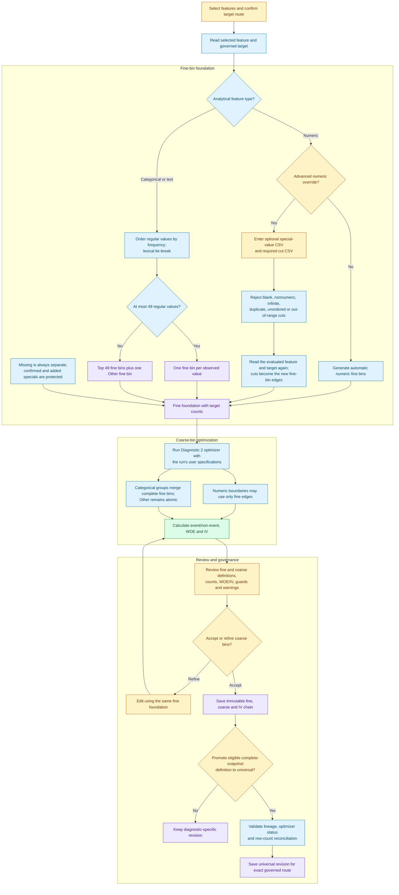

# Diagnostic 2 - Single-feature target separation and IV binning

Diagnostic 2 measures how individual features separate the governed target. Its binning
output is also the governed target-aware foundation used by PSI. Fine bins preserve the
available detail; coarse bins are optimized from that fixed foundation using the run's
constraints and event/non-event evidence.

## Binning workflow

Blue nodes are automated operations, yellow nodes are user decisions, purple nodes are
immutable AAR artifacts and green nodes are calculations.

## Categorical contract

Regular Baseline values are ranked by descending frequency with a lexical tie-break. Up to
49 values receive individual fine bins. If more values exist, every remaining value is stored
as the membership of a single fine bin displayed as `Other`. Missing and confirmed special
values are separate protected bins and do not consume the 49-value allowance.

`Other` is a governed fine bin, not merely a display shortcut. The optimizer may combine it
with other complete fine bins, but it cannot split its member values. The persisted definition
retains the exact member list so it can be applied reproducibly. Values absent from that
definition are handled by the consuming diagnostic's unseen-value rule; PSI, for example,
assigns Current-only values to `UNSEEN`.

## Numeric advanced override

The normal route generates the numeric fine foundation automatically. The advanced route lets
the user replace it with comma-separated cuts such as `10,25,50,100` and optionally add
numeric special values. Missing remains a mandatory separate bin. Confirmed Data Sourcing
specials are retained; additions belong to this new definition and do not silently alter an
older universal definition.

Cuts must be finite numeric values, unique, strictly increasing and inside the observed regular
range. `NA`, `Null`, `Infinity`, blank tokens and other text are rejected with the failing token
position. Because arbitrary new boundaries cannot be calculated exactly from an older set of
fine-bin aggregates, confirming the override performs one additional vectorized read of the
evaluated feature and governed target.

The entered cuts are fine-bin edges, not final coarse bins. Diagnostic 2 then runs its normal
optimizer using the run's user specifications. This preserves the event/non-event design:
every optimized numeric coarse boundary is one of the entered fine edges, and WOE/IV are
calculated on the resulting coarse bins.

## Storage, reuse and approval

The manifest stores the run selections and constraints. AAR stores immutable fine-bin,
coarse-bin and IV payloads, their lineage and any promotion receipt. An override produces a
new complete artifact chain; it does not mutate the automatic chain.

Diagnostic-specific revisions remain evidence for that diagnostic. Eligible complete-snapshot
revisions may be promoted explicitly to universal use. Promotion is never inferred from being
the first run because it changes which exact target-aware route Diagnostic 2 and PSI may reuse.
After a completed run, the existing variable-results table follows the PSI review pattern:
eligible rows have checkboxes, all are checked initially, and inline **Select all eligible** and
**Promote selected** controls sit in the table header. Unchecked features remain
diagnostic-specific; each feature can still be reviewed, refined and promoted individually
from its bin workspace. No separate card or browser pop-up is used.
The exact binary route includes the target column, target type and effective positive/event
class, so reversing the positive class cannot load the opposite IV definition.

Fine and coarse counts reconcile when both totals equal the number of evaluated rows after
missing target values are excluded. Persisted definitions must also retain full lineage,
valid interval/group coverage, protected missing/special bins and a recorded optimizer success
or deterministic fallback status.
## Progressive run review

Diagnostic 2 publishes a read-only feature preview after each IV/coarse result completes. The
preview combines the already-completed ROC result with AUC, Gini, IV, category, fine/coarse bin
counts, optimizer status and warnings. These SSE payloads improve visibility only: formal
`diag_results`, findings, promotion, bin editing and universal governance remain unavailable
until the full run is finalized.

Running history entries expose **View progress**. Re-entry attaches to the existing server-owned
execution and replays its buffered feature previews; it never launches a duplicate run.
