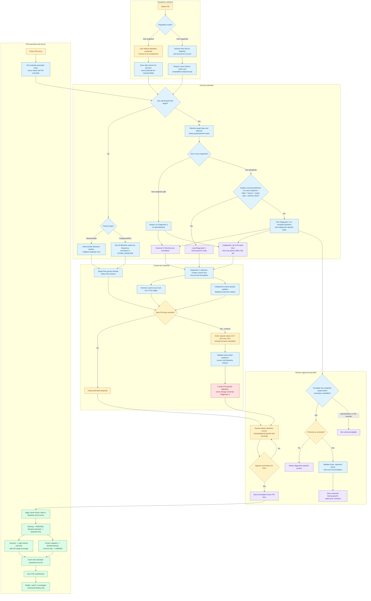

# Diagnostic 14 - Population Stability Index (PSI)

This is the governed PSI workflow contract and its relationship with Diagnostic 2
(single-feature target separation / IV binning). The arithmetic is in this directory;
routing and artifact governance are in `manifest_population_stability.py` and
`binning_reviews.py`.

## Simplified workflow

There is no user option to search for or match bins. Population mode and target availability
determine the route. When Data Sourcing has no governed target, PSI automatically uses the
target-free contract; target absence is not a blocker and requires no user confirmation. When
a saved target exists, the user may explicitly use it or continue target-free.

Blue nodes are automated decisions, yellow nodes are user decisions, purple nodes are
immutable AAR artifacts, green nodes are execution, and red is the exceptional PSI override.

## Route matrix

| Population | Target | Initial run and rerun behavior |
|---|---|---|
| One snapshot split | Target-free | Always generate deterministic PSI-contract bins from the split Baseline. |
| One snapshot split | Target-aware | Always run Diagnostic 2 IV binning on the split Baseline. The artifacts are diagnostic-specific and cannot become universal. |
| Two snapshots | Target-free | Always generate deterministic PSI-contract bins from the complete Baseline. |
| Two snapshots | Target-aware | Use the active explicitly promoted Diagnostic 2 chain for the exact complete Baseline identity; if absent, generate diagnostic-specific fine/coarse/IV artifacts and offer explicit promotion. |

An old frozen PSI definition or a definition created from another Baseline is never searched
for as a candidate. A frozen definition remains part of its original run's reproducibility
record, but a future run follows the matrix again.

## Exactness and what is matched

Only two-snapshot target-aware PSI performs a lookup. It is an exact governed Diagnostic 2
lookup, not a user-visible matching exercise. The key is immutable Baseline snapshot ID,
internal table (sheet/relation), exact feature name, compatible analytical type, governed
target column, resolved target type, effective binary positive/event class, and an explicit
universal-promotion receipt. Numeric and string forms of the same displayed binary label (for
example `1` and `"1"`) canonicalize to the same route. Reversing the event class creates a
different route, so both universal definitions can coexist and never cross-match.

Population fingerprints, transformations, missing policy, optimizer constraints and a
user-visible methodology version are not lookup choices. A split predicate is stored for
reproducibility, but one-snapshot PSI always regenerates. Missing is a mandatory common
policy. Technical payload/schema versions remain internal compatibility controls.

There is no longer a "created from another Baseline" applicability path. Approximate matching
and projection were deliberately removed from the normal PSI journey. Those artifacts remain
historical AAR evidence only.

## Alignment with Diagnostic 2

- Target-aware numeric PSI uses Diagnostic 2 IV fine bins as its governed foundation. Coarse
  optimization and ordinary refinement can retain only fine-bin edges.
- A universal coarse definition is loaded with its own fine foundation; coarse cuts never
  replace or bypass that foundation.
- Diagnostic 2 categorical fine binning keeps up to 49 observed regular values separately.
  Higher cardinality produces those 49 bins plus one atomic `Other` fine bin containing the
  remaining Baseline values. Coarse groups must merge complete fine bins and cannot split
  `Other`.
- Target-free numeric PSI uses deterministic Baseline deciles.
- Target-free categorical PSI keeps the 49 most frequent Baseline values separately and puts
  the remainder in `OTHER_BASELINE`; frequency ties are lexical.
- When no exact universal IV chain exists, PSI runs Diagnostic 2 and stores a new
  diagnostic-specific chain. It never reuses a coarse artifact alone.

## Missing, special, unseen and manual numeric overrides

Missing is always separate and not configurable. The UI says: "Missing values are kept in a
separate bin. Includes blank cells and values recognized as missing during Data Sourcing, such
as NA or Null."

Confirmed Data Sourcing special values are defaults. The advanced numeric override accepts
optional comma-separated PSI-specific special values and comma-separated cuts such as
`10,25,50,100`. It rejects blank tokens, NA, Null, Infinity, non-numeric text, duplicates and
non-increasing cuts with the exact token position. Thousands separators are unsupported.
Current-only categories use `UNSEEN`; numeric intervals cover the full range.

Arbitrary cuts cannot be derived exactly from the fixed profile histogram or IV fine
aggregates. The UI warns that this exceptional action performs one vectorized Baseline rescan
of the required feature. The resulting coarse definition applies only to the current PSI run,
does not change Diagnostic 2, and is ignored on future reruns.

## User review and approvals

The user reviews proposed fine/coarse labels and boundaries/groups, Baseline counts and
proportions, fine/coarse reconciliation, missing/special handling, range/unseen guards, and
optimizer warnings or deterministic fallback.

Freezing is explicit because it fixes the rule applied to both populations. Universal
promotion is a separate explicit choice because it changes the default for future Diagnostic 2
and target-aware two-snapshot PSI on the same immutable identity. Promotion requires the
complete unsplit Baseline, governed target, readable schema-valid fine/coarse/IV chain,
documented optimizer status/fallback, and reconciled counts.

Counts reconcile when summed fine rows equal summed coarse rows and both equal evaluated
Baseline rows. Missing-target rows are excluded from the target-aware evaluated count and
reported separately.

## AAR, scans and cached aggregates

The manifest retains run selections, predicates, review progress and artifact references. AAR
stores immutable profiles, Diagnostic 2 fine/coarse/IV versions, PSI draft/frozen definitions,
lineage, promotion receipts and PSI results. "Diagnostic-specific" is owned by that diagnostic;
"universal" is explicitly promoted for an exact full-snapshot identity.

A one-file split scans the split column for preview. Automatic generation reads selected
Baseline columns once as a batch (plus target when used). Exact universal definitions carry
cached fine/coarse aggregates; coarse refinement on existing fine edges uses those aggregates.
Only arbitrary numeric cuts require the exceptional Baseline feature rescan.

During batch preparation, the UI updates the prepared-definition count from live completion
events rather than waiting for the final manifest reload. Target-aware generation also displays
the actual Diagnostic 2 optimization mode, per-variable solver cap and concurrent worker count,
so the expected cost is visible while work is running.

### Execution ownership and reconnects

PSI draft generation and diagnostic execution are owned by a server background thread, not by
the browser's SSE connection. SSE is observation-only. Closing the tab, navigating away, a
development React remount, or an EventSource reconnect does not cancel the computation or skip
artifact/result/status persistence. A second connection attaches to the existing run and
replays buffered progress instead of starting another optimizer batch. Heartbeat frames keep an
otherwise idle connection open while a solver is working; the UI deliberately ignores them.

After a server-process restart the in-memory observer buffer is gone, but durable state remains
authoritative: completed runs replay persisted results, Diagnostic 2 `running` runs can resume,
and PSI draft generation recalculates only definitions that are not already saved. This also
means an abandoned client can no longer leave the PSI batch lock held by an unconsumed response
generator.

All diagnostic workflows share a fair FIFO execution queue. By default one diagnostic workflow
is active at a time (`DWB_DIAGNOSTIC_JOB_CAPACITY=1`), while that workflow may use up to four
shared feature-optimizer slots (`DWB_OPTIMIZER_CAPACITY=4`). Starting another diagnostic is
accepted immediately and displays its queue position; it begins automatically when the earlier
workflow reaches a terminal event. This applies across Diagnostic 2, PSI preparation, PSI
execution and the other diagnostic runners—not only to IV-related work.

AAR mutations additionally pass through one ordered writer. Computation remains parallel inside
the admitted workflow, but artifact JSON publication and its SQLite catalogue transaction cannot
compete with another artifact writer. The database busy timeout remains a last-resort safeguard,
not the normal concurrency mechanism.

PSI preparation and final PSI execution publish a read-only variable preview as each feature
finishes. Preparation previews show fine/coarse counts, metric, method, warnings or failure;
execution previews show PSI, classification, bin count and population counts. The workspace
replaces its editable review controls with this preview while the batch is active. Approval,
freezing, refinement and universal promotion become available only after the terminal event and
authoritative manifest reload.

Navigating away does not discard these previews. Reopening a running entry through **View
progress** attaches to the same server execution and replays buffered feature events before
continuing live. If the run completed while unattended, the UI opens its persisted results
instead of reconstructing an editable state from preliminary events.

## PSI calculation

The same frozen definition assigns every Baseline and Current row. The engine calculates each
bin's population share and sums `(current_share - baseline_share) * ln(current_share /
baseline_share)`, using the governed epsilon where a share is zero. Bin counts and
contributions must reconcile. Thresholds are stable below 0.10, watch from 0.10, and investigate
from 0.25. PSI remains contextual and never creates a violation automatically.

## Compatibility note

Historical manifests/artifacts with the old repository/generate choice and internal
`diagnostic_local` / `workflow_local` strings remain readable. New UI copy says
"diagnostic-specific" and never presents bin matching. The legacy patch action remains
temporarily API-readable; automatic routing overwrites it after feature selection.

`target_fingerprint` now identifies the target column, resolved target type, and effective
binary positive/event class. Diagnostic 2 and PSI persist the same canonical route in AAR
metadata and payload lineage. Historical column-only artifacts remain readable, but are not
treated as exact matches for a newly governed binary route because their event class cannot be
proven.
