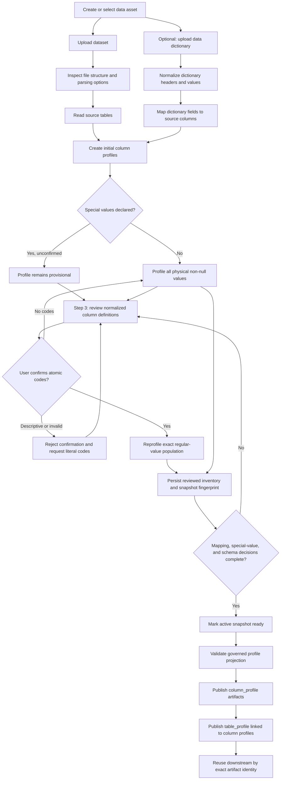
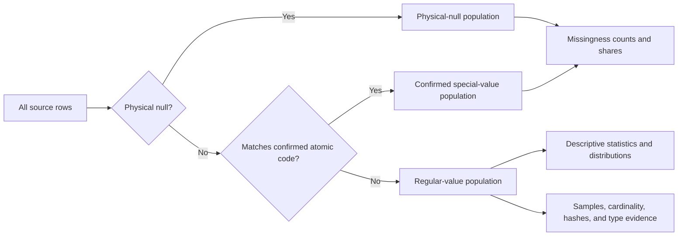
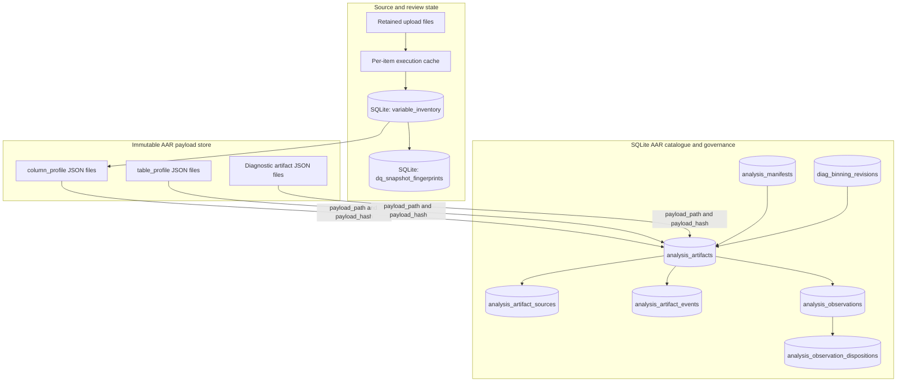
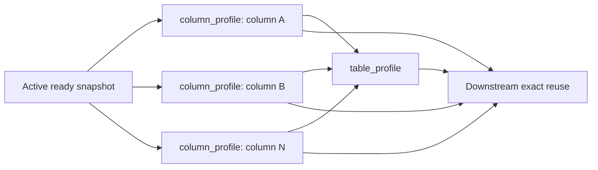

# Data sourcing, profiling, and AAR storage

**Status:** Current implementation  
**Application version:** 0.5.2  
**Owners:** Data Sourcing and Governed Analytics Artifact Repository

## Purpose

This document describes how an uploaded dataset becomes a reviewed, reusable
profile and how that evidence is stored in the Analytics Artifact Repository
(AAR). It covers source and dictionary ingestion, treatment of physical nulls
and confirmed special values, exact profiling metrics, publication gates, and
the hybrid SQLite and immutable-JSON storage model.

The central rule is:

> A dictionary value can affect profiling only after the user confirms it as
> an atomic special or missing source value. Confirmed special values are
> excluded from the regular-value population used by descriptive metrics.

## End-to-end workflow



### Workflow stages

| Stage | Main persisted result | Important behavior |
| --- | --- | --- |
| Upload | `dq_item_files`, `dq_item_tables` | Source files are retained; readable tables are identified. |
| Dictionary normalization | Dictionary version and mapping records | Header aliases and values are normalized; fuzzy mappings require review. |
| Initial profile | `variable_inventory.profile_json` | Exact working profile is generated immediately. Declared but unconfirmed special values do not alter the analytical population. |
| Step 3 review | Normalized variable inventory | Users confirm mappings, logical types, roles, and atomic special values. |
| Confirmation reprofile | Updated `variable_inventory.profile_json` | The affected column is recalculated from physical non-null, non-special rows. |
| Snapshot readiness | Active `dq_items` snapshot | Publication requires the snapshot to be both `active` and `ready`. |
| AAR publication | `column_profile` and `table_profile` artifacts | Complete governed payloads are saved for downstream exact reuse. |

## Population separation

For a column with total population `N`, profiling separates three mutually
exclusive populations:

1. **Physical nulls:** values the dataframe reports as null.
2. **Confirmed special values:** non-null values matching a user-confirmed
   atomic code.
3. **Regular values:** all remaining values.



The resulting count reconciliation is:

```text
total_count = physical_null_count + special_value_row_count + regular_value_count
effective_missing_count = physical_null_count + special_value_row_count
```

### Special-value rules

- SQLite JSON strings, API arrays, tuples, sets, and scalar values are
  normalized into one list before profiling.
- Empty and null declarations are removed.
- Numeric dictionary strings can match numeric source values exactly. For
  example, `"-999.0"` and numeric `-999` share the canonical matched label
  `"-999"`.
- Matching is performed against the complete code. Codes are never split into
  characters.
- Descriptive annotations such as `-999 = source missing` cannot be confirmed.
  The code belongs in the special-value field and its meaning belongs in the
  column description.
- An atomic confirmed code may have zero matches in a particular snapshot. It
  is retained as declared evidence and reported as unmatched.
- Unconfirmed codes may produce proposed-match counts for review, but do not
  affect mean, variance, histograms, percentiles, or any other core metric.

### Profile basis

Every profile states which population it uses:

| `profile_basis` | Meaning |
| --- | --- |
| `all_non_null_no_specials_declared` | No special values are declared; metrics use physical non-null values. |
| `provisional_all_non_null` | Special values are proposed but unconfirmed; metrics still use every physical non-null value. This profile cannot be published as confirmed AAR evidence. |
| `confirmed_regular_values` | Confirmed special values are excluded; metrics use only regular values. |

## Exact profiling metrics

The core profile uses the complete uploaded snapshot rather than a sample.
`calculation_method` is stored as `exact`.

### Population and missingness metrics

- total, raw non-null, and physical-null counts;
- physical-null count and share;
- proposed special-value counts by code and total proposed rows;
- confirmed special-value counts by code, total rows, and share;
- unmatched declared and unmatched confirmed codes;
- regular-value count and share; and
- effective-missing count and share.

### General column metrics

- physical dtype, inferred logical type, and confirmed classification;
- raw distinct count and regular-value cardinality;
- regular-value sample;
- bounded top-value evidence;
- low-cardinality distinct-set hash; and
- the explicit calculation method and profile basis.

### Numeric metrics

- numeric values, numeric parse failures, finite values, and non-finite values;
- zero and negative counts and shares;
- minimum, maximum, mean, population variance, and population standard
  deviation;
- median;
- percentiles `p01`, `p05`, `p25`, `p50`, `p75`, `p95`, and `p99`;
- first quartile, third quartile, and interquartile range;
- median absolute deviation;
- moment skewness and excess kurtosis; and
- an exact 10-bin histogram over finite regular values.

### Categorical metrics

- top values and counts;
- mode, mode count, and mode share;
- distinct-value ratio; and
- duplicate-value count and share.

### Date and period metrics

- minimum and maximum parsed dates;
- date parse-failure count and share; and
- normalized inclusive period bounds for recognized calendar-quarter values.

The working profile retains up to 50 top categorical values. The AAR projection
retains up to 50 for ordinary features and limits identifier samples to 5.
Low-cardinality distinct-set hashes are retained only when cardinality is at
most 100.

## Confirmation and publication sequence

```mermaid
sequenceDiagram
    actor User
    participant UI as Step 3 UI
    participant API as Data Sourcing service
    participant DB as SQLite state
    participant Source as Retained source snapshot
    participant AAR as AAR repository
    participant Files as Immutable JSON payloads

    User->>UI: Confirm atomic special codes
    UI->>API: Save normalized column decision
    API->>API: Normalize and validate code list
    alt Descriptive or invalid code
        API-->>UI: Reject confirmation
    else Valid confirmation
        API->>Source: Read affected source table
        API->>API: Separate null, special, and regular rows
        API->>API: Recalculate exact profile
        API->>DB: Save inventory profile and fingerprint
        API->>DB: Check active and ready state
        alt Snapshot is not ready
            API-->>UI: Retain review state; do not publish
        else Snapshot is active and ready
            API->>AAR: Validate profile basis and code/count reconciliation
            AAR->>Files: Atomically write immutable payload JSON
            AAR->>DB: Insert catalogue metadata, hash, summary, and lineage
            alt Metadata insert fails
                AAR->>Files: Remove newly written orphan payload
            else Publication succeeds
                AAR-->>API: Created or exactly reused artifact ID
            end
        end
    end
```

## AAR storage architecture

The AAR is intentionally hybrid:

- **SQLite** holds searchable metadata, identity, status, bounded summaries,
  lineage, run manifests, review state, and integrity hashes.
- **Immutable JSON files** hold the complete analytical payloads, including
  profile metrics, distributions, histograms, and later diagnostic evidence.



### Storage responsibilities

| Store or table | Responsibility |
| --- | --- |
| `variable_inventory` | Mutable review surface and compatibility copy of the latest working `profile_json`. It is not the canonical downstream artifact once publication succeeds. |
| `dq_snapshot_fingerprints` | Compact per-column change-detection evidence. It is not a replacement for the full profile. |
| `analysis_artifacts` | Central catalogue containing artifact identity, asset/snapshot bindings, population and methodology fingerprints, scope, status, bounded summary, payload path/hash, schema version, and supersession metadata. |
| `analysis_artifact_sources` | Normalized directed lineage edges from a derived artifact to its source artifacts, including the source role. |
| `analysis_artifact_events` | Append-only artifact lifecycle audit. |
| `analysis_manifests` | Frozen analysis request, versions, readiness result, run status, output, and produced artifact IDs. |
| `analysis_observations` | Reviewable findings derived from an analysis artifact. |
| `analysis_observation_dispositions` | Append-only human decisions on observations. |
| `diag_binning_revisions` | Governed revision history linking fine-bin, coarse-bin, and IV artifacts. |
| `analysis_artifacts/*.json` | Complete immutable payload content. Files are addressed through the catalogue and verified using SHA-256 hashes. |

The source upload directory and per-item database are not part of the AAR. The
per-item database is a regenerable execution cache; the upload, SQLite state,
and AAR JSON directory have separate persistence responsibilities.

## Data Sourcing artifact structure

For every active, ready snapshot, Data Sourcing currently publishes:



Each `column_profile` contains the confirmed schema metadata and complete exact
profile projection. Each `table_profile` contains table identity, row count,
column count, and column names, and records every column profile as a lineage
source.

Artifact identity includes the artifact type, asset, snapshot, table or
feature, population fingerprint, methodology fingerprint, scope, dictionary
version, profile schema version, schema role, and an evidence fingerprint.
Therefore:

- the same identity and payload are reused;
- the same identity with a different payload is a conflict;
- a reviewed meaning-changing update creates a new identity; and
- the previous active projection is superseded but retained for audit.

## AAR publication safeguards

A confirmed Data Sourcing profile cannot be published unless:

1. every declared special-value field has been normalized to a list;
2. declared codes have been explicitly confirmed;
3. the profile basis is `confirmed_regular_values` when codes exist;
4. canonical declared codes exactly match the profile's normalized code labels;
5. per-code count keys exactly match those labels;
6. the sum of per-code counts reconciles to `special_value_row_count`;
7. the snapshot is active and its ingestion status is `ready`; and
8. a valid asset identity exists.

If AAR publication fails during final readiness, the snapshot is returned to
`needs_review`; AAR persistence is not treated as a best-effort side effect.

## Reuse and backup boundary

Downstream analysis should resolve the exact AAR artifact before recalculating.
Reuse is safe only when all meaning-changing identity inputs match, including
the snapshot, population, methodology, dictionary version, schema role, target
where applicable, and source lineage.

Because the AAR is hybrid, a complete backup or environment move must preserve
together:

1. the SQLite state database;
2. the retained upload storage required to reconstruct source snapshots; and
3. the complete immutable AAR JSON payload directory.

Copying SQLite without its payload directory leaves catalogue rows whose
payloads fail integrity checks. Copying payloads without SQLite leaves orphan
files that are not addressable as governed artifacts.

## Implementation references

- Data Sourcing profiling and confirmation: `backend/ai/v2/service.py`
- Snapshot refresh profiling: `backend/assets/refresh.py`
- Data Sourcing AAR projection: `backend/analysis_runtime/data_sourcing_artifacts.py`
- Artifact repository and integrity checks: `backend/analysis_runtime/artifacts.py`
- Artifact type registry: `backend/analysis_runtime/artifact_types.py`
- SQLite schema and reset/backup behavior: `backend/system_db.py`

