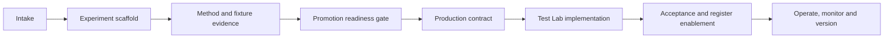

# Canonical diagnostic experiment and production lifecycle blueprint

## Purpose

This blueprint gives every diagnostic two compatible contracts:

1. an **experiment contract** for proving analytical value, safety and repeatability in `experiments/`;
2. a **production contract** for promoting a ready experiment into the governed Test Lab workflow.

The experiment may iterate quickly, but it must produce a promotion package whose names and evidence map directly to production boundaries. A successful notebook is evidence, not a deployable diagnostic by itself.

Start with the copy-ready
[experiment blueprint](../../../../experiments/test-lab/_blueprints/new-diagnostic/README.md), then
use the [production deployment blueprint](production-diagnostic/README.md) after its readiness gate
is approved. Both packs include guarded scaffold commands and stable file naming.

## Lifecycle



## 1. Intake contract

Record these decisions before analytical implementation:

| Area | Required decision |
|---|---|
| Identity | Framework test/diagnostic ID, slug, title, owner, version |
| User question | One plain-language question the diagnostic answers |
| Decision type | Verdict, classification, comparison, recommendation, or evidence-only |
| Scope | Table/snapshot cardinality, selected fields, row/population boundary |
| Inputs | Required roles, optional roles, declarations, KBs, upstream artifacts |
| Outputs | Metrics, tags/findings, reports, artifacts and downstream consumers |
| Non-goals | Claims the diagnostic cannot make |
| Determinism | Which steps are deterministic and versioned |
| AI | Whether optional/required, exact purpose, data sent, schema, human gate |
| Governance | Tenant/auth boundary, sensitive-data handling, audit and retention |
| Acceptance | Golden fixtures, invariants, scale envelope and regression gates |

If the intended analytical use is unknown, the intake must say whether the diagnostic can run in a general context, which rules remain usable, and how partial coverage is reported. It must not silently substitute a guessed use case.

## 2. Experiment scaffold

Recommended structure:

```text
experiments/<test>_<diagnostic>_<slug>/
  README.md
  contract.yaml
  kb/
    <slug>_kb_v0_1.yaml
    archive/
  prompts/
    <purpose>_v0_1.txt
  schemas/
    <structured_output>_v0_1.json
  src/
    adapters.py
    engine.py
    summaries.py
    actions.py
  inputs/test_fixtures/
    <scenario>/
  tests/
    test_engine.py
    test_invariants.py
    test_contract.py
  notebooks/
    end_to_end.ipynb
  output/                 generated and not a source of truth
  promotion/
    readiness.yaml
    artifact-inventory.md
    known-limitations.md
```

Names should carry the diagnostic slug and version. Input fixtures and expected outputs must be reproducible and must not contain live sensitive data. Generated output, caches, secrets and checkpoints are excluded from the promotion source package.

The experiment README must cover the hypothesis, intended user decision, rule mathematics, terminology, inputs, examples, limitations, test commands and evidence. Any LLM evaluation must separate retrieval/matching accuracy from deterministic diagnostic correctness.

## 3. Promotion readiness gate

An experiment is ready for implementation only when:

- the user question and non-goals are stable;
- inputs and semantic roles are explicit;
- every rule has stable ID, prerequisites, grain, outcome and reason contract;
- missing prerequisites have an explicit outcome such as `UNSCOPED` or `NOT_APPLICABLE`;
- precedence/tie handling is deterministic and fails closed;
- representative positive, negative, boundary and ambiguous fixtures pass;
- reports and large-output storage have been designed;
- AI behavior is bounded and can be audited;
- sensitive-data handling is documented;
- known limitations and scale assumptions are recorded;
- the promotion inventory identifies what is copied, rewritten, archived or excluded.

The readiness record should be machine-readable (`promotion/readiness.yaml`) so a later validation command can check required files, versions and evidence hashes.

## 4. Production package

Recommended backend structure:

```text
backend/domains/test_lab/diagnostics/<test>_<diagnostic>_<slug>/
  README.md
  manifest.py
  runner.py
  engine.py
  resources.py
  summaries.py
  actions.py
  knowledge.py              when a KB applies
  adjudication.py           only when an AI seam applies
  adjudication_contract.py  only when structured AI output applies
```

Recommended frontend structure:

```text
ui/src/features/test-lab/diagnostics/<test>-<diagnostic>-<slug>/
  <Diagnostic>ScopeGate.jsx
  <Diagnostic>Results.jsx
```

Recommended process documents:

```text
docs/diagnostics/<slug>/
  contract.md
  phase-plan.md
  promotion-record.md
  implementation-report.md
```

## 5. Required Test Lab workflow

Every deployed diagnostic should explicitly address each stage, even if a stage is not applicable:

| Stage | Minimum production behavior |
|---|---|
| Discover | Register entry, readiness reason, clear name and user question |
| Understand | Intro/help content, intended use, outputs, non-goals and limitations |
| Scope | Immutable snapshots/tables/fields/populations and upstream artifact references |
| Configure | Roles, parameters/declarations, KB/method versions and defaults |
| Infer | Explainable deterministic suggestions; optional AI disclosure and human gate |
| Preview | Runnable, blocked, partial and not-applicable coverage before launch |
| Freeze | Canonical manifest fingerprint, actor, timestamp and immutable decisions |
| Execute | Deterministic/versioned runner, progress, persisted worker lease/heartbeat, duplicate-execution refusal, terminal failure state and safe retry as a new run |
| Display | Executive outcome, detailed measures, coverage and limitations |
| Export | Authenticated PDF/text or documented equivalent |
| Persist | Governed AAR artifacts with identity, hash, lineage and media type |
| Act | Grouped findings, human disposition, issue creation and RCA handoff |
| Recover | One resumable draft, duplicate-draft archival, failed/interrupted-run behavior, stale-lease recovery and rollback plan |

## 6. Manifest contract

The frozen manifest is the execution contract. It must include:

- tenant, user/actor and item identity;
- immutable snapshot and qualified table/field/population selection;
- confirmed semantic roles and their evidence/provenance;
- parameters and declarations with defaults distinguished from overrides;
- KB, terminology, prompt, schema, engine and methodology versions/hashes;
- upstream artifact IDs and payload hashes;
- deterministic and LLM inference disclosure;
- coverage preview and unresolved blockers;
- canonical fingerprint excluding run-local timestamps/IDs.

Candidate mappings must not be serialized as confirmed choices. Frozen manifests cannot be patched.

## 7. Result and report contract

Results should be compact enough for the UI and include:

- `result_kind` and methodology identity;
- executive decision/verdict and plain-language explanation;
- scoped population and coverage denominators;
- metrics by rule/field/group as applicable;
- artifact references rather than large embedded rows;
- limitations and partial/unscoped outcomes;
- safe inference disclosure;
- grouped finding references.

The downloadable report must be reproducible from frozen inputs and persisted result/artifact metadata. It must disclose partial coverage and cannot imply that “no finding” means “data is valid” unless that is the diagnostic's tested contract.

Every completed run must remain re-enterable from per-diagnostic history. A re-run creates a new
run ID and frozen manifest; requesting execution for an already completed run replays persisted
results and must not duplicate results, findings, issues or artifacts. History exposes draft,
running, done and failed states plus safe interruption reasons. Discarded drafts remain auditable
but need not appear in the normal user history.

## 8. Analytics Artifact Repository contract

For every material output decide:

| Question | Requirement |
|---|---|
| Type | Registered stable artifact type and schema version |
| Identity | Producer, methodology, snapshot, manifest fingerprint and parameters |
| Payload | JSON for compact structured state; Parquet for large tabular evidence |
| Integrity | Canonical payload hash and verification on read/download |
| Lineage | Source snapshot and upstream artifact IDs/hashes |
| Summary | Bounded JSON metadata for discovery without loading the payload |
| Access | Authenticated, tenant-aware view/download behavior |
| Reuse | Exact identity + equal payload reuses; collisions fail closed |
| Retention | Immutable historical artifacts remain readable after disablement |

Raw data should not be duplicated unless it is essential to the governed output. Prefer stable masked row references, aggregates and evidence references. Binary payloads need an explicit media type and filename.

## 9. KB and versioning contract

When a KB applies:

- package the machine-readable version with the diagnostic;
- validate it at load/startup;
- publish a readable document in the KB section;
- retain prior versions and activate the promoted version instead of overwriting history;
- freeze KB document/version/hash into the manifest and artifacts;
- define how shared terminology versions affect other diagnostics;
- make rollback change the active version without rewriting historical runs.

Rule IDs are stable. A material change to rule meaning, prerequisite, precedence or output requires an explicit KB/methodology version decision.

## 10. AI/LLM contract

An AI seam must specify:

- why deterministic logic is insufficient;
- whether invocation is optional or required;
- exact input projection and confirmation that row data is excluded when possible;
- prompt/model/deployment/API and structured-schema versions;
- timeout, retry, validation and sanitized failure behavior;
- proposal-versus-application boundary;
- whether AI can influence scope, metrics, verdict, findings or actions;
- complete internal audit and safe report disclosure;
- rerun reuse identity (snapshot, feature metadata, KB, prompt and schema), source-event lineage,
  and the conditions that force a new provider call;
- separate counts for provider calls made in the current run and prior validated inferences reused;
- deterministic fallback or launch blocker.

Default policy: AI may propose semantic/configuration choices but may not silently apply them or calculate the deterministic diagnostic result.
For the same immutable input identity, a rerun should reference a prior validated inference rather
than call the provider again. Failed or invalid output, tenant changes, new/changed features, or
versioned KB/prompt/schema changes must fail cache eligibility. Reuse remains advisory and does not
carry forward human confirmation automatically. A new call requires an explicit action for a field
without a reusable inference.

## 11. Findings, issue and RCA contract

The diagnostic must distinguish a calculated result from an organisational issue:

1. deterministic execution produces evidence;
2. evidence is grouped into bounded candidate findings;
3. a human confirms or dismisses a finding with rationale;
4. only a confirmed finding creates/links an issue;
5. the issue carries diagnostic, run, result, rule and artifact traceability into RCA.

The contract must state which outcomes are issue candidates and which are configuration/coverage review. Automatic issue or RCA creation requires a separate explicit governance decision.

## 12. Acceptance and enablement

Required gates:

- resource/KB schema and version tests;
- pure rule, boundary, precedence and invariant tests;
- manifest draft/patch/freeze/immutability/tenancy tests;
- runner, failure, exact-reuse and artifact-integrity tests;
- re-run/new-run identity, completed-run replay and per-diagnostic history tests;
- browser-disconnect, duplicate observer/executor, synchronous failure, expired lease and process-restart recovery tests;
- API auth/tenant/launch/result/report/download tests;
- frontend scope/result dispatch and interaction tests;
- findings/issue/RCA traceability tests;
- regression tests for existing deployed diagnostics;
- frontend production build and backend suite;
- documentation and promotion inventory review.

Keep the register entry `workflow_pending` until all blocking gates pass. Enable it in the final change, record the acceptance decision, and retain a one-field register rollback path.

## 13. Promotion record

The final record must list:

- experiment source and evidence version;
- files carried forward, modified, replaced and intentionally excluded;
- analytic corrections made during production hardening;
- KB/terminology activation and history behavior;
- database migrations and backward compatibility;
- tests executed with results;
- known limitations and operational follow-ups;
- enablement and rollback decision.

This record closes the loop between exploratory evidence and the exact code users can launch.
