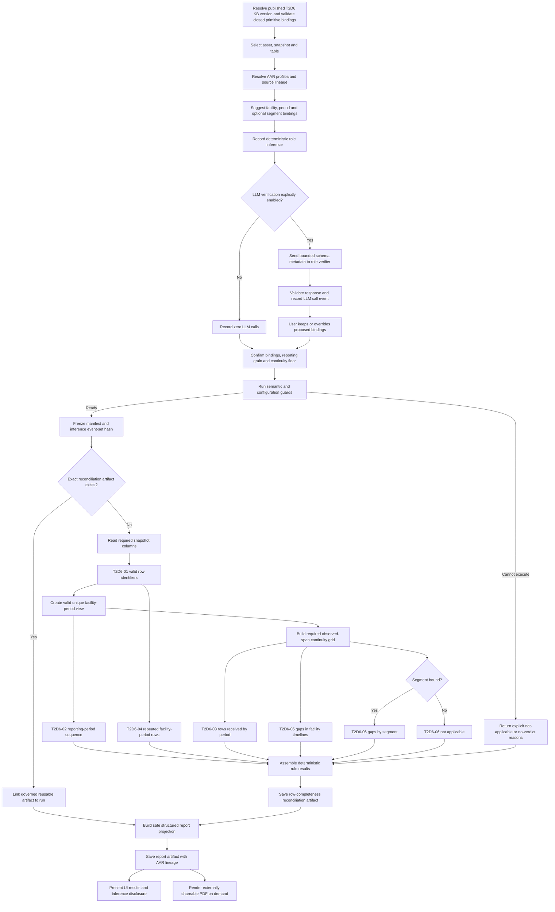

# Diagnostic #6 — Row continuity contract

**Status:** Design contract for review  
**Framework location:** Test 2, Diagnostic 6  
**Decision type:** Verdict  
**Implementation status:** Workflow pending

## 1. Purpose and vocabulary

Diagnostic #6 determines whether a facility-by-period panel is continuous within each
facility's observed lifespan and whether a facility-period pair occurs more than once.
It does not estimate a statistical or business-expected population.

The word `expected` is deliberately avoided. In this contract:

- **facility observed span** is the inclusive interval from a facility's first observed
  period to its last observed period;
- **required period** is every period at the confirmed grain within that observed span;
- **required continuity grid** is the union of all required facility-period pairs;
- **observed period** is a unique facility-period pair present in the assessed snapshot;
- **continuity gap** is a required facility-period pair absent from the snapshot;
- **continuity coverage** is observed required pairs divided by required pairs.

The following are the only rule identifiers used by DataWorkbench:

| Rule ID | Rule name |
| --- | --- |
| `T2D6-01` | Valid row identifiers |
| `T2D6-02` | Reporting-period sequence |
| `T2D6-03` | Rows received by period |
| `T2D6-04` | Repeated facility-period rows |
| `T2D6-05` | Gaps in facility timelines |
| `T2D6-06` | Gaps by segment |

These IDs are used consistently by manifests, results, findings, artifacts, reports,
issues and RCA. No alternate rule-ID namespace is carried into the integration.

## 2. Scope and non-goals

Version 1 assesses exactly one panel table per run. It does not infer joins or combine a
panel with a facility master.

Version 1 detects:

- missing periods inside a known facility's observed span;
- duplicate facility-period pairs;
- localised continuity gaps within segment-period cells.

Version 1 cannot determine:

- whether a facility is completely absent from the uploaded snapshot;
- whether rows are missing before a facility's first observed row;
- whether a facility disappeared prematurely after its last observed row;
- whether values inside received rows are correct;
- whether individual fields are populated.

Origination and closure information may be recorded as contextual evidence, but neither
silently extends the version 1 required continuity grid beyond the observed span. A future
boundary-completeness mode may use authoritative facility-master, origination, closure and
run-off evidence under a separate methodology version.

## 3. Inputs and semantic roles

| Role | Requirement | Version 1 use |
| --- | --- | --- |
| `facility_id` | Required | Identifies the facility whose observed span is assessed |
| `period` | Required | Establishes ordering and the panel grain |
| `segment` | Optional; required only for `T2D6-06` | Assigns required pairs to segment-period cells |
| `origination_date` | Optional context | Reports contradictions with the first observed period |
| `closure_marker` | Optional context | Reports contradictions with the last observed period |

Data Sourcing's confirmed `period_column` is the preferred period binding. Saved table and
column-profile artifacts are the preferred evidence for table discovery, role candidates,
physical types, descriptions, cardinality and null rates. A user may override a proposed
binding in the Test Lab scope gate. Every override is an append-only run decision.

The manifest must qualify each binding with both table and column. A column cannot be
automatically assigned to multiple roles.

The absence of a segment column does not block Diagnostic #6. `T2D6-01` through `T2D6-05`
remain runnable, while `T2D6-06` returns `NOT-APPLICABLE` with the reason that no segment
role is bound.

### Minimum inputs for a run

The minimum user-confirmed inputs are:

| Input | Minimum requirement | How it is obtained |
| --- | --- | --- |
| Dataset scope | One DataWorkbench asset, immutable snapshot and selected table | Selected in Test Lab from Data Sourcing |
| Facility role | One qualified table/column binding for `facility_id` | Deterministic suggestion or manual selection; user confirms |
| Period role | One qualified table/column binding for `period` | Existing period metadata, deterministic suggestion or manual selection; user confirms |
| Reporting grain | One of monthly, quarterly, semiannual or annual | Existing governed metadata or deterministic recommendation; user confirms |
| Minimum required rows | `continuity_floor`; default 0.95 may be accepted | Governed default or user-approved override |

The `segment` binding is optional. No target column, comparison/baseline snapshot, external
facility population, externally supplied start/end dates, complete facility list or LLM call
is required. The observed start and end period for each facility are calculated from the
selected snapshot after invalid keys are separated.

The system adds and freezes the active six-rule KB version, engine/methodology versions,
source artifact IDs and hashes, role-binding evidence, actor decisions and manifest
fingerprint. These are required provenance, but they are not additional user inputs.

### LLM and inference disclosure

Version 1 makes **zero LLM calls by default**. A user may explicitly request the existing
pre-freeze semantic-role verification seam. That single bounded call may review the proposed
`facility_id`, `period` and optional `segment` mappings. It is advisory only: it cannot set a
threshold, construct the continuity grid, execute a rule, calculate a measure, determine a
verdict, select report evidence or write recommended next steps. A proposed mapping is not
applied unless the user makes a separate governed role-binding decision before manifest
freeze.

The journey distinguishes two kinds of inference:

- **deterministic inference** — role candidate scoring, period parsing, grain recommendation
  and observed-span construction performed by versioned code;
- **LLM inference** — optional semantic-role verification performed through the governed
  model boundary.

Every run has an `inference_disclosure` object, including runs for which no LLM was invoked:

```json
{
  "llm_call_count": 0,
  "llm_used": false,
  "verdict_influenced_by_llm": false,
  "events": [],
  "deterministic_inferences": []
}
```

Each deterministic inference records its type, algorithm/methodology version, inputs by
artifact or qualified-column reference, evidence summary, proposed value, confidence or
validation status, user disposition, final frozen value and timestamp.

Each attempted LLM call records an append-only event with:

- run/call ID, journey stage, purpose, opt-in actor and timestamp;
- invoked, skipped, succeeded or failed status, including retry count and sanitized error;
- provider, model/deployment and API version;
- prompt-template ID/version/hash and structured-output schema version;
- a redacted input manifest and hash, source artifact references, and whether row-level data
  was included (it must be `false` for role verification);
- response hash, validated structured response, token usage, latency and provider request ID;
- proposed mapping, deterministic mapping, user disposition and final applied mapping;
- explicit flags that metrics and verdicts were not produced or changed by the model.

Secrets, credentials and unrestricted raw prompts/responses are never placed in the report.
The complete governed event remains queryable for authorised audit. A bounded safe projection
is embedded in the reconciliation artifact, report artifact and external PDF. If no model was
called, those outputs state `No LLM calls were made during this diagnostic journey`; absence
of events must never be presented as unknown AI usage.

## 4. Period parsing and grain

Supported grains are monthly, quarterly, semiannual and annual. The engine parses the
confirmed period column into a canonical period key and can recommend a grain from the
observed values, but the grain used by the run is confirmed in Test Lab and frozen in the
manifest. This is a semantic guard, not a second diagnostic threshold. When the confirmed
grain is incompatible with the observed periods, the key and duplicate checks can still
run, but calendar- and grid-dependent rules are `NOT-APPLICABLE` because their required
period sequences cannot be constructed reliably.

Rows with an unparseable period, null facility ID or null period must be counted and
reported. They must not disappear silently from group-by operations.

## 5. Required continuity grid

For each non-null facility `f`:

1. `first_f` is its minimum canonical observed period.
2. `last_f` is its maximum canonical observed period.
3. `required_f` is every period at the confirmed grain from `first_f` through `last_f`,
   inclusive.

The portfolio required continuity grid is:

```text
required_grid = union(required_f for every observed facility f)
```

The received grid is the set of unique, valid facility-period pairs in the snapshot.
Duplicates are counted once for continuity coverage and assessed separately by `T2D6-04`.

```text
continuity_gaps = required_grid minus received_grid
continuity_coverage = |required_grid intersect received_grid| / |required_grid|
```

Because both endpoints come from observed rows, every facility with at least one valid row
has at least one required pair. A one-period facility has no interior in which a continuity
gap can occur.

## 6. Rule contracts

### T2D6-01 — Valid row identifiers

**User question:** Can every row be assigned to a facility and reporting period?

**Purpose:** Detect rows that cannot participate reliably in row-completeness calculations.

**Required roles:** `facility_id`, `period`.

The rule counts null or blank facility IDs, null periods, unparseable periods and period
values incompatible with the confirmed representation. These rows must not disappear
silently from grouping operations.

**Outcome:**

- `PASS` when every row has a valid facility-period key;
- `VIOLATION` when one or more rows cannot be assigned;
- `NOT-APPLICABLE` when either mandatory role is unbound.

There is no non-zero tolerance in version 1.

### T2D6-02 — Reporting-period sequence

**User question:** Are any reporting periods missing between the dataset's first and last
periods?

**Purpose:** Detect a complete missing reporting period in the panel calendar.

**Required role:** `period` and a valid grain.

The rule generates every calendar period at the confirmed grain from the dataset's first
valid period through its last valid period and compares that sequence with the periods that
contain rows.

**Outcome:**

- `PASS` when the panel calendar contains every required period;
- `VIOLATION` when one or more entire reporting periods are absent;
- `NOT-APPLICABLE` when period semantics or a valid grain are unavailable.

### T2D6-03 — Rows received by period

**User question:** Did every reporting period receive at least the configured minimum
percentage of its required facility rows?

**Purpose:** Detect a partially missing period that may be hidden by the full-panel total.

**Required roles:** `facility_id`, `period` and a valid required continuity grid.

For each period `t`:

```text
period_coverage(t) = received required facility-period pairs at t /
                     all required facility-period pairs at t
```

**Parameter:** `continuity_floor`, initially `0.95`.

**Outcome:**

- `PASS` when every assessable period is at or above the floor;
- `VIOLATION` when one or more periods are below the floor;
- `NO-VERDICT` when coverage can be computed but the floor is not configured;
- `NOT-APPLICABLE` when mandatory roles or a valid grain are unavailable.

### T2D6-04 — Repeated facility-period rows

**User question:** Does any facility appear more than once in the same reporting period?

**Purpose:** Detect more than one row for the same valid facility-period key.

**Required roles:** `facility_id`, `period`.

For each facility-period group with more than one row, the engine classifies it as:

- **exact duplicate** when all assessed row values are equal after canonical null handling;
- **conflicting duplicate** when at least one assessed value differs.

**Outcome:**

- `PASS` when no duplicate pair exists;
- `VIOLATION` when one or more duplicate pairs exist;
- `NOT-APPLICABLE` when mandatory roles are unavailable.

There is no non-zero duplicate tolerance in version 1.

**Always reported:** duplicate pair count, surplus row count, rows affected, exact/conflicting
split, and bounded distributions across periods and segments.

### T2D6-05 — Gaps in facility timelines

**User question:** Were at least the configured minimum percentage of required
facility-period rows received across all facility timelines?

**Purpose:** Detect missing periods inside known facility observed spans.

**Required roles:** `facility_id`, `period` and a valid grain.

**Measure:**

```text
portfolio_continuity_coverage =
    received required facility-period pairs / all required facility-period pairs
```

**Parameter:** `continuity_floor`, initially `0.95`.

**Outcome:**

- `PASS` when coverage is greater than or equal to the floor;
- `VIOLATION` when coverage is below the floor;
- `NO-VERDICT` when the measure can be computed but the floor is not configured;
- `NOT-APPLICABLE` when mandatory roles or a valid grain are unavailable.

**Always reported:** facilities assessed, required pairs, received required pairs, missing
interior pairs, coverage, affected facilities, affected periods, grain and floor provenance.

### T2D6-06 — Gaps by segment

**User question:** Where a segment is available, did every assessable segment-period group
receive at least the configured minimum percentage of its required facility rows?

**Purpose:** Detect localised continuity gaps hidden by portfolio aggregation.

**Required roles:** `facility_id`, `period`, `segment` and a valid grain.

Each required facility-period pair must have a deterministic segment assignment. Version 1
accepts a segment only when it is stable for a facility across its observed rows. Facilities
whose segment changes are excluded from cell judgment and reported as `NOT-ASSESSABLE`
unless a future governed time-varying attribution policy is selected.

For segment `s` and period `t`:

```text
required_facilities(s,t) = facilities assigned to s whose observed span includes t
received_facilities(s,t) = required facilities with a received unique pair at t
cell_continuity_coverage(s,t) = received_facilities(s,t) / required_facilities(s,t)
```

The denominator is not every facility ever seen in the segment. Cells with zero received
rows remain present because cells originate from the required grid, not from received-row
grouping.

**Parameter:** `continuity_floor`, initially `0.95`, shared with `T2D6-03` and
`T2D6-05`.

For an assessable cell, the single test is:

```text
cell coverage >= continuity_floor
```

**Outcome:**

- `VIOLATION` when one or more assessable cells are below the floor;
- `PASS` when every assessable cell is at or above the floor;
- `NO-VERDICT` when coverage can be computed but the shared floor is not configured;
- `NOT-APPLICABLE` when `segment` or another mandatory role is unbound;
- cell-level `NOT-ASSESSABLE` when a stable segment assignment is unavailable.

## 7. Relationship between portfolio and cell controls

Both controls derive from the same required continuity grid:

```text
required continuity grid
    ├── group by period                    -> T2D6-03 rows received by period
    ├── aggregate all required pairs       -> T2D6-05 facility timeline gaps
    └── group by segment and period        -> T2D6-06 gaps by segment
```

The shared continuity floor applies to both aggregations: once to the entire required grid
and once to every assessable segment-period cell. Portfolio aggregation identifies broad
thinning, while cell aggregation identifies concentrated gaps that a large complete segment
can mask. Version 1 has no peer-relative test and no separate segment floor.

## 8. Assessment states

Rule and cell evidence preserves five states:

- `PASS` — an applicable judgment was made and passed;
- `VIOLATION` — an applicable judgment was made and failed;
- `NO-VERDICT` — a measure exists but required judgment configuration is absent;
- `NOT-APPLICABLE` — required data semantics or roles are unavailable;
- `NOT-ASSESSABLE` — the relevant population is too small or attribution is unreliable.

DataWorkbench's top-level verdict contract requires an additive `inconclusive` state when no
rule violates but an in-scope rule has `NO-VERDICT`. `NOT-ASSESSABLE` cells are excluded from
the judged denominator and are reported separately. Scoring must state judged-rule and
assessable-cell coverage rather than treating these states as passes.

## 9. Manifest and governed configuration

The frozen manifest must contain:

- snapshot, asset and selected table identity;
- rule IDs and display order;
- framework and product;
- role bindings with source, score and reason;
- detected grain and parsing statistics;
- all parameter values and provenance;
- KB document/version/fingerprint;
- source artifact IDs and payload hashes;
- deterministic-inference records and the complete pre-freeze LLM disclosure summary;
- engine and methodology versions;
- manifest fingerprint and actor decisions.

Initial governed keys are:

```text
continuity_floor                  0.95
```

The existing Diagnostic #6 `coverage_floor` has the same initial value. It is renamed to
`continuity_floor` so the parameter reflects the observed-span methodology. Migration must
retain the former key and value in provenance for historical manifests.

LLM attempts and deterministic inference decisions are written to a new append-only
`diag_inference_events` audit seam keyed by run ID. The reconciliation artifact contains a
safe, immutable projection and its event-set hash. Existing `diag_run_decisions` continues to
record the user's binding or override decision; it does not substitute for call-level model
provenance.

## 10. Analytics Artifact Repository contract

The engine first resolves active `table_profile`, `column_profile` and available governance
artifacts for the selected snapshot. These provide schema, role-candidate and provenance
evidence. The engine reads the required snapshot columns only for calculations that profiles
cannot answer, including anti-joins and duplicate comparison.

The run produces a governed `row_completeness_reconciliation` artifact with:

- `diagnostic_local` scope and table granularity;
- no target or comparison snapshot;
- lineage to the table and bound-column source artifacts;
- aggregate rule results and assessment coverage;
- bounded missing-pair, duplicate and segment-cell evidence;
- explicit total counts and truncation metadata;
- manifest, methodology, KB and engine fingerprints.

Exact reuse requires equality of snapshot, table, role bindings, rule set, parameters, grain,
source artifact identities and hashes, KB fingerprint, engine version and manifest-relevant
methodology inputs. A reused artifact is linked to the new run; it does not erase run-specific
provenance. The new run retains its own inference-event ledger. Its result and report distinguish
`current journey AI usage` from `source calculation AI usage`, so reuse cannot hide either history.
An advisory LLM response does not change calculation identity unless the user applies a role
override and that changed binding is frozen.

## 11. External shareable report

The diagnostic provides an externally shareable PDF report. The PDF is a deterministic
rendering of governed structured results; it must never rerun rules, query a changed
snapshot, or become a second source of truth.

The AAR stores a versioned `row_completeness_report` JSON artifact derived from the
`row_completeness_reconciliation` artifact. Its lineage records the source artifact ID and
payload hash, report-schema and renderer versions, manifest fingerprint, and the external
redaction profile. The PDF is rendered from that report artifact. The existing diagnostic
report endpoint is extended rather than creating a separate reporting service:

```text
GET /diagnostics/runs/{run_id}/report?fmt=pdf&audience=external
```

The response uses `application/pdf`, a `row-completeness-{run_id}.pdf` attachment filename,
and exposes the report artifact ID and payload hash as response metadata. Report generation
is available only for a completed run. A rendering failure is retryable and does not change
the diagnostic verdict or source artifact.

### Report structure

The external PDF contains these sections in order:

1. **Report identity and scope** — report/run IDs, generation basis, dataset display name,
   table, snapshot/as-of time, reporting grain, observed period range, optional segment,
   configuration, methodology version and the observed-span limitation.
2. **Overall summary** — overall verdict, continuity coverage, violated/passed/not-applicable
   rule counts, facilities and periods assessed, and short plain-language interpretation.
3. **Issue summary** — invalid-key rows, missing facility-period pairs, duplicate pairs,
   surplus duplicate rows, affected facilities, affected periods, and affected segments.
4. **Rule-level results** — all six `T2D6` rules in display order with outcome, measure,
   shared floor where applicable, issue count, affected population, and explanation.
5. **Example findings** — bounded examples appropriate to each rule: invalid row references,
   missing facility/period combinations, repeated pair references, and optional
   segment-period gaps. Each section states total findings, examples shown, and whether the
   evidence was truncated.
6. **Recommended next steps** — deterministic actions mapped to each violated rule, followed
   by a recommendation to correct the source and rerun the diagnostic.
7. **AI and inference disclosure** — deterministic inferences, number and purpose of LLM
   calls, model/prompt provenance, user disposition, and an explicit statement that the model
   did not calculate metrics or verdicts. A zero-call run says so explicitly.
8. **Methodology, limitations and provenance** — definitions, denominator construction,
   exclusions, role bindings, source and report artifact references, fingerprints and
   renderer version.

`Issue count` must not be a naive sum of overlapping rule findings. The headline primary
issue-instance count is the sum of invalid-key rows, missing facility-period pairs, surplus
duplicate rows, and complete missing calendar periods that are not already represented by a
missing facility-period pair. Period and segment findings that aggregate those primary
findings are displayed separately. The report always shows category counts so the total
remains explainable.

The external report applies a governed safe-sharing profile by default:

- facility identifiers are replaced with stable report-local references;
- unrelated source columns and raw row contents are omitted;
- only the bound identifiers, missing period, optional segment and finding reason needed to
  explain an example are shown;
- dataset and segment labels follow their AAR sensitivity classification;
- evidence caps and truncation metadata match the governed structured result.

Recommended next-step text is rule-based and frozen from the governed KB package into the
run manifest. It is not generated by an LLM and cannot alter the recorded verdict.

## 12. UI language

The UI uses `required`, `observed span`, `continuity gap` and `continuity coverage`. It does
not label the constructed grid as an expected population.

Examples:

- `Required periods within observed spans`
- `Received required facility-period pairs`
- `Facilities with continuity gaps`
- `Minimum required facility rows (%)`
- `Segment-period continuity`

The technical configuration key remains `continuity_floor`, but the UI must describe what
the percentage controls. For example, with a value of 95%:

- pass: `Every reporting period received at least 95% of its required facility rows.`
- violation: `March 2025 received 90.2% of its required facility rows, below the minimum
  of 95%.`

The UI must not use `continuity requirement` as a standalone phrase because it does not tell
the user which rows are counted or what the threshold means.

The scope gate must state the structural limitation before execution: boundary omissions and
completely absent facilities cannot be detected by the version 1 observed-span methodology.

After a run completes, the results header provides `Download shareable report (PDF)`. The
control has explicit `preparing`, `ready`, `download failed/retry` and `unavailable` states.
The report action remains disabled while a run is queued or executing. The UI explains that
example identifiers are masked in the external report.

The scope and results views also show `AI assistance: None` or `AI assistance: Role mapping
review`, with a details action exposing the safe inference disclosure. Deterministic suggestions
are labelled `System-derived`, not `AI-generated`.

## 13. Planned process flow



The diagram shows the only permitted model boundary. No LLM dependency exists downstream of
manifest freeze. Newly calculated results disclose their calculation journey. Reused results
disclose both the source artifact's calculation journey and the current run's journey.

## 14. Centralized knowledge package and change guardrails

`backend/knowledge_base/row_completeness_v1.json` is the source-controlled bootstrap package.
At startup it is installed through `backend/kb.py` as one approved immutable KB document
version with six published, human-confirmed and bound rules. Runtime manifests resolve the
published database records, not frontend constants or engine labels, and freeze the document,
version, rule and retrieval-manifest identifiers plus their hashes.

The package owns diagnostic wording, methodology guidance, configuration help, rule titles,
user help, severity, semantic-role requirements, optionality, floor applicability and next
steps. Python owns the calculation primitives, result schema and verdict logic. A package is
accepted only when it contains exactly `T2D6-01` through `T2D6-06` in order and each rule maps
to its registered primitive. Arbitrary expressions, changed IDs/order, unsupported roles,
additional optional rules and reassignment of the coverage floor are rejected.

Published versions are never edited in place. A future approved change is supplied as a new
`backend/knowledge_base/row_completeness_v*.json` file with a unique `version_id` and increasing
`version_seq`. Startup validates and installs every source-controlled version and activates the
highest contract-valid version. Calculation-affecting changes also require a supported engine/
methodology version; otherwise manifest creation refuses the package.

Installation is resumable and two-phase. All six rules remain non-executable drafts while the
single registered binder validates and records their primitive bindings. One database transaction
publishes all six only after every binding succeeds. A restart can repair missing draft rows and
resume binding, while archived or superseded versions are never silently reactivated.

The KB package hash participates in both reconciliation and external-report AAR identity, so a new
version cannot silently reuse an artifact produced under older knowledge. Results and PDFs display
the frozen KB version, package hash and retrieval record. Historical run manifests and reports
remain unchanged and retain compatibility fallbacks for pre-versioning runs.

## 15. Acceptance gate for implementation

Implementation begins only after agreement on:

1. the observed-span definition in section 5;
2. stable-only segment attribution in version 1;
3. five rule/cell states and the top-level `inconclusive` addition;
4. bounded artifact evidence versus a complete exception export;
5. governed KB import/versioning for the six rules;
6. the structured external report, safe-sharing profile and issue-count definition in
   section 11;
7. zero-by-default LLM usage, append-only inference events and report disclosure in sections
   3 and 13.
