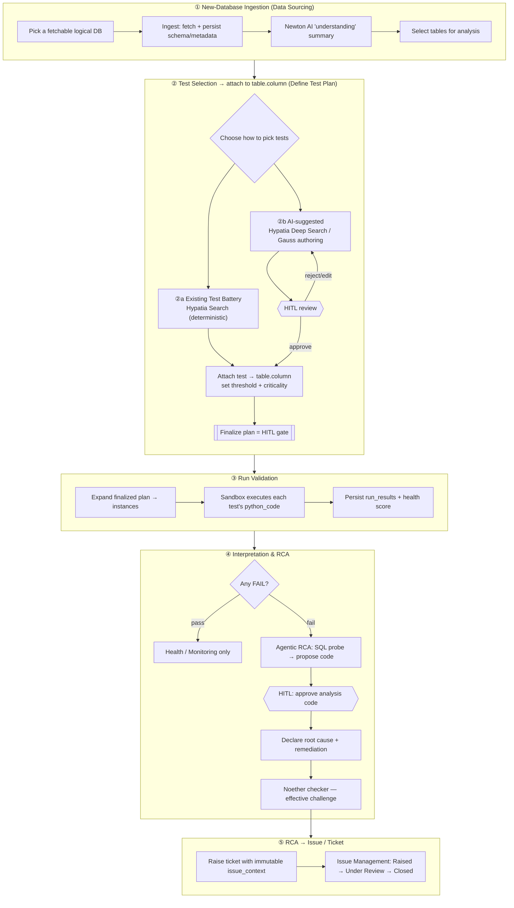

# Aegis Labs — Historical Workflow Lineage & Independent Testing Guide

> **Retired pre-0.4.0 reference.** The workflow, modules, scripts, and four-step
> Test Lab descriptions below are historical only and are not runnable guidance
> for the current application. See [`../../../USER_GUIDE.md`](../../../USER_GUIDE.md) for
> current operation and `docs/0.4.0/09-release-notes.md` for the transition that
> retired this design.

This document does two things:

1. **Part 1** — draws the end-to-end **workflow lineage** (how the five workflows
   connect: ingestion → test selection → validation run → interpretation/RCA →
   ticketing).
2. **Parts 2–4** — gives you **copy-paste instructions** to test, from Python:
   - every deterministic DQ test (KS, PSI, …),
   - the **AI-recommended** tests,
   - the **AI-RCA**.

All instructions are grounded in the real backend modules. Three runnable helper
scripts live in [`scripts/`](scripts/).

---

## Part 1 — Workflow Lineage

### 1.1 The overall connected flow



### 1.2 The same thing as a tree (lineage view)

```
Aegis Labs end-to-end lineage
│
├── ① INGEST NEW DATABASE                         page: Data Sourcing
│     router: routers/ingestion.py
│     ├── GET  /api/ingestion/catalog              (known vs fetchable DBs)
│     ├── GET  /api/ingestion/databases/{db}/schema
│     ├── POST /api/ingestion/ingest               → writes ingested_databases + table_metadata + app_fsm
│     ├── GET  /api/ingestion/{db}/summary/stream  → Newton AI understanding (SSE)   ai/db_understanding.py
│     └── POST /api/ingestion/{db}/select-tables
│                 │
│                 ▼  (table_metadata now exists for the DB's tables)
│
├── ② SELECT TESTS & ATTACH TO table.column        page: Define Test Plan
│     router: routers/test_plan.py
│     ├── (a) EXISTING TEST BATTERY
│     │       ├── GET  /api/test-library            (the 12 seeded tests)        seeds/test_library_seed.py
│     │       └── POST /api/test-plan/screen {mode:"search"}  → Hypatia deterministic match (NO LLM)
│     │                                                          ai/agents/test_screening.py
│     ├── (b) AI-SUGGESTED TESTS  + HITL
│     │       ├── POST /api/test-plan/screen {mode:"deep"}   → Hypatia ranks the library (LLM)
│     │       └── Gauss New-Test Manager (authoring)         ai/test_manager.py
│     │             Fisher → Poincaré → Fermat → Euler → Hypatia → synthesis → dry-run
│     ├── POST /api/test-plan          attach test_ref{library_id} + fields → table.column
│     ├── POST /api/test-plan/criticality   (Criticality agent ranks; engine assigns)
│     └── POST /api/test-plan/finalize  ◀── HITL GATE: status under_review → finalized
│                 │
│                 ▼  (a finalized, governed plan per table)
│
├── ③ RUN VALIDATION                                page: Run Validations
│     router: routers/test_plan.py
│     ├── GET  /api/test-plan/instances?table=…     (expands plan → runnable rows, w/ verbatim python_code)
│     ├── POST /api/test-plan/run                   (refuses unless finalized)
│     └── GET  /api/test-plan/run/stream            SSE: start → (running, console, result)* → done
│             executes each python_code via ai/code_sandbox.run(load_table(table))
│             → writes run_results + health_scores
│                 │
│                 ▼  (pass/fail + metric per test)
│
├── ④ INTERPRETATION & RCA                          page: RCA
│     router: routers/rca.py   agent: ai/rca_agent.py
│     ├── POST /api/rca/start-table {table, failed_test}
│     ├── (loop) propose_analysis_code → POST /api/rca/{sid}/approve-code  ◀── HITL code approval
│     ├── GET  /api/rca/{sid}/result                (root_cause, evidence, remediation_key)
│     └── POST /api/rca/{sid}/check                 → Noether checker        ai/rca_checker.py
│                 │
│                 ▼  (a vetted root cause + remediation)
│
└── ⑤ RCA → ISSUE / TICKET                          page: Issue Management
      router: routers/tickets.py
      └── POST /api/rca/raise-ticket  → routers/tickets.raise_ticket
            issue_context {Table, Variable, Test, Threshold}  (immutable)
            ticket_no IDQ-NNN; status Raised → Under Review → Closed
            → writes tickets + transaction_log
```

### 1.3 State that connects the workflows

| Produced by | Stored in (`system_state.db`) | Consumed by |
| --- | --- | --- |
| ① Ingestion | `ingested_databases`, `table_metadata`, `app_fsm` | ② (column list, datatypes, date_col) |
| ② Test plan | `test_plan` (status `under_review`→`finalized`), `hitl_decisions` | ③ (only finalized rows run) |
| ③ Run | `run_results`, `health_scores` | ④ (the failed test seeds RCA) |
| ④ RCA | `hitl_decisions`, in-memory RCA session | ⑤ (root cause + remediation feed the ticket) |
| ⑤ Ticket | `tickets`, `transaction_log` | Issue Management / Monitoring |

> Uploaded source files are kept separate from mutable system metadata. The
> product does not use a bundled physical warehouse.

---

## Part 2 — Test the DQ tests from Python (KS, PSI, …)

### 2.1 How a test actually runs (so you can reproduce it)

At the time of this historical workflow, each library test was a self-contained
script stored in the now-retired `backend/seeds/test_library_seed.py` module.
Every script:

- imports its own deps (pandas / numpy / scipy only),
- defines `run_<id>(df, columns, params)`,
- **prints** CLI diagnostics, and
- assigns `result = run_<id>(df, columns, params)` — a dict
  `{test, status: pass|fail|skip, metric, threshold, detail, …}`.

The runner injects three things and executes the code through the hardened
sandbox [`ai/code_sandbox.run`](../../../backend/ai/code_sandbox.py):

| Injected name | What it is | Where it comes from |
| --- | --- | --- |
| `df` | the **whole table** as a pandas DataFrame | `database.load_table(table)` |
| `columns` | the selected field name(s), in order | your test plan / your CLI |
| `params` | thresholds **+** `date_col` | library defaults, overridable |

So "passing db/table/column/date-range" = choosing the `table`, the `columns`,
and the `params` (incl. `date_col`), then optionally filtering `df` to a date
window before it is passed in. There is one database
(`portfolio_alt_master.db`); the "db" is fixed.

### 2.2 The fastest way — the helper script

[`scripts/run_library_test.py`](scripts/run_library_test.py) does all of the
above for you. It loads the **verbatim** code from the library and runs it
through the **same sandbox the app uses**, so the number is identical to a real
Run-Validations result. **No Azure key, no system_state.db needed.**

```powershell
# from the repo root, using the project venv (created by ./setup.ps1)
.\.venv\Scripts\python.exe docs\history\pre-0.4.0-guide\scripts\run_library_test.py --list

.\.venv\Scripts\python.exe docs\history\pre-0.4.0-guide\scripts\run_library_test.py `
    --test psi --table retail_accounts --columns bureau_score
```

(If `.venv` isn't there, plain `python` works as long as pandas/numpy/scipy are
installed.)

Flags:

| Flag | Meaning |
| --- | --- |
| `--test` | library `test_id` (`psi`, `ks`, …) |
| `--table` | warehouse table |
| `--columns` | comma-separated column(s), **in the order the test expects** |
| `--date-col` | override the table's default date column |
| `--start` / `--end` | restrict to a date window (`YYYY-MM` or `YYYY-MM-DD`) |
| `--param k=v` | override any threshold/param (repeatable) |

**Verified known-answer checks** (these reproduce the calibration oracle):

```
psi  retail_accounts.bureau_score  → FAIL  metric 0.2867   (planted issue I1)
psi  transactions.amount           → FAIL  metric ~0.205   (planted issue I3)
psi  obligors.leverage             → PASS  metric 0.0162   (clean control)
```

### 2.3 Per-test reference (all 12)

`n=1` tests run once **per** selected column. `n=2` tests take exactly two
columns and **order matters**. "date" means the test needs a date column
(supplied automatically from the table's registered `date_col`, or via
`--date-col`).

| `test_id` | Name (category) | cols | Default params | Example |
| --- | --- | --- | --- | --- |
| `psi` | PSI (C1) | 1 + date | `threshold 0.20, ref_frac 0.4, bins 10` | `--test psi --table retail_accounts --columns bureau_score` |
| `ks` | KS Test (C1) | 1 | `alpha 0.05` | `--test ks --table transactions --columns amount` |
| `vintage` | Observation Window Depth (C1) | 1 (date) | `min_months 24` | `--test vintage --table retail_accounts --columns open_date` |
| `maturity` | Maturity Profile (C1) | 1 (date) | `min_seasoning_months 12, min_seasoned_share 0.5` | `--test maturity --table retail_accounts --columns open_date` |
| `regime` | Stress-Period Coverage (C1) | 1 (date) | `downturn_start 2020-03, downturn_end 2020-12, min_coverage 0.05` | `--test regime --table retail_accounts --columns open_date` |
| `trend` | Trend / Target-Rate Stability (C2) | 1 + date | `max_range 0.15` | `--test trend --table retail_accounts --columns default_flag` |
| `missing` | Missingness / MCAR (C3) | 1 (+1 opt) | `tol 0.01` | `--test missing --table retail_accounts --columns bureau_score,credit_limit` |
| `outlier` | Outliers / IQR (C3) | 1 | `iqr_k 1.5, mostly 0.99` | `--test outlier --table retail_accounts --columns balance` |
| `corr_stability` | Correlation Stability (C3) | 2 + date | `max_delta 0.2` | `--test corr_stability --table obligors --columns leverage,interest_coverage` |
| `feature_drift` | Feature Drift (C3) | 1 + date | `threshold 0.20, bins 10` | `--test feature_drift --table retail_accounts --columns bureau_score` |
| `monotonicity` | Monotonicity Check (C3) | 2 | `expected monotone_increasing, min_strength 0.10` | `--test monotonicity --table obligors --columns rating_num,leverage --param expected=monotone_increasing` |
| `drift_decomp` | Drift Decomposition (C4) | 1 + date | `threshold 0.20, bins 10, ref_frac 0.4` | `--test drift_decomp --table retail_accounts --columns bureau_score` |

> **Available tables / date columns** (one warehouse):
> `customers` (`onboarding_date`), `retail_accounts` (`open_date`),
> `transactions` (`txn_datetime`), `obligors` (`reporting_date`),
> `macro_scenarios` (`month`).

### 2.4 Doing it by hand (no helper script)

If you'd rather call the function yourself in a REPL / notebook:

```python
import sys; sys.path.insert(0, "backend")          # run from repo root
from database import load_table, TABLE_KEYS
from seeds.test_library_seed import seed_rows
from ai import code_sandbox

lib  = {r["test_id"]: r for r in seed_rows()}
test = lib["psi"]

table   = "retail_accounts"
columns = ["bureau_score"]
df      = load_table(table)                          # the whole table

# optional date-range filter:
# import pandas as pd
# dt = pd.to_datetime(df["open_date"], errors="coerce")
# df = df[(dt >= "2018-01") & (dt <= "2020-12")].reset_index(drop=True)

params = dict(test["thresholds"])                    # defaults
params["date_col"] = TABLE_KEYS[table]["date_col"]   # 'open_date'
# params["threshold"] = 0.15                          # override anything

out = code_sandbox.run(test["python_code"], df, {"columns": columns, "params": params})
print(out["stdout"])          # the CLI diagnostics
print(out["result_obj"])      # {'status': 'fail', 'metric': 0.2867, ...}
```

Or skip the sandbox entirely and call the function directly (the code is plain
pandas/numpy/scipy):

```python
ns = {}
exec(test["python_code"].rsplit("result =", 1)[0], ns)   # defines run_psi
print(ns["run_psi"](df, columns, params))
```

---

## Part 3 — Test the AI-recommended tests from Python

**Yes.** There are three recommendation paths, exposed by
[`scripts/recommend_tests.py`](scripts/recommend_tests.py):

| Mode | Engine | LLM? | What it returns |
| --- | --- | --- | --- |
| `search` (default) | Hypatia deterministic match (`ai/agents/test_screening.py`) | **No** | existing-battery tests whose `input_spec` fits the column(s) |
| `deep` | Hypatia Deep Search | Yes | the LLM's ranked picks **from the existing library only** |
| `generate` | Gauss New-Test Manager (`ai/test_manager.py`) | Yes | a **newly authored** test (code + narrative), dry-run against the real table |

### 3.1 `search` — existing battery (no key required)

```powershell
.\.venv\Scripts\python.exe docs\history\pre-0.4.0-guide\scripts\recommend_tests.py `
    --table retail_accounts --columns bureau_score --target default_flag
```

Returns the deterministically-applicable library tests (psi, ks, trend, missing,
outlier, feature_drift, drift_decomp for a numeric, dated column). This is
exactly workflow **②a**, runnable with no model.

### 3.2 `deep` — AI ranks the existing library (needs Azure key)

```powershell
.\.venv\Scripts\python.exe docs\history\pre-0.4.0-guide\scripts\recommend_tests.py --mode deep `
    --table retail_accounts --columns bureau_score `
    --description "distribution drift on the bureau score feature"
```

### 3.3 `generate` — full Gauss authoring loop (needs Azure key + `system_state.db`)

```powershell
.\.venv\Scripts\python.exe docs\history\pre-0.4.0-guide\scripts\recommend_tests.py --mode generate `
    --table retail_accounts --columns bureau_score --category C1 `
    --description "detect distribution drift over time"
```

This streams every Agent-Console event
(`Fisher → Poincaré → Fermat → Euler → Hypatia → Gauss`) and prints the authored
`python_code`, then its **dry-run stdout** (the code is executed once against the
real table; if it isn't runnable, a verified fallback is substituted). The output
test conforms to the same `run_test(df, columns, params)` contract, so you can
immediately feed its `python_code` into the Part-2 harness to run it for real.

### 3.4 Prerequisites for the AI modes

- Azure OpenAI env vars (auto-loaded from `backend/.env`):
  `AZURE_OPENAI_ENDPOINT`, `AZURE_OPENAI_API_KEY`, `AZURE_OPENAI_DEPLOYMENT`,
  `AZURE_OPENAI_API_VERSION`.
- `generate` queries the seeded `test_library`, so `backend/system_state.db` must
  exist (it is created automatically on the first backend boot — already present
  in this repo).

---

## Part 4 — Test the AI-RCA from Python

**Yes.** [`scripts/run_rca.py`](scripts/run_rca.py) drives the whole agentic loop
headless: it starts a table-scoped RCA on a failed test, **acts as the human**
(auto-approving each proposed analysis snippet — the HITL gate), prints the
declared root cause + remediation, and runs the **Noether** checker.

```powershell
# default: the planted PSI failure on retail_accounts.bureau_score (issue I1)
.\.venv\Scripts\python.exe docs\history\pre-0.4.0-guide\scripts\run_rca.py

# any other failure:
.\.venv\Scripts\python.exe docs\history\pre-0.4.0-guide\scripts\run_rca.py --table transactions --column amount `
    --test "PSI (Population Stability Index)" --expected "PSI <= 0.20" --actual "PSI = 0.205 (FAIL)"

# stress the rejection path (decline every proposed snippet):
.\.venv\Scripts\python.exe docs\history\pre-0.4.0-guide\scripts\run_rca.py --reject
```

What it exercises (`ai/rca_agent.py`):

1. `start_session_table(table, failed_test)` — builds the schema/stats prompt and
   steps the agent until it pauses or finishes.
2. The agent runs **read-only SELECT** probes automatically, then calls
   `propose_analysis_code` → the script **approves** (or rejects) → the code runs
   in the hardened sandbox, output is fed back.
3. `declare_root_cause` → `{root_cause, evidence, remediation_key}` where the key
   is one of: `re_baseline_reference`, `exclude_post_outcome_cols`,
   `extend_history`, `data_engineering_fix`, `segment_recalibration`.
4. **Noether** (`ai/rca_checker.py`) issues an `approve | revise | reject` verdict.

> Needs only the Azure key + the warehouse (no `system_state.db`). Per the build
> log, against the live Azure `gpt-4.1` deployment the agent correctly diagnosed
> the planted leakage case; the PSI/I1 case above is the analogous drift example.

### 4.1 Manual RCA via the running API (alternative)

With the backend up (`cd backend && python -m uvicorn main:app --port 8000`):

```bash
# 1. start
curl -s -X POST localhost:8000/api/rca/start-table -H "Content-Type: application/json" -d '{
  "table":"retail_accounts",
  "failed_test":{"id":"psi_bureau_score","name":"PSI (Population Stability Index)",
    "column":"retail_accounts.bureau_score","category":"C1",
    "expected":"PSI <= 0.20","actual":"PSI = 0.287 (FAIL)","target":"default_flag"}}'
# -> {"id":"<sid>","status":"awaiting_approval","pending_code":"...","rationale":"..."}

# 2. approve the proposed code (repeat until status:"done")
curl -s -X POST localhost:8000/api/rca/<sid>/approve-code -H "Content-Type: application/json" -d '{"approved":true}'

# 3. fetch the finding and run the checker
curl -s localhost:8000/api/rca/<sid>/result
curl -s -X POST localhost:8000/api/rca/<sid>/check
```

### 4.2 Close the loop — RCA → ticket (workflow ⑤)

```bash
curl -s -X POST localhost:8000/api/rca/raise-ticket -H "Content-Type: application/json" -d '{
  "table":"retail_accounts",
  "failed_test":{"name":"PSI (Population Stability Index)","column":"retail_accounts.bureau_score",
    "expected":"PSI <= 0.20","category":"C1","id":"psi_bureau_score"},
  "root_cause":"Reference vintage stale vs recent population",
  "remediation":"Re-baseline the reference window using updated vintage",
  "owner":"anirban"}'
# -> a ticket IDQ-NNN with an immutable issue_context {Table, Variable, Test, Threshold}
```

---

## Appendix — environment setup

```powershell
# one-time (repo root): creates .venv, pip install, npm install
./setup.ps1

# AI modes only — set the Azure OpenAI vars (or put them in backend/.env)
$env:AZURE_OPENAI_ENDPOINT   = "https://dna-model-validation.openai.azure.com/"
$env:AZURE_OPENAI_API_KEY    = "<your key>"
$env:AZURE_OPENAI_DEPLOYMENT = "gpt-4.1"
$env:AZURE_OPENAI_API_VERSION= "2025-01-01-preview"
```

| Want to test… | Script | Needs Azure key? | Needs `system_state.db`? |
| --- | --- | --- | --- |
| A deterministic test (KS/PSI/…) | `run_library_test.py` | No | No |
| Existing-battery recommendation | `recommend_tests.py` (search) | No | No |
| AI library ranking | `recommend_tests.py --mode deep` | Yes | No |
| AI test authoring | `recommend_tests.py --mode generate` | Yes | Yes |
| AI-RCA + checker | `run_rca.py` | Yes | No |
